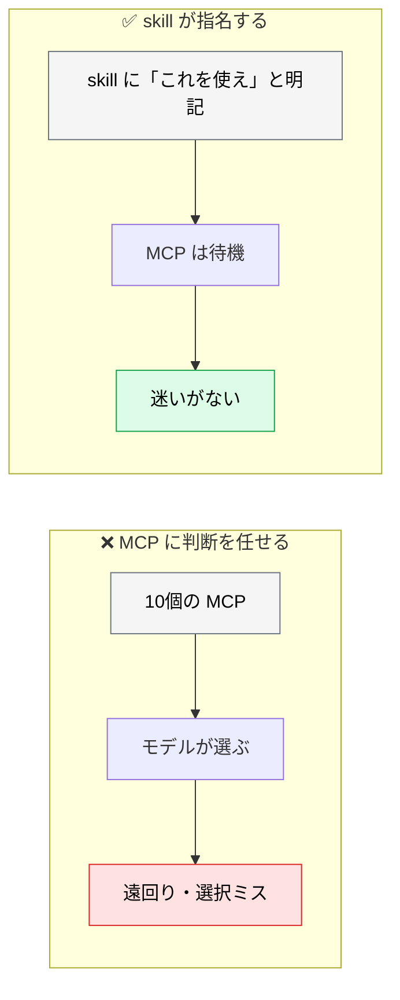
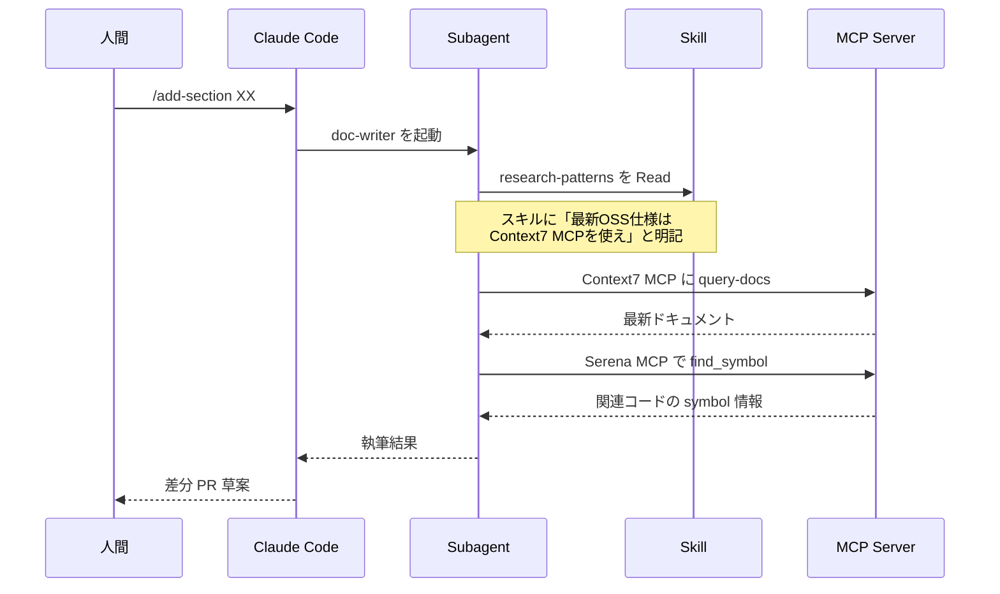
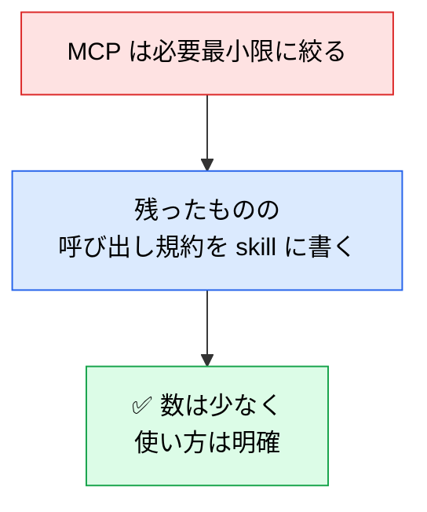

# skills × MCP の連携フロー

> **この記事でわかること**：「MCP は減らせ」と「MCP は価値がある」を両立させる設計。skill 側に呼び出し規約を書くという解法。

## 結論

MCP を増やすとツール選択ミスが増える。しかし Context7 や Serena のように**追加で価値を生む MCP** もある。

両立のカギは1つである。

> **「どの MCP をいつ呼ぶか」を skill 層に記述し、AI の迷いを減らす。**

MCP を道具として静かに待機させ、**呼び出しの意図は skill が持つ**。この非対称な関係が、コンテキスト効率と再現性を両立させる。

## 背景・課題

MCP を10個繋ぐと、モデルは毎ターン10個分のツール定義を見る。似た機能のツールが並べば、どれを呼ぶべきか迷う。



## 具体的な方法

### 役割分担

| 層 | 役割 | 具体例 |
| --- | --- | --- |
| **skills** | いつ・なぜ・どう MCP を呼ぶかの**呼び出し規約** | `research-patterns` / `ai-usecase-templates` |
| **sub-agents** | タスク単位の実行エージェント | `research-agent` / `doc-writer` / `fact-checker` |
| **MCP Server** | 何を取ってくるかの**実行レイヤ** | Context7 / Serena / gh CLI / Postgres MCP |

**skill が「意図」を、MCP が「手段」を担う。**

### 呼び出しフロー



### 推奨マッピング

| サブエージェント / スキル | 呼ぶ MCP | 目的 |
| --- | --- | --- |
| `research-agent` + 調査スキル | **Context7** | OSS ライブラリの最新仕様・変更履歴を取得 |
| `doc-writer` + テンプレート | **Context7** | コード例で使う API の現行シグネチャ確認 |
| コードレビュー系 | **Serena** | symbol 単位で取得し、ファイル全読み込みを回避 |
| `fact-checker` | **Context7** | 検証対象がライブラリ仕様の場合に一次情報を参照 |
| Issue ドリブンのタスク実行 | **gh CLI（Bash）** | 着手前に `gh issue view`、完了時に `gh pr create` |

### skill への記法

skill 本文に呼び出し規約を明記することで、sub-agent がスキルを読み込んだ瞬間に MCP を指名できる。

```markdown
## 最新情報の取得手順

1. ライブラリ・フレームワーク仕様の確認は **Context7 MCP** を第一選択とする
   - プロンプト末尾に `use context7` を付与する
   - 学習データ cutoff 以降に変更のあった API は必ず Context7 で確認
2. コード参照は **Serena MCP** の `find_symbol` を優先し、`Read` による全文読み込みは最後の手段
3. GitHub の Issue / PR 文脈は **gh CLI** を Bash 経由で呼ぶ（MCP より軽量）
```

**「第一選択」「最後の手段」のように優先順位を書く**のが要点である。「使ってもよい」では選択の助けにならない。

> **skill に具体的なツール名を書き込まない。** ツール名はサーバーのバージョンで変わりうる（Context7 は v2.0.0 で `get-library-docs` → `query-docs` に改名された）。**skill は静的ファイルなので、名前がずれても誰も気づかない。** サーバー名までに留め、ツールの選択はモデルに任せる。

### 「減らす」との両立

MCP を減らす原則（→ [`../02_mcp/02_tool-reduction.md`](../02_mcp/02_tool-reduction.md)）と矛盾しない。



**減らしたうえで、残ったものの使い方を明示する。** これが両立の形である。

### CLAUDE.md への反映

エージェント委譲ルールの表に「**参照する MCP**」列を追加する運用も有効である。

| エージェント | 役割 | model | 参照する MCP |
| --- | --- | --- | --- |
| `research-agent` | 最新情報の調査 | `sonnet` | Context7 |
| `senior-engineer-reviewer` | 実装妥当性レビュー | `opus` | Serena |
| `fact-checker` | 事実検証 | `sonnet` | Context7 |

**どのエージェントが何を使うかが一覧で見える**ようになり、棚卸しもしやすくなる。

## 実際のプロンプト例

```text
# 呼び出し規約を skill として設計させる
このリポジトリの構成と接続中の MCP を踏まえて、
「調査系」の呼び出し規約を .claude/skills/research-patterns/SKILL.md として作成して。

含めるもの：
- どの MCP を第一選択とするか（優先順位付き）
- Read による全文読み込みを避ける方針
- 各 MCP を使うべきでない場面

description には「いつこのスキルが必要か」を明記して。
```

```text
# 現状の診断
.claude/ 配下と .mcp.json を読んで、次を確認して。

1. 接続中の MCP のうち、skill で呼び出しが指名されていないもの
2. 役割が重なっていて、モデルが迷いそうな組み合わせ
3. skill には書かれているが、実際には接続されていない MCP

「skill に追記すべき規約」と「外すべき MCP」に分けて提案して。
```

```text
# エージェント定義への反映
CLAUDE.md のエージェント委譲ルールの表に「参照する MCP」列を追加して。
各エージェントの役割から、どの MCP を使うべきか判断して埋めて。
どれも使わないエージェントは「—」にして。
```

## 注意点

> **skill で指名しても「必ず使う」保証はない。** モデルが「知っている」と判断すれば既存知識で答える。確実性が要る場面ではプロンプトで明示する（`use context7` など）。

> **skill が肥大化すると読み込みコストが上がる。** 呼び出し規約は簡潔に。長い背景説明は別ファイルに分ける。

> **接続していない MCP を skill に書かない。** 「Serena を使え」と書いてあるのに繋がっていないと、モデルは代替手段を探して遠回りする。

> **まず減らす。それから規約を書く。** 順序が逆だと、使わない MCP の規約を書くことになる。

## 参考リンク

- 関連：[`../02_mcp/02_tool-reduction.md`](../02_mcp/02_tool-reduction.md) — 減らす原則
- 関連：[`../02_mcp/90_context-chain.md`](../02_mcp/90_context-chain.md) — 複数 MCP の連結
- 関連：[`../01_claude-code/08_combination-patterns.md`](../01_claude-code/08_combination-patterns.md) — 4部品の組み合わせ
