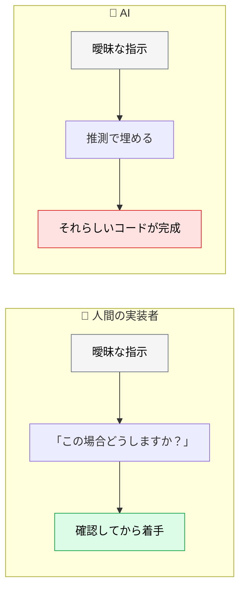
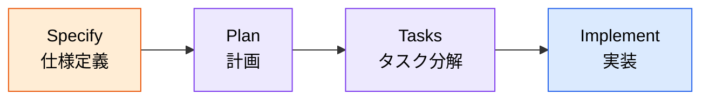
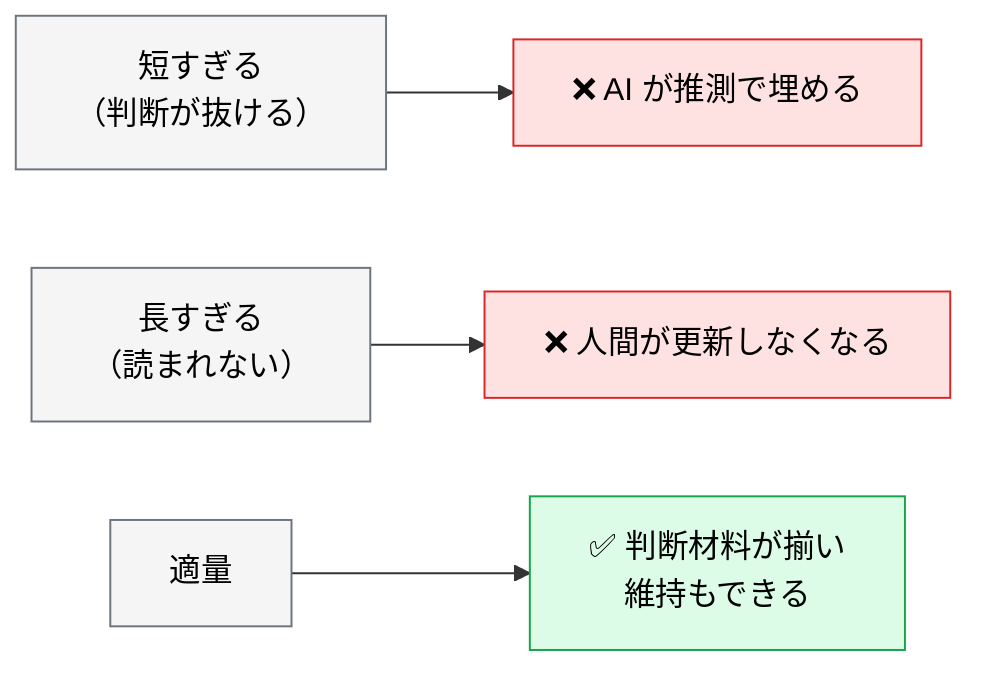

# スペック駆動開発（SDD）とは

> **この記事でわかること**：コードより先に仕様書を書く理由と、仕様書の適切な分量。

## 結論

SDD の要点は1行である。

> **仕様書の完成度 = 実装品質。** 曖昧な要件のままコード生成すると、後工程で全て崩れる。

そして分量には目安がある。**長ければ良いわけではない。**

| 対象 | 分量の目安 |
| --- | --- |
| 単純関数 | 100〜200語 |
| API エンドポイント | 300〜500語 |
| コンポーネント / モジュール | 500〜800語 |
| システムアーキテクチャ | 1,000〜2,000語 |

## 背景・課題

AI は「曖昧だ」と言わずに、それらしく埋める。ここが人間の実装者との決定的な違いである。



**しかも AI は速い。** 曖昧なまま大量のコードが生成され、レビューで初めて方向性の誤りに気づく。この手戻りが最も高くつく。

## 具体的な方法

### 4ステップのフロー



**各段階で人間が確認を挟む。** Specify を飛ばして Implement に行くのが最も高くつく。

### 仕様書ツールの選択

| ツール | 接続方法 | 特徴 |
| --- | --- | --- |
| **GitHub + Markdown** | Git 管理 | **開発フェーズから直接参照できる。Claude Code が直読みできる** |
| Excel | Claude in Excel | 表形式で視覚的に編集しやすい |
| Notion | Notion MCP | 文章・データベースを一体で管理 |
| Apidog | Apidog AI + MCP | API 仕様書を AI で自動生成・品質チェック |

**開発チーム内で完結するなら Markdown + Git が最も軽い。** `@docs/spec/SPEC.md` で参照でき、変更履歴も追える。MCP も要らない。

> ステークホルダーが非エンジニアで、Notion や Excel が既に定着しているなら、そちらに合わせる。**AI が読めるかより、人間が更新し続けられるかが優先**である。

### 分量を守る意味

「詳しく書くほど良い」ではない。



**長すぎる仕様書は更新されなくなる。** 更新されない仕様書は、実装と乖離して有害になる。

> **上の数値は目安であって基準ではない。** 語数を満たすことが目的化すると、水増しされた仕様書ができる。**判断に必要な情報が揃っているか**で見る。

### 配置

設計書は場所を固定する。`@` で短く参照でき、AI も人間も迷わない。

| フェーズ | ファイル名 | 配置 |
| --- | --- | --- |
| 要件定義 | `SPEC.md` | `docs/spec/` |
| 基本設計 | `BASIC_DESIGN.md` | `docs/basic_design/` |
| 詳細設計 | `DETAIL_DESIGN.md` | `docs/detail_design/` |

詳細は [`../00_overview/03_design-doc-structure.md`](../00_overview/03_design-doc-structure.md) を参照する。

### 仕様確定後はセッションを切り替える

仕様を固める対話は長くなる。**そのコンテキストを引きずったまま実装に入らない。**

```text
仕様が確定したら /clear して、新しいセッションで
「@docs/spec/SPEC.md を読んで実装して」から始める。
```

要件定義の試行錯誤（却下された案、途中の議論）がコンテキストに残っていると、実装の品質に影響する（→ [`../01_claude-code/10_context-management.md`](../01_claude-code/10_context-management.md)）。

## 実際のプロンプト例

```text
# 仕様書の分量を診断させる
@docs/spec/SPEC.md を読んで、対象の複雑度に対して分量が適切か診断して。

判定の目安（厳密な基準ではない）：
- 単純関数：100〜200語
- APIエンドポイント：300〜500語
- コンポーネント/モジュール：500〜800語
- システムアーキテクチャ：1,000〜2,000語

※ 日本語の場合、文字数はおおむねこの2〜3倍が目安

長すぎる場合は削れる箇所を、短すぎる場合は不足している判断材料を指摘して。
```

```text
# 実装前の仕様チェック
@docs/spec/SPEC.md を読んで、この仕様で実装を始められるか判定して。

判定できない場合、あなたが推測で埋めることになる箇所を全て列挙して。
その箇所について、私に質問する形で提示して。
実装はまだ始めないで。
```

> **既存コードから仕様書を起こす場合**の具体的な手順は [`../13_implementation/04_legacy-code.md`](../13_implementation/04_legacy-code.md) に集約している。意図の推測をさせない書き方と、バグと仕様の切り分けが要点になる。

## 注意点

> **仕様書は「作って終わり」にしない。** 実装が進むと乖離する。定期的に突き合わせる仕組みを作る（→ [`../02_mcp/14_apidog.md`](../02_mcp/14_apidog.md)）。

> **長さで安心しない。** 分量が多い仕様書は、更新されずに放置されやすい。適量を守るほうが長く機能する。

> **AI に仕様書を書かせるときこそ、推測を禁じる。** 「不明な点は質問して」と明示しないと、それらしい仕様が生成される。

> **仕様確定後はセッションを切り替える。** 要件定義の議論を引きずったまま実装に入らない。

## 参考リンク

- 次に読む：[`01_requirements-with-ai.md`](01_requirements-with-ai.md) — AI との対話で要件を固める
- 関連：[`02_failure-patterns.md`](02_failure-patterns.md) — よくある失敗
- 関連：[`../13_implementation/04_legacy-code.md`](../13_implementation/04_legacy-code.md) — 既存コードから仕様を起こす
- 関連：[`../00_overview/03_design-doc-structure.md`](../00_overview/03_design-doc-structure.md) — 設計書の配置
