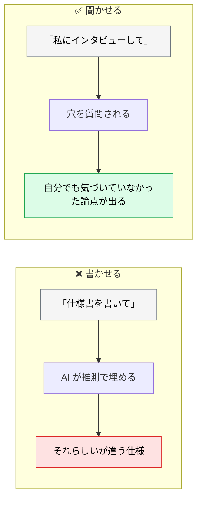
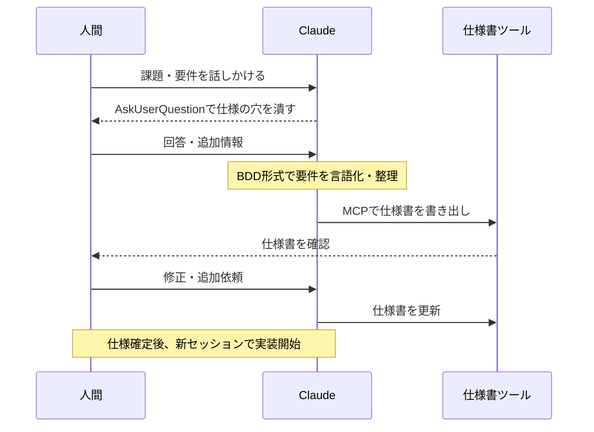
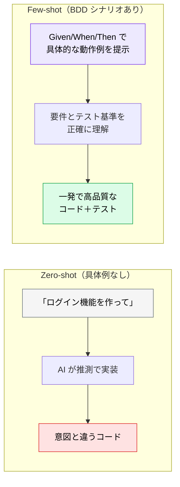

# AI と対話しながら要件を整理する

> **この記事でわかること**：AI に「インタビューさせる」手法と、BDD シナリオが AI への few-shot として機能する理由。

## 結論

要件定義で AI を使う最も効果的な形は、**書かせること**ではなく**聞かせること**である。

> **AskUserQuestion ツールを使って、AI に自分をインタビューさせる。**

これを明示的に指示することで、AI が**勝手な推測で作業を進めるのを防ぎ**、対話形式で要件の解像度を確実に引き上げられる。

そして固まった要件は BDD 形式で書く。理由は次のとおりである。

> **BDD のシナリオは AI への few-shot プロンプトとして直接機能する。**

## 背景・課題

「仕様書を書いて」と頼むと、AI はそれらしい仕様書を生成する。しかしそれは**あなたの頭の中にある要件ではない**。



**要件定義の価値は「決まっていないことに気づく」ことにある。** AI に埋めさせては意味がない。

## 具体的な方法

### インタビューさせる（推奨パターン）

```text
[構築したいものの簡単な説明] を構築したいと考えています。AskUserQuestion ツールを使って、私に詳しくインタビューしてください。

技術的な実装、UI/UX、エッジケース、懸念事項、トレードオフについて質問してください。
当たり前の質問は避け、私が考慮していないかもしれない難しい部分を深掘りしてください。

すべてを網羅するまでインタビューを続け、完了したら完全な仕様書を SPEC.md に作成してください。
```

**「当たり前の質問は避け、難しい部分を深掘りして」が効く。** これがないと、答えが自明な質問で時間を使う。

> **AskUserQuestion とは**：**Claude Code / Claude アプリに内蔵された、選択肢付きで人間に確認を取るツール**である。1回の呼び出しで複数問がまとめて提示され、各問に短いヘッダーと選択肢が並ぶ。ユーザーは選択肢から選ぶか、自由記述で答える。
>
> **1回あたりの質問数に上限がある**ため、「すべてを網羅するまで」は複数ラウンドになる。
>
> **他ツール（Cursor / Copilot 等）を使っている場合**は、`「不明点は推測せず、まとめて質問してから進めて」`という指示で代替する。ツール名に依存しない形で同じ効果が得られる。

### やり取りの例

選択肢が提示されるため、答えるコストが低い。

> 🧑 「ユーザー管理機能を作りたい」
>
> 🤖 **認証方法**
> - メール + パスワードのみ
> - SNS ログインのみ（Google / GitHub）
> - **両方**
>
> 🤖 **権限管理**
> - 管理者とエンドユーザーを分ける
> - 全員同権限
>
> 🤖 **退会機能**
> - 必要（論理削除）
> - 必要（物理削除）
> - 不要
>
> 🧑 （選択）→ 「両方」「管理者ロールあり」「必要（論理削除）」
>
> 🤖 **パスワードリセットの有効期限**
> - 15分 / 30分 / 60分 / その他
>
> （仕様の穴がなくなるまで、複数ラウンド続く）

**「有効期限は何分か」のような質問が価値である。** 自分では考えていなかった判断が明るみに出る。

### 全体のフロー



### 仕様書の必須要素

| セクション | 内容 |
| --- | --- |
| 目的・ゴール | 解決する課題と成功の定義 |
| コンテキスト・制約 | 既存アーキテクチャ、依存関係、パフォーマンス要件 |
| 機能要件 | コア動作（BDD 形式：Given/When/Then 推奨） |
| 非機能要件 | セキュリティ・スケーラビリティ・アクセシビリティ |
| **エッジケース** | 異常系・境界値・エラーハンドリング |
| **テスト基準** | 検証アプローチ・合格条件 |
| 具体例 | 入出力ペア・使用シナリオ |

**下の2つが最も抜けやすく、最も効く。** エッジケースとテスト基準がないと、AI は正常系だけを実装する。

### BDD 形式

```text
[ユーザー層] として、
[目的/利益] を達成するために、
[機能/アクション] を実行したい。

受け入れ基準（Acceptance Criteria）:
GIVEN（前提）: [事前条件やコンテキスト]
WHEN（操作）: [アクションの実行]
THEN（結果）: [期待される結果]
```

### なぜ BDD が AI に効くのか

**Given/When/Then は具体的な動作例である。** つまり few-shot プロンプトとして機能する。



**BDD シナリオはそのままテストケースになる。** 仕様とテストが一体化する。

### MCP 経由でツールに書き出す

決定した仕様をそのまま Excel・Sheets・Notion に書き出せる。「この要件を追記して」「不足項目を提案して」といった指示も可能である。

**ツールと AI が双方向につながることで、ドキュメントと対話が一体化する。**

### 仕様確定後は新セッションで

仕様が固まったら `/clear` して、クリーンなコンテキストで実装に移る。要件定義の試行錯誤を引きずらない。

## 実際のプロンプト例

```text
# インタビューさせる（基本形）
社内の経費精算システムを作りたいと考えています。
AskUserQuestion ツールを使って、私に詳しくインタビューしてください。

技術的な実装、UI/UX、エッジケース、懸念事項、トレードオフについて質問してください。
当たり前の質問は避け、私が考慮していないかもしれない難しい部分を深掘りしてください。

すべてを網羅するまでインタビューを続け、
完了したら完全な仕様書を docs/spec/SPEC.md に作成してください。
```

```text
# BDD シナリオに変換させる
以下の要件を BDD 形式（Given/When/Then）の受け入れ基準に変換して。

[要件のメモ]

条件：
- 正常系だけでなく、異常系・境界値のシナリオも作ること
- 「〜が適切に処理される」のような曖昧な THEN は書かないこと
- 各シナリオがそのままテストケースになる粒度にすること
```

```text
# 仕様の穴を洗い出させる
@docs/spec/SPEC.md を読んで、実装時にあなたが推測で埋めることになる箇所を列挙して。

各項目について、私に確認すべき質問の形で提示して。
「おそらく〜だろう」と補完しないで。
```

## 注意点

> **AI に仕様書を書かせるのではなく、質問させる。** 埋めさせると、それらしいが違う仕様ができる。

> **「当たり前の質問は避けて」を入れる。** これがないと、自明な質問で時間を使う。

> **エッジケースとテスト基準を必ず含める。** 最も抜けやすく、最も実装品質に効く。

> **THEN を曖昧にしない。** 「適切に処理される」ではテストにならない。「HTTP 422 とエラーコード `INVALID_EMAIL` を返す」まで書く。

> **仕様確定後はセッションを切り替える。** 却下された案がコンテキストに残っていると、実装に影響する。

## 参考リンク

- 関連：[`00_spec-driven-development.md`](00_spec-driven-development.md) — SDD の全体像
- 関連：[`02_failure-patterns.md`](02_failure-patterns.md) — よくある失敗
- 関連：[`../15_test/00_test-strategy.md`](../15_test/00_test-strategy.md) — BDD からテストへ
