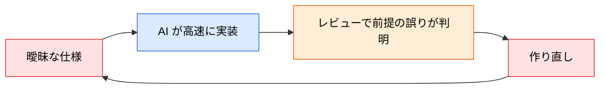

# 要件定義でよくある失敗パターン

> **この記事でわかること**：仕様書が実装で機能しなくなる5つの典型パターンと、それぞれの検出方法。

## 結論

失敗は5つに集約される。**すべて「AI が推測で埋めることになる」という一点に帰結する。**

| # | 失敗 | AI が埋めるもの |
| --- | --- | --- |
| 1 | 「速くしてほしい」など**数値のない曖昧な要件** | 勝手な性能目標 |
| 2 | **既存アーキテクチャへの言及なし** | それらしい新規構造 |
| 3 | **エッジケース・エラーシナリオの欠落** | 正常系だけの実装 |
| 4 | **セキュリティ・パフォーマンス仕様なし** | 最低限の実装 |
| 5 | **テスト基準・検証アプローチなし** | 自己検証なしの納品 |

> **仕様書の完成度がそのまま実装品質に直結する。コードより先に仕様を完成させる。**

## 背景・課題

これらの失敗は、人間の実装者が相手なら**質問で解消される**。「速くってどれくらいですか？」と聞かれる。

AI は聞かない。それらしく埋める。**しかも速い。** 誤った前提の上に大量のコードが積み上がってから発覚する。



## 具体的な方法

### ① 数値のない曖昧な要件

| ❌ | ✅ |
| --- | --- |
| 「レスポンスを速くしてほしい」 | 「p95 レイテンシを 500ms 以下にする」 |
| 「大量のデータに耐える」 | 「1テーブル 1,000万行、同時接続 500 で動作する」 |
| 「使いやすくする」 | 「登録完了までのクリック数を5回以内にする」 |

**検出方法**：形容詞・副詞を探す。「速く」「多く」「使いやすく」が出てきたら数値化する。

### ② 既存アーキテクチャへの言及なし

AI は既存構造を知らないまま、**一般論として正しい設計**を提案する。それがプロジェクトの方針と食い違う。

```text
既存の実装パターンは @src/api/orders/ を参照して。
同じ層構造・同じエラーハンドリング方式に従って。
異なる方式が適切だと判断した場合は、実装せずに理由を報告して。
```

**「参照すべき既存実装」を渡す**のが最も効く。文章で説明するより、コードを見せるほうが正確である。

### ③ エッジケース・エラーシナリオの欠落

最も頻繁に起きる。仕様書に正常系しか書かれていない。

| 観点 | 質問 |
| --- | --- |
| 境界値 | 0件のとき / 上限を超えたとき |
| 異常系 | 外部 API がタイムアウトしたとき |
| 並行性 | 同時に2人が同じ操作をしたとき |
| 中断 | 処理の途中でブラウザを閉じたとき |
| 権限 | 権限のないユーザーがアクセスしたとき |

**この5観点を仕様レビューのチェックリストにする。**

### ④ セキュリティ・パフォーマンス仕様なし

非機能要件が書かれていないと、AI は「動くもの」を作る。**動くことと本番で使えることは違う。**

| 項目 | 書くべきこと |
| --- | --- |
| 認証・認可 | 誰がこの操作を実行できるか |
| 入力検証 | 何を受け付け、何を拒否するか |
| レート制限 | 単位時間あたりの上限 |
| ログ | 何を記録し、何を記録しないか（個人情報） |
| 性能目標 | レイテンシ・スループット |

### ⑤ テスト基準・検証アプローチなし

**AI は検証手段があれば自分で直せる。** なければ「たぶん動く」コードを返す。

```text
実装後に npm test を実行して、失敗したら根本原因を直して。
テストを緩めて通すことはしないで。
```

これがないと、AI 駆動開発の最大の利点（自己修正ループ）が使えない（→ [`../00_overview/00_what-is-ai-driven-dev.md`](../00_overview/00_what-is-ai-driven-dev.md)）。

### 検出の仕組み化

5パターンは**機械的にチェックできる**。仕様レビューをコマンド化する。

```markdown
---
description: 仕様書に実装可能な粒度が揃っているか検査する。実装着手前に使う
argument-hint: [仕様書のパス]
---

$1 を読んで、以下の5観点で欠落を検出する。

1. 数値のない曖昧な要件（形容詞・副詞を探す）
2. 既存アーキテクチャへの言及の有無
3. エッジケース（境界値・異常系・並行性・中断・権限）
4. 非機能要件（認証認可・入力検証・レート制限・ログ・性能目標）
5. テスト基準・検証方法

各観点について「記載あり / 不足 / 該当なし」で判定し、
不足しているものは私に確認すべき質問の形で提示する。
推測で補完しない。
```

## 実際のプロンプト例

```text
# 5観点で仕様を診断する
@docs/spec/SPEC.md を読んで、次の5観点で欠落を検出して。

1. 数値のない曖昧な要件
2. 既存アーキテクチャへの言及
3. エッジケース（境界値・異常系・並行性・中断・権限）
4. 非機能要件（認証認可・入力検証・レート制限・ログ・性能目標）
5. テスト基準

判定は「記載あり / 不足」の2択で。
不足しているものは、私に確認すべき質問の形で提示して。推測で補完しないで。
```

```text
# 曖昧な表現を数値化させる
@docs/spec/SPEC.md から、数値化されていない要件を全て抜き出して。

各項目について、数値化するために必要な質問を提示して。
「一般的には〜」という補完はしないで。
```

```text
# エッジケースの洗い出し
この機能について、仕様書に書かれていないエッジケースを洗い出して。

観点：境界値 / 異常系 / 並行性 / 処理の中断 / 権限

それぞれ「起きたときにどうすべきか」を私に質問する形で提示して。
あなたの推奨案があれば併記してよいが、決定はしないで。
```

## 注意点

> **5パターンすべてが「推測で埋められる」に帰結する。** 個別に覚えるより、「AI が推測する余地を残さない」という一点で覚えるほうが実用的である。

> **仕様レビューをコマンド化する。** 5観点のチェックは機械的にできる。毎回手で確認しない（→ [`../05_prompt-engineering/02_versioning.md`](../05_prompt-engineering/02_versioning.md)）。

> **「推測で補完しないで」を必ず添える。** これがないと、AI は不足を指摘せず親切に埋めてしまう。

> **既存実装を渡すのが最も効く。** アーキテクチャを文章で説明するより、参照すべきコードを `@` で示すほうが正確である。

> **完璧な仕様書を目指さない。** 5観点が埋まれば実装に入れる。それ以上は実装しながら詰めるほうが速い。

## 参考リンク

- 関連：[`00_spec-driven-development.md`](00_spec-driven-development.md) — SDD の全体像
- 関連：[`01_requirements-with-ai.md`](01_requirements-with-ai.md) — 対話で埋める
- 関連：[`../00_overview/02_deliverables-and-dod.md`](../00_overview/02_deliverables-and-dod.md) — 完了条件
