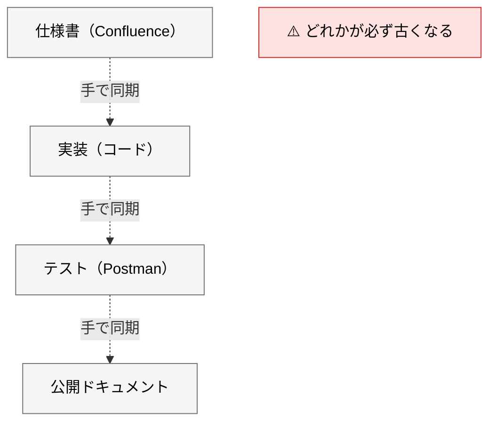
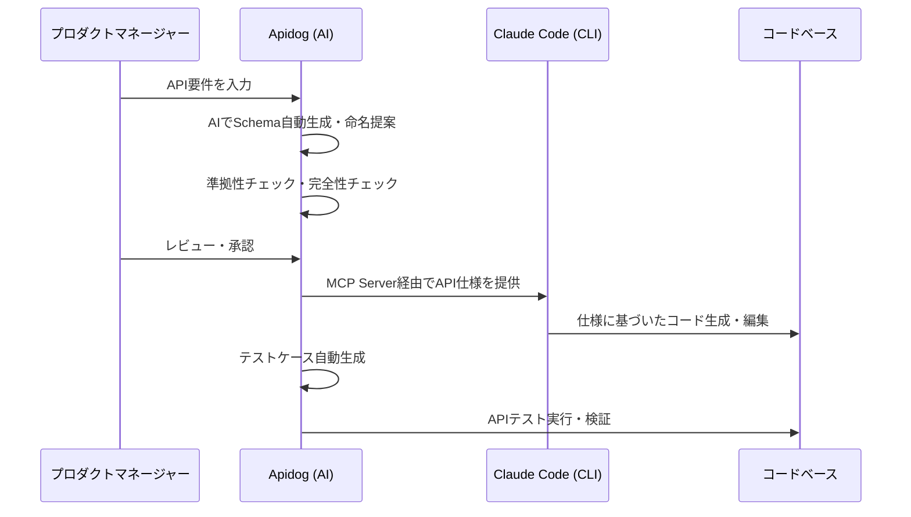

# Apidog AI による API 仕様書作成

> **この記事でわかること**：API 仕様を SSoT として運用し、設計→実装→テスト→ドキュメントの一貫性を保つ方法。

## 結論

Apidog の価値は個別の AI 機能ではない。

> **「API 仕様の Single Source of Truth」として運用することで、設計 → 実装 → テスト → ドキュメントの一貫性が保たれる。**

同じ仕様を全フェーズで参照し続けることが要点である。仕様書が「作って終わり」にならない。

## 背景・課題

API 開発では、同じ情報が4箇所に散らばる。



手動同期は必ず破綻する。**1箇所を正とし、他はそこから導出する**構造にする。

## 具体的な方法

### AI 機能一覧

| 機能 | 説明 | 活用場面 |
| --- | --- | --- |
| **Schema 編集支援** | フィールド説明や Mock データを自動生成 | データモデル設計時に説明文を一括生成 |
| **API 準拠性チェック** | API 定義が設計ガイドラインに準拠しているか検証 | レビュー前の品質ゲート |
| **AI 命名支援** | パラメーターに標準的なフィールド名を提案 | 命名規則の統一・国際化対応 |
| **テストケース自動生成** | テストデータ・アサーション・カスタムスクリプトを自動作成 | テスト工数の削減 |
| **ドキュメント完全性チェック** | API ドキュメントの網羅性を分析し改善点を提案 | 公開前の品質保証 |

**「準拠性チェック」と「完全性チェック」が実務で効く。** 生成より検査のほうが、人間には面倒で AI には得意な作業である。

### 連携ワークフロー



**PM のレビュー・承認が中央にある**のが重要である。AI が生成した Schema をそのまま実装に流さない。

### MCP の設定

```json
{
  "mcpServers": {
    "apidog": {
      "command": "npx",
      "args": ["-y", "apidog-mcp-server@latest", "--project=<PROJECT_ID>"],
      "env": {
        "APIDOG_ACCESS_TOKEN": "${APIDOG_ACCESS_TOKEN}"
      }
    }
  }
}
```

> **アクセストークンが必要である。** MCP 接続には Apidog のアクセストークンが要る。**`.mcp.json` に直書きせず、環境変数参照にする。**
>
> `--project` は**等号連結（`--project=<ID>`）**である。空白区切りでは受け付けられない。正確なパッケージ名と引数は公式ドキュメントで確認する。

> **IDE ではなく Claude Code に接続する。** IDE に読ませるとコンテキストを大量消費し、本来の補完・レビューまで劣化する。**重い仕様読み込みは Claude Code に一任する**（→ [`../02_mcp/02_tool-reduction.md`](../02_mcp/02_tool-reduction.md)）。

> **注意**：Apidog の「環境変数」機能は **API テスト実行時の変数置換**であり、MCP サーバーの認証とは別物である。**MCP 接続にはアクセストークンが必須**なので、「MCP には認証情報を渡さない」という運用は成立しない。渡し方（環境変数参照）を正しくするのが対策である。

### フェーズをまたいだ活用

同じ仕様を全フェーズで参照する。**これが SSoT 運用の実体である。**

| フェーズ | 使い方 |
| --- | --- |
| **要件定義** | AI と対話しながら API 仕様を起草する（本記事） |
| **実装** | 仕様を参照しながらハンドラを実装する |
| **レビュー** | 実装と仕様の差分を検知する |
| **テスト** | 仕様からテストケースを生成する |

実装以降の使い方は [`../02_mcp/14_apidog.md`](../02_mcp/14_apidog.md) を参照する。

### 導入しないほうがいいケース

**前提は「仕様書が SSoT として維持されていること」である。** 維持されていないなら、ツールを入れても解決しない。

> 具体的な非導入基準（仕様が形骸化している / コードから自動生成されている / API が少数）は [`../02_mcp/14_apidog.md`](../02_mcp/14_apidog.md) に集約している。

### 代替手段

Apidog を使わない場合でも、SSoT の考え方は同じである。

| 手段 | SSoT |
| --- | --- |
| **OpenAPI ファイルを Git 管理** | `openapi.yaml` を正とし、コードと型定義を生成 |
| コードファースト | 実装から OpenAPI を自動生成（仕様書は生成物） |
| Apidog | Apidog 上の定義を正とする |

**どれを正とするかを決めることが本質**であり、ツールは手段である。

## 実際のプロンプト例

```text
# 対話で API 仕様を起草させる
新しい「クーポン適用」API を設計したい。
AskUserQuestion ツールを使って、私にインタビューして。

質問してほしいこと：
- リクエスト / レスポンスの構造
- エラー時のステータスコードとエラーコード体系
- 認証・認可の要件
- レート制限
- 冪等性の必要性

すべて揃ったら OpenAPI 形式で仕様を作成して。
私が答えていない項目は推測せず、必ず質問して。
```

```text
# 準拠性チェック
作成した API 仕様を、以下の観点でレビューして。

1. 既存の API（@docs/spec/API.md）と命名規則が揃っているか
2. エラーレスポンスの形式が統一されているか
3. ページネーションの方式が既存と一致しているか
4. HTTP ステータスコードの使い方が適切か

不一致があれば、既存側に合わせる案を示して。
```

```text
# 完全性チェック
この API 仕様で、実装者が推測で埋めることになる箇所を列挙して。

特に次を確認して：
- 各フィールドの必須/任意、デフォルト値
- 文字数上限・形式の制約
- null 許容の有無
- エラー時の詳細（どのコードがどの条件で返るか）

不足を私への質問の形で提示して。
```

## 注意点

> **仕様が形骸化しているなら、まず運用を直す。** 古い仕様との差分を大量に検出しても、ノイズにしかならない。

> **AI が生成した Schema をそのまま実装に流さない。** 人間のレビュー・承認を中央に置く。

> **認証情報を MCP に直接渡さない。** Apidog 側の環境変数機能に登録して参照させる。

> **IDE に接続しない。** 重い仕様読み込みは Claude Code に一任する。IDE に繋ぐと本来の補完まで劣化する。

> **ツールより「何を正とするか」の決定が本質である。** Apidog でも OpenAPI ファイルでもよいが、**1つに決める**ことが要点である。

## 参考リンク

- [Apidog 公式](https://apidog.com/)
- 関連：[`../02_mcp/14_apidog.md`](../02_mcp/14_apidog.md) — 実装フェーズでの活用
- 関連：[`../11_design/02_api-design.md`](../11_design/02_api-design.md) — API 設計
