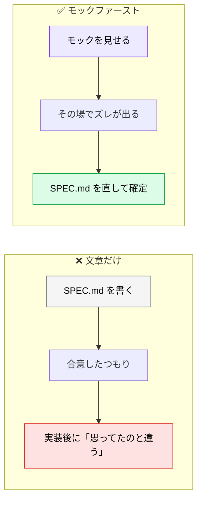
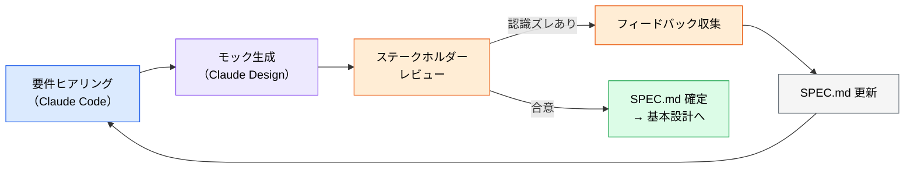

# デザインモックファースト開発

> **この記事でわかること**：文章だけで合意を取ると起きる「UI の認識ズレ」を、要件定義の段階で潰す方法。

## 結論

`SPEC.md` の文章だけで合意を取ろうとすると、**文字では伝わらない UI の認識ズレ**が実装後に発覚する。

> **要件定義の段階でモックを早期に作り、視覚的なレビューを繰り返しながら SPEC.md を確定させる。**

そして最も重要な心構えがこれである。

> **モックの目的は「完成品を作ること」ではなく「認識ズレを早期に発見すること」。** 作り込みすぎず、1〜2回のレビューで SPEC.md が確定するのが理想。

## 背景・課題

「ユーザー一覧画面に検索機能をつける」という一文に、全員が同じ絵を思い浮かべることはない。

- 検索ボックスはどこに置くか
- インクリメンタルサーチか、ボタンを押すのか
- 結果が0件のとき何を表示するか

これらは**文章で書けば書くほど読まれなくなる**。絵を見せれば5秒で合意できる。



## 具体的な方法

### 反復ループ



**ループの出口は「モックの完成」ではなく「SPEC.md の確定」である。** モックは合意を取るための道具にすぎない。

### ツールの選択

| ツール | 種別 | 特徴 | 推奨ユースケース |
| --- | --- | --- | --- |
| **Claude Design** | Web サービス | Figma ファイル（`.fig`）の import でデザインシステムを自動抽出。GitHub リポジトリ連携で既存コンポーネントを参照。「Send to Claude Code」で handoff bundle を出力 | モック生成〜handoff 一貫。ブランド・コードベースに整合したモックが必要な場合 |
| **Claude Code** | CLI ツール | HTML や React コードを生成してブラウザでプレビュー。その場で修正ループが完結 | **エンジニア主導の軽量プロトタイプ検証** |
| **v0.dev**（Vercel） | Web サービス | テキストから React + shadcn/ui のコードとプレビューを即生成 | フォールバック |

**エンジニアだけで合意を取るなら Claude Code で十分**である。HTML を生成してブラウザで見せれば、認識ズレは出る。

### Claude Design と Figma MCP の違い

混同されやすい。**担当するフェーズが違う。**

| | Claude Design | Figma MCP |
| --- | --- | --- |
| 役割 | **仕様書から UI モックを生成**し、handoff bundle で Claude Code に引き渡す | **既存の Figma デザインから**トークン・コンポーネント仕様を Claude Code が参照する |
| フェーズ | **要件定義**（モック生成） | **実装**（デザイン → コード） |


実装フェーズの Figma MCP は [`../02_mcp/30_figma.md`](../02_mcp/30_figma.md) を参照する。

### 作り込みすぎない

モックファーストが失敗する最大の原因は、**モックを作品にしてしまう**ことである。

| ❌ 作り込みすぎ | ✅ 適量 |
| --- | --- |
| 全画面・全状態を作る | 認識ズレが起きそうな画面だけ |
| 色・余白を詰める | レイアウトと情報構造だけ |
| インタラクションを実装する | 静的な画面遷移で足りる |

**1〜2回のレビューで SPEC.md が確定すればよい。** 3回目に入ったら、モックの精度ではなく要件そのものが固まっていない可能性を疑う。

### 確認すべき状態

合意で漏れやすいのは正常系以外である。モックには**3つの状態**を含める。

| 状態 | 内容 |
| --- | --- |
| **通常** | データがある状態 |
| **空** | 0件のとき何を表示するか |
| **エラー** | 失敗時に何を出し、どう復帰させるか |

**「空状態」の合意が最も抜ける。** そして実装時に必ず問題になる。

## 実際のプロンプト例

```text
# パターンを複数出させる（Claude Design）
@SPEC.md の「ユーザー管理画面」セクションをもとに、
管理者向けのUIモックを3パターン提案してください。

各パターンに以下を含めること：
- レイアウトの設計意図
- 主要な操作フロー（一覧 → 詳細 → 編集）
- エラー・空状態の表示方針
```

> 案が確定したら、**UI から Claude Code への引き渡し操作を人間が行う**。この操作はプロンプトに書いても実行されない。

```text
# 既存デザインシステムに合わせる（Figma + GitHub 連携時）
インポートした Figma ファイルのデザインシステム（カラー・タイポグラフィ・コンポーネント）と、
接続した GitHub リポジトリの既存コンポーネントパターンを参照して、
ユーザー管理画面のモックを生成してください。

要件：
- ユーザー一覧テーブル（名前・メール・ロール・ステータス）
- 検索・フィルター機能
- ユーザー招待ボタン
- モバイル対応

既存コンポーネントと一致するものは再利用し、新規コンポーネントが必要な場合は
デザインシステムのルールに従って定義してください。
```

```text
# Claude Code で軽量に作る
@docs/spec/SPEC.md の「注文履歴画面」の要件をもとに、
単一の HTML ファイルでモックを作って。ブラウザで開いて確認できる形で。

含めるもの：
- 通常状態（データ3件）
- 空状態（0件）
- エラー状態（読み込み失敗）

色や余白は作り込まないで。レイアウトと情報構造の確認が目的。
```

```text
# レビュー結果を SPEC.md に反映
モックレビューで以下のフィードバックが出た。

[フィードバックのメモ]

これを @docs/spec/SPEC.md に反映して。
UI の見た目ではなく「要件として何が決まったか」の形で書いて。
```

## 注意点

> **モックは合意の道具であって成果物ではない。** 作り込むほど、捨てにくくなって判断が歪む。

> **3回目のレビューに入ったら要件を疑う。** モックの精度の問題ではなく、そもそも何を作りたいかが固まっていない可能性が高い。

> **空状態とエラー状態を必ず含める。** 合意で最も抜けやすく、実装で最も揉める。

> **Claude Design はトークン消費が大きい。** プランによっては利用制限がある。エンジニア間の合意なら Claude Code の HTML 生成で足りることが多い。

> **モックの結果を SPEC.md に戻す。** モックだけが更新されて仕様書が古いままだと、実装時にどちらを見るか分からなくなる。

## 参考リンク

- 関連：[`01_requirements-with-ai.md`](01_requirements-with-ai.md) — 要件ヒアリング
- 関連：[`../02_mcp/30_figma.md`](../02_mcp/30_figma.md) — 実装フェーズの Figma 連携
- 関連：[`../12_ui-ux/00_ui-draft-generation.md`](../12_ui-ux/00_ui-draft-generation.md) — UI ラフ案の生成
