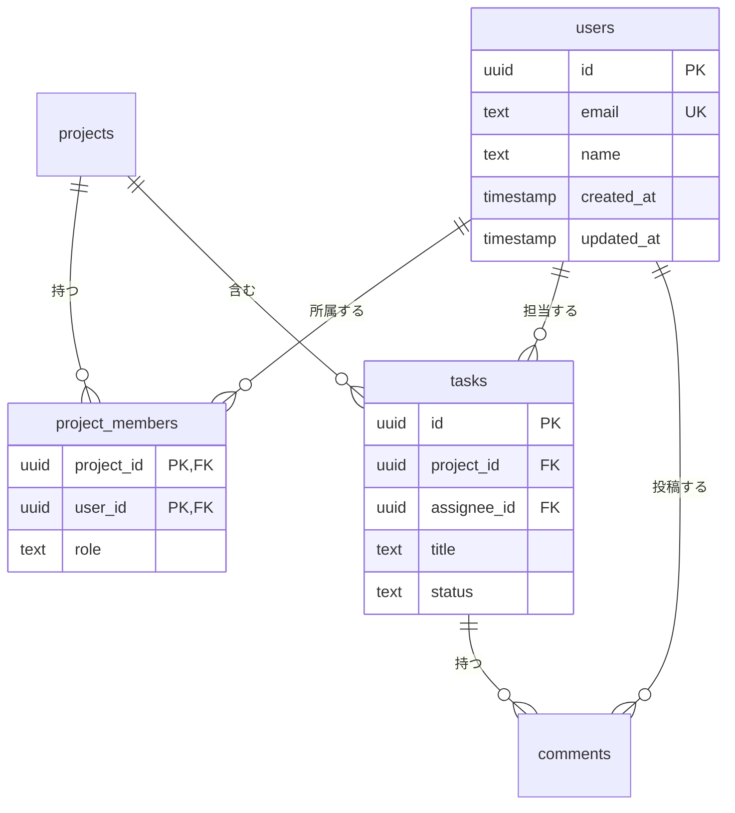
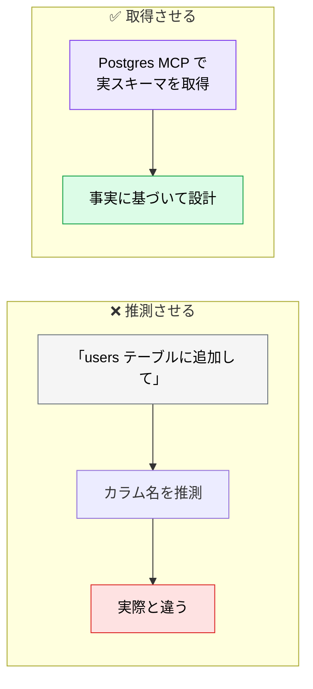

# DB 設計（データモデリング）

> **この記事でわかること**：要件から ER 図を生成させる方法と、既存スキーマを AI にレビューさせる5観点。

## 結論

DB 設計で AI が効くのは2箇所である。

| 場面 | AI の役割 |
| --- | --- |
| **新規設計** | 要件から ER 図の**叩き台**を生成する |
| **既存レビュー** | 正規化・インデックス・命名の**機械的なチェック** |

そして最も重要な注意がある。

> **既存 DB がある場合は、AI に推測させず Postgres MCP 等で実スキーマを取得させる。**

## 背景・課題

DB 設計は「一度決めると変えにくい」領域である。テーブル構造の変更にはマイグレーションが要り、データがあれば移行も必要になる。

**だから叩き台を早く作り、レビューを厚くする**のが効率的である。AI は前者に強く、後者にも一定使える。

一方で、既存 DB がある状況で AI にカラム名を推測させると高確率で外す。実スキーマを渡すことが前提になる。

## 具体的な方法

### ER 図の生成

要件から `erDiagram` を生成させる。

```text
以下の要件からER図をMermaid erDiagram記法で生成してください。

[要件]
- ユーザーは複数のプロジェクトに所属できる（多対多）
- 各プロジェクトには複数のタスクがある（一対多）
- タスクには担当者（ユーザー）を1人割り当てる
- コメント機能あり（タスクに対して複数のコメント）

[出力に含めるもの]
- テーブル名・カラム名・型・制約（PK/FK/NOT NULL/UNIQUE）
- リレーション（1対多 / 多対多の中間テーブル含む）
- created_at / updated_at は全テーブルに付与
```

**「出力に含めるもの」を明示する**のが要点である。指定しないと制約やタイムスタンプが抜ける。

期待される出力はこの形になる。



**多対多は中間テーブル（`project_members`）で表現されているか**を確認する。カーディナリティ記号を読めないと、AI の出力ミスを検出できない。

| 記号 | 意味 |
| --- | --- |
| `||--||` | 1対1 |
| `||--o{` | 1対多（0以上） |
| `||--|{` | 1対多（1以上） |
| `}o--o{` | 多対多（中間テーブルなしの論理表現） |

> **`}o--o{` が出てきたら疑う。** 物理設計では中間テーブルに分解されているべきである。

### テーブル設計のレビュー

```text
以下のテーブル設計をレビューしてください。

[観点]
1. 正規化レベル（第3正規形を満たしているか）
2. インデックス設計（頻出クエリに対して適切か）
3. 命名規則の一貫性
4. 将来の拡張性（カラム追加・テーブル分割の余地）
5. パフォーマンスのボトルネック（N+1になりやすい箇所）

[テーブル定義]
（DDL または ER 図を貼る）
```

**5観点のうち、AI が特に強いのは1・3である**（機械的に判定できる）。2・5 は実際のクエリパターンを知らないと判断できないため、**頻出クエリも一緒に渡す**と精度が上がる。

### 既存 DB がある場合

**推測させない。実スキーマを取得させる。**



接続先は**開発用 DB に限定し、読み取り専用ユーザー**を使う（→ [`../02_mcp/13_postgres.md`](../02_mcp/13_postgres.md)）。

### AI が苦手なこと

DB 設計には、AI が判断できない領域がある。

| 領域 | なぜ判断できないか |
| --- | --- |
| **論理削除 vs 物理削除** | 業務要件・監査要件による |
| **履歴の持ち方** | 更新履歴が必要かは業務次第 |
| **正規化をどこまで崩すか** | 実際の読み書き比率を知らないと決まらない |
| **マルチテナントの分離方式** | 契約・法規制の要件が絡む |

**これらは「選択肢と判断材料を出させて、人間が決める」**という使い方をする。

### マイグレーションの生成

既存スキーマを取得させたうえで生成させる。**破壊的変更の扱いを明示する。**

```text
現在の users テーブルの定義を Postgres MCP で確認して、
「最終ログイン日時」カラムを追加するマイグレーションを作成して。

条件：
- 既存データがある前提で、NOT NULL 制約をどう扱うか提案して
- ロールバック用のマイグレーションも作成して
- 実行はしないで。ファイルの作成までに留めて
```

**ロールバックを必ず書かせる。** 前進のマイグレーションだけでは、失敗時に戻せない。

## 実際のプロンプト例

```text
# 頻出クエリとセットでレビューさせる
以下のテーブル定義をレビューして。

[テーブル定義]
（DDL を貼る）

[頻出クエリ]
1. ユーザーIDで直近30日の注文を取得（1日約1万回）
2. 商品カテゴリ別の売上集計（1日1回・バッチ）
3. 注文ステータスでの絞り込み（1日約5千回）

観点：正規化 / インデックス / 命名 / 拡張性 / N+1 の危険

インデックスの提案は、上記クエリに実際に効くものだけにして。
「念のため」のインデックスは提案しないで。
```

```text
# 判断材料だけ出させる
このテーブルで「論理削除」と「物理削除」のどちらを採るべきか、
判断材料を整理して。結論は出さないで。

- それぞれのメリット・デメリット
- 判断に必要な情報（私に確認すべきこと）
- 後から変更する場合のコスト
```

```text
# 既存スキーマとの整合性チェック
Postgres MCP で実際のスキーマを取得して、
@docs/basic_design/BASIC_DESIGN.md の ER 図と突き合わせて。

食い違っている箇所を一覧にして。
どちらが正しいかは判断せず、差分だけ示して。
```

## 注意点

> **既存 DB があるなら推測させない。** Postgres MCP 等で実スキーマを取得させる。カラム名のハルシネーションは実行するまで気づかない。

> **接続先は開発用 DB に限定する。** 読み取り専用ユーザーを使い、本番には繋がない。

> **インデックスを「念のため」で増やさせない。** 書き込み性能が落ちる。実際のクエリに効くものだけにする。

> **業務要件が絡む判断は AI に決めさせない。** 論理削除・履歴・マルチテナント分離は、選択肢と判断材料を出させるまでに留める。

> **マイグレーションはロールバックとセットで作らせる。** 前進だけでは失敗時に戻せない。

> **ER 図は `BASIC_DESIGN.md` に埋め込む。** 別ファイルに分けると、実装時に参照されなくなる。

## 参考リンク

- 関連：[`00_basic-design.md`](00_basic-design.md) — 基本設計の全体像
- 関連：[`../02_mcp/13_postgres.md`](../02_mcp/13_postgres.md) — 実スキーマの取得
- 関連：[`02_api-design.md`](02_api-design.md) — API 設計との接続
