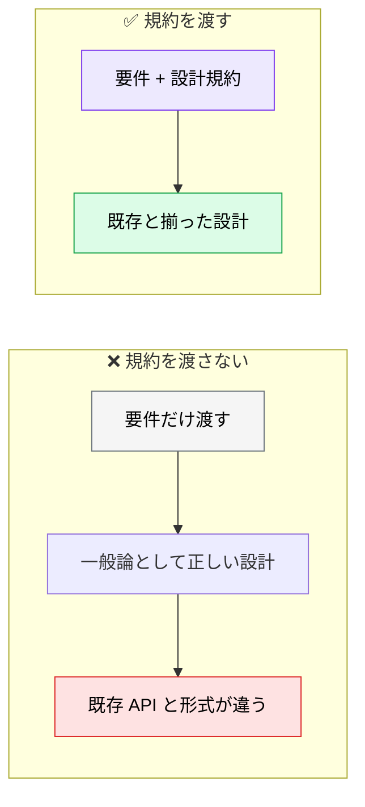
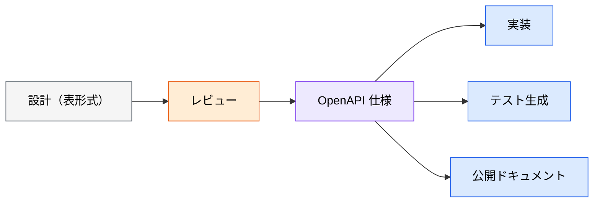

# API 設計（インターフェース設計）

> **この記事でわかること**：設計規約を先に渡す理由と、AI がやりがちな「動詞ベース URL」の是正。

## 結論

API 設計で AI に渡すべきものは要件だけではない。

> **設計規約（URL 形式・レスポンス構造・認証方式・ページネーション方式）を先に渡す。**

渡さないと、AI は一般的なパターンで書く。既存 API と形式が揃わず、クライアント側が両対応を強いられる。

そして最も頻出の是正がこれである。

> **AI が動詞ベースの URL（`/api/getUsers` 等）を提案したら修正する。** リソース指向（名詞ベース）を徹底する。

## 背景・課題

API は**一度公開すると変えにくい**。クライアントが依存するためである。

そして API 設計の良し悪しは「一般的に正しいか」ではなく「**このシステムの他の API と揃っているか**」で決まる部分が大きい。



## 具体的な方法

### 規約を先に渡す

```text
以下の機能要件からREST APIのエンドポイント設計を作成してください。

[機能要件]
- ユーザー登録・ログイン・プロフィール更新
- プロジェクトのCRUD
- タスクのCRUD（プロジェクトに紐づく）

[設計規約]
- URLパスはケバブケース（/api/v1/user-profiles）
- レスポンスは { data, error, pagination } 形式
- 認証はBearer Token
- ページネーションはcursor方式

[出力形式]
| メソッド | パス | 説明 | リクエストボディ | レスポンス | 認証 |
の表形式で出力してください。
```

**`[設計規約]` ブロックが要点である。** 4項目を渡すだけで、既存 API との整合性が大きく改善する。

### 規約を skills に切り出す

毎回プロンプトに書くのは非効率である。`.claude/skills/api-conventions/SKILL.md` に置く。

```markdown
---
name: api-conventions
description: プロジェクトの REST API 設計規約。エンドポイントの追加・変更時に参照する
---

# API 設計規約

- URL パスにはケバブケース（kebab-case）を使用すること
- JSON のプロパティにはキャメルケース（camelCase）を使用すること
- リストを返すエンドポイントには必ずページネーションを含めること
- URL パスに API のバージョンを含めること（/v1/, /v2/ など）
- エラーレスポンスは { error: { code, message, details } } 形式に統一すること
```

これで `@` 参照すら不要になる（→ [`../01_claude-code/04_skills.md`](../01_claude-code/04_skills.md)）。

### リソース指向を徹底する

AI は動詞ベースの URL を提案することがある。**訓練データに両方の例があるためである。**

| ❌ 動詞ベース | ✅ リソース指向 |
| --- | --- |
| `GET /api/getUsers` | `GET /api/v1/users` |
| `POST /api/createProject` | `POST /api/v1/projects` |
| `POST /api/deleteTask` | `DELETE /api/v1/tasks/{id}` |
| `POST /api/updateUserProfile` | `PATCH /api/v1/users/{id}` |

**規約に明記しておけば防げる。** 事後の修正より、規約で先に潰すほうが安い。

### 設計時に決めておくこと

要件だけでは決まらない項目がある。**AI に推測させない。**

| 項目 | 決めること |
| --- | --- |
| **冪等性** | `PUT` / `DELETE` を複数回呼んでも安全か |
| **エラーコード体系** | HTTP ステータス + アプリ固有コードの使い分け |
| **バージョニング** | URL パス / ヘッダー / どちらか |
| **ページネーション** | offset / cursor のどちらか |
| **部分更新** | `PUT`（全置換）か `PATCH`（部分更新）か |
| **レート制限** | 単位時間あたりの上限とレスポンスヘッダー |

**冪等性とエラーコード体系が最も抜けやすい。** そして実装後に変えるのが最も高くつく。

### OpenAPI として管理する

設計は表で作り、**確定したら OpenAPI に落とす**。



**OpenAPI を SSoT にする**と、実装・テスト・ドキュメントが同じ定義から導出される。Apidog MCP で参照させれば、実装との乖離も検知できる（→ [`../02_mcp/14_apidog.md`](../02_mcp/14_apidog.md)）。

## 実際のプロンプト例

```text
# 既存 API と揃える
新しい「クーポン適用」エンドポイントを設計して。

まず @src/api/orders/ の既存実装を読んで、
このプロジェクトの API 規約（URL形式・レスポンス構造・エラー形式・
ページネーション方式）を抽出して。

その規約に従って設計を作成して。
規約から外れる必要があると判断した場合は、実装せずに理由を報告して。
```

```text
# 決めきれていない項目を洗い出させる
この API 設計について、実装時に判断が必要になる項目を列挙して。

特に次を確認して：
- 冪等性（複数回呼んでも安全か）
- エラーコード体系（どのコードがどの条件で返るか）
- 部分更新の扱い（PUT か PATCH か）
- レート制限

決まっていないものは、私に確認する質問の形で提示して。
推測で埋めないで。
```

```text
# 動詞ベース URL の検出
@docs/basic_design/BASIC_DESIGN.md の API 仕様セクションを読んで、
リソース指向になっていないエンドポイントを検出して。

動詞ベース（getUsers / createProject など）になっているものを
リソース指向に書き換えた案を示して。
```

## 注意点

> **設計規約を先に渡す。** 渡さないと一般論で書かれ、既存 API と形式が揃わない。規約は skills に切り出して常設する。

> **動詞ベース URL を見逃さない。** AI は訓練データに両方の例があるため提案しうる。規約で先に潰す。

> **冪等性とエラーコード体系を先に決める。** 実装後の変更が最も高くつく2項目である。

> **設計は表で、確定後は OpenAPI で管理する。** 表は議論しやすく、OpenAPI は機械可読である。役割が違う。

> **API は一度公開すると変えにくい。** 設計レビューを厚くする価値が最も高い領域である。

## 参考リンク

- 関連：[`00_basic-design.md`](00_basic-design.md) — 基本設計の全体像
- 関連：[`../10_requirements/03_api-spec.md`](../10_requirements/03_api-spec.md) — Apidog での仕様作成
- 関連：[`../02_mcp/14_apidog.md`](../02_mcp/14_apidog.md) — 実装との差分検知
