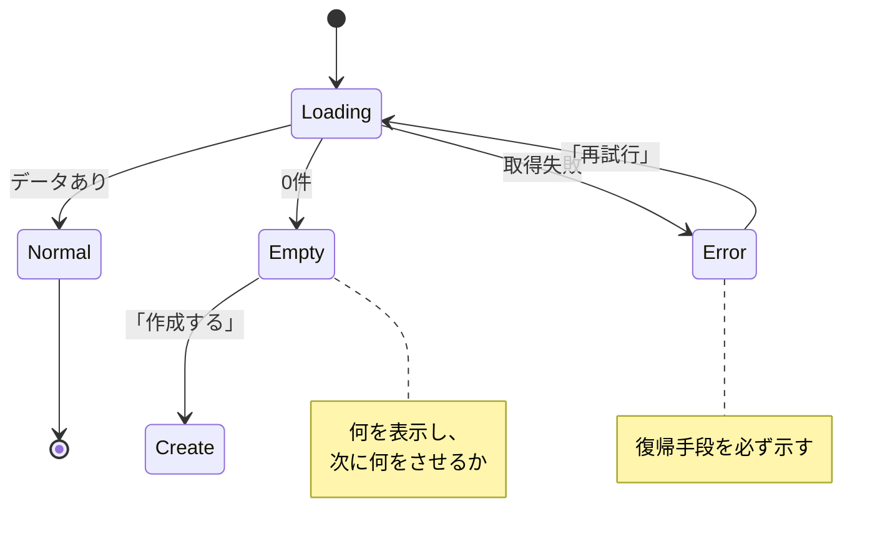
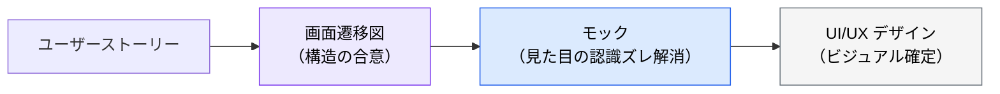

# 画面設計（画面遷移図・画面一覧）

> **この記事でわかること**：ユーザーストーリーから画面遷移図を生成させる方法と、基本設計で扱う範囲の線引き。

## 結論

基本設計での画面設計は**範囲を限定する**。

> **ワイヤーフレーム・画面遷移レベルまで。ビジュアルデザイン（色・タイポグラフィ・コンポーネント設計）は扱わない。**

線を引かないと、基本設計の段階でデザインの議論が始まり、構造の合意が遅れる。

そして画面遷移図で最も抜けるのがこれである。

> **エラー時の遷移を必ず含める。**

## 背景・課題

画面設計を「見た目の話」だと捉えると、基本設計の段階で色や余白の議論が始まる。しかしこのフェーズで決めるべきは**構造**である。

| 基本設計で決めること | 後のフェーズで決めること |
| --- | --- |
| 画面の一覧と役割 | 色・タイポグラフィ |
| 画面間の遷移とトリガー | コンポーネントの見た目 |
| 認証の要否 | インタラクションの詳細 |
| **エラー時の遷移** | アニメーション |

**構造が固まる前にビジュアルを作ると、後で全部やり直しになる。**

## 具体的な方法

### 画面遷移図の生成

```text
以下のユーザーストーリーから画面遷移図をMermaid stateDiagram-v2 記法で生成してください。

[ユーザーストーリー]
1. 未ログインユーザーがトップページにアクセス
2. ログインページでメール+パスワードまたはGoogleログイン
3. ダッシュボードでプロジェクト一覧を表示
4. プロジェクト詳細画面でタスク一覧を表示
5. タスク作成・編集モーダル
6. 設定画面でプロフィール編集

[含めるもの]
- 各画面の名前と主要アクション
- 遷移のトリガー（ボタン押下・URL直接アクセス等）
- エラー時の遷移（認証失敗→ログイン画面）
```

**`[含めるもの]` の3項目目が要点である。** 指定しないと正常系の遷移だけが描かれる。

### 画面一覧の生成

遷移図から表に落とす。**実装のタスク分割に直結する。**

```text
以下の画面遷移図から、画面一覧テーブルを作成してください。

[出力形式]
| # | 画面名 | URL | 主要機能 | 認証要否 | 備考 |
```

**「認証要否」の列が効く。** ここが曖昧なまま実装に入ると、認可漏れが生まれる。

### 必ず含める3つの状態

画面設計で最も抜けるのは、正常系以外である。

| 状態 | 決めること |
| --- | --- |
| **通常** | データがあるときの表示 |
| **空** | 0件のとき何を表示し、次に何をさせるか |
| **エラー** | 失敗時に何を出し、どう復帰させるか |



**「エラー時にリトライ手段がない」は実装後に必ず問題になる。** 設計段階で決めておく。

### 遷移のトリガーを明示する

「A画面 → B画面」だけでは実装できない。**何をしたら遷移するか**が要る。

| トリガーの種類 | 例 |
| --- | --- |
| ユーザー操作 | ボタン押下、リンククリック |
| 自動遷移 | 処理完了後のリダイレクト |
| **URL 直接アクセス** | ブックマーク・共有リンク |
| **認証状態の変化** | セッション切れ → ログイン画面 |

**下2つが抜けやすい。** 特に「URL 直接アクセス時に認証チェックが要るか」は実装で必ず問題になる。

### モックとの関係

画面遷移図は**構造**を、モックは**認識ズレの解消**を担う。



要件定義段階でモックを先に作る進め方もある（→ [`../10_requirements/04_mock-first.md`](../10_requirements/04_mock-first.md)）。**どちらを先にするかはプロジェクト次第**だが、構造とビジュアルを混ぜないことは共通である。

## 実際のプロンプト例

```text
# エラー遷移まで含めて生成させる
@docs/spec/SPEC.md のユーザーストーリーから、
画面遷移図を Mermaid stateDiagram-v2 で生成して。

必ず含めるもの：
- 各画面の名前と主要アクション
- 遷移のトリガー（ボタン押下 / 自動リダイレクト / URL直接アクセス）
- エラー時の遷移と復帰手段
- 認証切れ時の遷移

正常系だけの図にしないで。
```

```text
# 空状態・エラー状態の洗い出し
この画面遷移図に登場する各画面について、
「通常 / 空 / エラー」の3状態で何を表示すべきか整理して。

特に：
- 0件のときに次に何をさせるか
- エラー時にどう復帰させるか

決まっていないものは、私に確認する質問の形で提示して。
```

```text
# 認可漏れの検出
画面一覧テーブルの「認証要否」列を読んで、
認証が必要な画面に URL 直接アクセスされた場合の挙動が
仕様に書かれているか確認して。

書かれていない画面を一覧にして。
```

## 注意点

> **基本設計ではビジュアルを扱わない。** 色・タイポグラフィ・コンポーネント設計は UI/UX フェーズの範囲である。混ぜると構造の合意が遅れる。

> **エラー時の遷移を必ず含めさせる。** 指定しないと正常系だけの図になる。

> **「空状態」を決めておく。** 0件のときに何を表示し、次に何をさせるか。実装で最も揉める。

> **URL 直接アクセス時の挙動を決める。** 認可漏れの温床になる。

> **画面一覧は実装のタスク分割に直結する。** 「認証要否」列を必ず埋める。

## 参考リンク

- 関連：[`00_basic-design.md`](00_basic-design.md) — 基本設計の全体像
- 関連：[`../10_requirements/04_mock-first.md`](../10_requirements/04_mock-first.md) — モックによる合意
- 関連：[`../12_ui-ux/00_ui-draft-generation.md`](../12_ui-ux/00_ui-draft-generation.md) — ビジュアルデザイン
