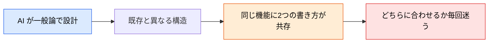

# 詳細設計（クラス設計・シーケンス図）

> **この記事でわかること**：基本設計と詳細設計の境界と、クラス設計で「既存パターンとの一貫性」を保つ方法。

## 結論

境界は **What と How** で切れる。

| 観点 | 基本設計（**What**） | 詳細設計（**How**） |
| --- | --- | --- |
| システム構造 | アーキテクチャパターン選定 | モジュール分割・クラス設計 |
| データ | ER 図・テーブル設計 | クエリ設計・インデックス最適化 |
| API | エンドポイント一覧・I/O 定義 | バリデーションロジック・エラーハンドリング |
| 画面 | 画面遷移図・ワイヤーフレーム | コンポーネント設計・状態管理 |

そして詳細設計で AI を使うときの要点はこれである。

> **クラス設計を AI に任せる際は、既存コードベースのパターンとの一貫性を重視する。**

## 背景・課題

詳細設計は実装の直前にある。**ここでの設計が既存と食い違うと、コードベースが分裂する。**

AI は一般論として正しい設計を出す。しかし「このプロジェクトではこう書く」という暗黙のパターンは知らない。



**対策は2つある。** 既存コードを `@` で渡すこと、そして `CLAUDE.md` にアーキテクチャ規約を書いておくことである。

## 具体的な方法

### 成果物一覧

`DETAIL_DESIGN.md` にセクション単位で統合する。

| 成果物 | 内容 | AI 活用ポイント |
| --- | --- | --- |
| クラス図 | モジュール構造・依存関係 | `classDiagram` で叩き台生成 |
| シーケンス図 | 処理フロー・API 間連携 | ユースケースから自動生成 |
| コンポーネント設計 | UI 部品の責務分割 | ディレクトリ構造の提案 |

### クラス図の生成

**基本設計の成果物を渡す**のが要点である。ER 図と API 設計から導出させる。

```text
以下のAPI設計とER図から、バックエンドのクラス図をMermaid classDiagram記法で生成してください。

[アーキテクチャ]
- レイヤードアーキテクチャ（Controller → Service → Repository）
- 言語：TypeScript

[含めるもの]
- 各クラスの主要メソッドとプロパティ
- クラス間の依存関係（継承・実装・依存注入）
- インターフェース定義

[ER図]
（ここに基本設計で作成したER図を貼る）

[API設計]
（ここにエンドポイント一覧を貼る）
```

**`[アーキテクチャ]` を明示する。** レイヤー構造を指定しないと、AI が独自の分割を提案する。

### ディレクトリ構造の提案

```text
以下の技術スタックとアーキテクチャ方針に基づいて、推奨ディレクトリ構造を提案してください。

[技術スタック]
- フロントエンド：Next.js App Router
- バックエンド：Express + Prisma
- テスト：Vitest + Playwright

[方針]
- Feature-based ディレクトリ構成（機能ごとにフォルダを分ける）
- 共有ユーティリティは /shared に集約
- テストファイルはソースファイルと同階層に配置

tree形式で出力し、各ディレクトリの役割をコメントで付記してください。
```

> **既存プロジェクトなら「提案」ではなく「既存構造の抽出」をさせる。** 新規提案は、既にあるものと必ず食い違う。

### シーケンス図の生成

処理フローを図にすると、**責務の偏り**が見える。1つのクラスに矢印が集中していれば、それは設計の問題である。

```text
以下のユースケースからシーケンス図をMermaid sequenceDiagram 記法で生成してください。

[ユースケース]
ユーザーがタスクを作成する

[含めるもの]
- 各レイヤー（Controller / Service / Repository / DB）の呼び出し順
- バリデーションが行われる位置
- エラー時の分岐（バリデーション失敗 / DB エラー）
- トランザクションの境界
```

**「トランザクションの境界」が抜けやすい。** どこで commit するかは実装で必ず問題になる。

### デザインパターンの提案

```text
以下のコードにデザインパターンを適用して改善案を提示してください。

[観点]
1. SOLID原則に違反している箇所の指摘
2. 適用すべきデザインパターン（Strategy / Factory / Observer等）の提案
3. リファクタリング前後のクラス図（Mermaid）

[コード]
（ここに対象コードを貼る）
```

> **パターンの適用は過剰設計になりやすい。** 「今この複雑さが必要か」を必ず併せて問う。AI は「適用できるパターン」を出すが、「適用すべきか」は判断しない。

### 既存パターンとの一貫性

2つの手段を併用する。

| 手段 | 効果 |
| --- | --- |
| **`@` で既存コードを渡す** | 具体的なパターンを示せる。最も確実 |
| **`CLAUDE.md` に規約を書く** | 毎回渡さなくてよい。常時効く |

```markdown
# アーキテクチャ (Architecture)

- API ルートは /src/api に、共有の型定義は /src/types に配置すること
- レイヤー構造は Controller → Service → Repository を厳守すること
- Controller から Repository を直接呼ばないこと
- /internal ディレクトリ内にあるものを、そのディレクトリ外から絶対にインポートしないこと
```

### 詳細設計をどこまでやるか

**全機能に詳細設計を書かない。** コストに見合わない。

| 対象 | 詳細設計 |
| --- | --- |
| コアなビジネスロジック | ✅ 書く |
| 複数チームが関わる連携部分 | ✅ 書く |
| 既存パターンの繰り返し（CRUD の追加等） | ❌ 不要 |
| UI の細部 | ❌ 不要 |

**「実装者が迷う箇所」だけ書く。** 迷わない箇所の設計書は読まれない。

## 実際のプロンプト例

```text
# 既存パターンを抽出させてから設計させる
まず @src/api/orders/ を読んで、このプロジェクトの
レイヤー構造・命名規則・エラーハンドリング方式を抽出して。

そのうえで、新しい「クーポン」機能のクラス設計を
同じパターンで作成して。

既存と異なる構造が適切だと判断した場合は、
実装せずに理由とともに提案して。
```

```text
# 責務の偏りを検出させる
このシーケンス図を見て、責務が偏っているクラスがないか確認して。

判定基準：
- 1つのクラスに呼び出しが集中していないか
- レイヤーを飛び越えた呼び出しがないか
- トランザクションの境界が適切か

問題があれば、分割案をクラス図で示して。
```

```text
# 過剰設計の検出
提案されたクラス設計に含まれる抽象化（インターフェース・
抽象クラス・ファクトリ等）を全て列挙して、
それぞれ「今この段階で必要か」を判定して。

実装が1つしかないインターフェースは、
削除した場合の構成も示して。
```

## 注意点

> **既存パターンとの一貫性を最優先する。** 一般論として正しい設計より、このプロジェクトで揃っている設計のほうが保守しやすい。

> **`CLAUDE.md` にアーキテクチャ規約を書く。** 毎回 `@` で渡すより確実で、実装フェーズでも効き続ける。

> **デザインパターンの提案は過剰設計になりやすい。** 「適用できるか」ではなく「適用すべきか」を問う。実装が1つしかないインターフェースは疑う。

> **全機能に詳細設計を書かない。** 実装者が迷う箇所だけに絞る。

> **トランザクションの境界を明示させる。** シーケンス図で最も抜けやすく、実装で最も問題になる。

## 参考リンク

- 関連：[`00_basic-design.md`](00_basic-design.md) — What を決めるフェーズ
- 関連：[`../01_claude-code/03_claude-md.md`](../01_claude-code/03_claude-md.md) — 規約の常設
- 関連：[`../14_code-review/01_design-review.md`](../14_code-review/01_design-review.md) — 設計レビュー
