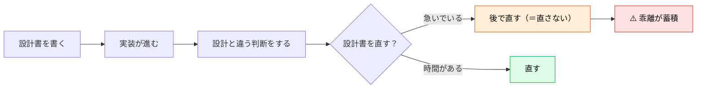
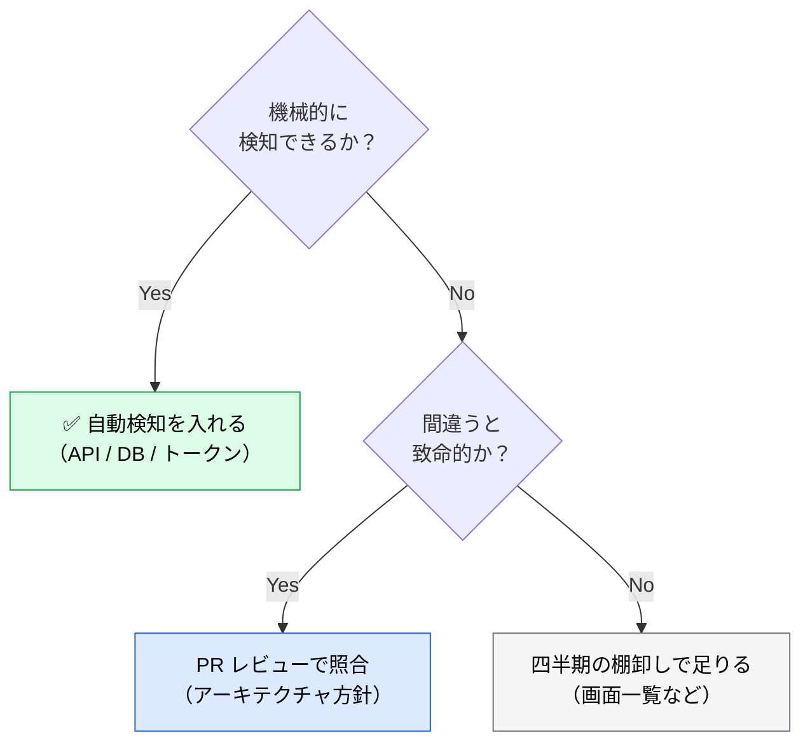

# 設計書を腐らせない仕組み

> **この記事でわかること**：実装が進むと設計書が最初に腐る理由と、それを検知する仕組み。

## 結論

設計書は**書いた瞬間から腐り始める**。放置すれば、実装と乖離した記録が残るだけになる。

> **「更新する」という運用に頼らない。「乖離を検知する」仕組みを作る。**

人間の善意で維持される文書は、忙しい時期に必ず止まる。

そして最も重要な判断がある。

> **設計書と実装が食い違ったとき、どちらが正かを AI に決めさせない。** 差分の提示までに留め、判断は人間が行う。

## 背景・課題

設計書が腐るのは、書き手が怠慢だからではない。**更新の動機がないから**である。



**AI 駆動開発ではこれが加速する。** 実装が速くなるぶん、設計書との乖離も速く広がる。

そして腐った設計書は、**AI に渡すと有害になる**。誤った前提でコードが生成される。

## 具体的な方法

### 最上位の打ち手は「生成する」

検知より強い手がある。**そもそも手書きをやめる。**

| 優先 | 打ち手 | 例 |
| --- | --- | --- |
| **①** | **生成する（腐りようがない）** | ER 図をスキーマから生成、API ドキュメントを OpenAPI から生成 |
| ② | 機械的に差分検知する | Apidog MCP、CI でのトークン差分 |
| ③ | レビューで AI に照合させる | 設計方針との整合 |
| ④ | 定期棚卸し | 画面一覧など |

> **決定的に生成できるものに、確率的な照合と継続コストをかけない。** 「AI で毎 PR 突き合わせる」仕組みを作る前に、「生成できないか」を検討する。

### 検知の仕組みを作る

「更新する」ではなく「**ずれたら分かる**」にする。

| 対象 | 検知方法 |
| --- | --- |
| **API 仕様 ↔ 実装** | Apidog MCP 等で差分検知。ただし**腐りきってから入れるツールではない**。まず一度**人手で初期同期を取ってから**差分検知に乗せる（→ [`../02_mcp/14_apidog.md`](../02_mcp/14_apidog.md)） |
| **ER 図 ↔ 実スキーマ** | **マイグレーションから生成**するのが理想。照合する場合は Postgres MCP を使う（**照合先はテスト DB。本番には繋がない** → [`../02_mcp/13_postgres.md`](../02_mcp/13_postgres.md)） |
| **デザイントークン ↔ コード** | CI で `tokens.json` を再生成して差分チェック |
| 設計方針 ↔ 実装 | PR レビューで AI に照合させる |

**上3つは機械的に検知できる。** 4番目だけが判断を要する。

### PR レビューに組み込む

最も継続しやすいのは、**既存のレビュー工程に混ぜること**である。

```text
この PR を @docs/basic_design/BASIC_DESIGN.md に照らして確認して。

出力：
| 項目 | 設計書の記述 | 実装 | 一致 |

食い違いがあれば列挙して。
ただし**どちらが正しいかは判断しないで**。差分と、それぞれの最終更新日だけ示して。
```

**「どちらが正か判断しない」を必ず入れる。** 実装のほうが正しく設計書が古いケースは多い。AI に決めさせると、もっともらしい理由で片方に寄せる。

### 更新のトリガーを決める

「気づいたら直す」では直らない。**イベントに紐づける。**

| トリガー | やること |
| --- | --- |
| **PR で設計との差分が検出された** | その PR で設計書も直す（後回しにしない） |
| **スプリントレビュー** | 検出された差分をまとめて棚卸し |
| 四半期 | 設計書全体を通読し、明らかに古い記述を削除 |

**1行目が最も効く。** 差分を作った PR で直すのが、最も文脈が残っている瞬間である。

### 「削除」を許容する

古い記述を**残したまま追記する**と、設計書は肥大化して読まれなくなる。

| ❌ | ✅ |
| --- | --- |
| 古い記述を残して「※現在は〜」と追記 | **古い記述を削除する** |
| 全ての決定を時系列で残す | 現在の姿だけを書く。経緯は ADR に |

> **設計書は「現在の姿」を書く。** 経緯は ADR（Architecture Decision Record）に分ける。両方を1つの文書に入れると、どちらも読まれなくなる（→ [`00_basic-design.md`](00_basic-design.md)）。

### 腐りやすい順に手を打つ

すべてを維持しようとしない。**腐りやすさと影響の大きさで優先する。**



### 設計書がない既存プロジェクトの入り口

**大半のプロジェクトは新規ではない。** 設計書がない状態から始める場合、いきなり全体を書かない。

| 段階 | 対象 |
| --- | --- |
| **1. 触る範囲だけ** | 今回変更する機能の現状を書き起こす |
| 2. 依存が集中する箇所 | 多くの機能が依存しているコア部分 |
| 3. 拡大 | 必要になった箇所から |

> **既存コードから文書を起こす具体的な手順**（意図を推測させない書き方、バグと仕様の切り分け）は [`../13_implementation/04_legacy-code.md`](../13_implementation/04_legacy-code.md) に集約している。

**設計書は「機能単位」で起こす。** 関数単位の書き起こしは実装フェーズの話であり、設計書は複数の実装をまたぐ責務の記述になる。

### 腐り具合を測る

放置していないかを機械的に見る。

| 指標 | 見方 |
| --- | --- |
| **設計書の最終更新日** | 対応する実装の最終更新日と比較。**`git log -1 --format=%cI -- <path>` で測る** |
| 検出された差分の件数 | 増えていれば運用が止まっている |
| 「要確認」の残数 | 減っていなければ調査が進んでいない |

**1行目が最も簡単で効く。** `docs/` の更新日が半年前なら、その設計書は信用できない。

> **⚠️ ファイルの mtime で測らない。** clone / checkout / CI 実行のたびにリセットされるため、**全ファイルが同じ日付になる**。必ず git のコミット日時で比較する。

## 実際のプロンプト例

```text
# 乖離の棚卸し
@docs/ 配下の設計書と、対応する @src/ の実装を突き合わせて、
食い違っている箇所を洗い出して。

出力：
| 設計書のファイル | 該当箇所 | 実装 | 最終更新日（設計 / 実装） |

どちらが正しいかは判断しないで。差分と更新日だけ示して。
更新日の差が大きいものから並べて。
```

```text
# 腐り具合の測定
docs/ 配下の各ファイルと、対応する src/ の
**git のコミット日時**（`git log -1 --format=%cI -- <path>`）を比較して。
**ファイルの mtime は使わないで。**

「設計書のほうが半年以上古い」ものを一覧にして。
それぞれ、実装側でどれくらいの変更があったかも添えて。
```

```text
# 古い記述の削除候補
@docs/basic_design/BASIC_DESIGN.md を読んで、
現在の実装と照らして「もう存在しない記述」を検出して。

- 削除された機能の記述
- 使われなくなったライブラリへの言及
- 変更前の構成を説明している箇所

削除案を diff で示して。実際の削除はまだしないで。
```

## 注意点

> **「更新する」運用に頼らない。** 人間の善意で維持される文書は、忙しい時期に必ず止まる。検知の仕組みを作る。

> **どちらが正かを AI に判断させない。** 実装が正しく設計書が古いケースは多い。差分の提示までに留める。

> **差分を作った PR で直す。** 後回しにすると、文脈が失われて直せなくなる。

> **古い記述は削除する。** 残したまま追記すると肥大化し、読まれなくなる。経緯は ADR に分ける。

> **既存プロジェクトでは全体を書かない。** 触る範囲から始める。網羅を目指すと着手できない。

> **設計書の最終更新日を見る。** 半年前なら信用しない。AI に渡す前に鮮度を確認する。

## 参考リンク

- 関連：[`00_basic-design.md`](00_basic-design.md) — ADR での経緯の記録
- 関連：[`../02_mcp/14_apidog.md`](../02_mcp/14_apidog.md) — API 仕様の差分検知
- 関連：[`../13_implementation/04_legacy-code.md`](../13_implementation/04_legacy-code.md) — 既存コードからの起こし方
- 関連：[`../14_code-review/01_design-review.md`](../14_code-review/01_design-review.md) — レビューでの照合
