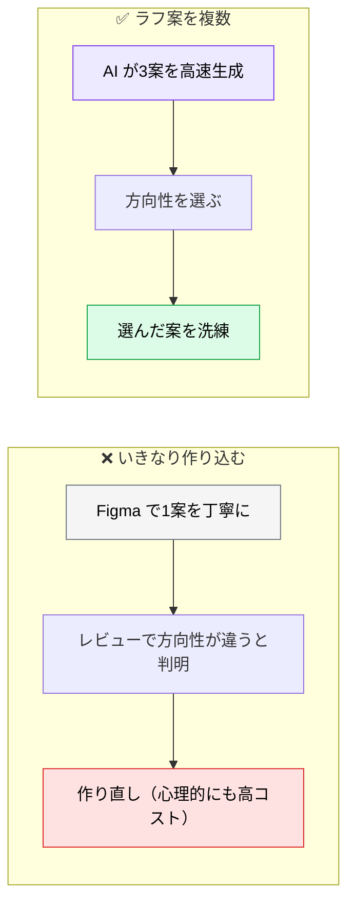
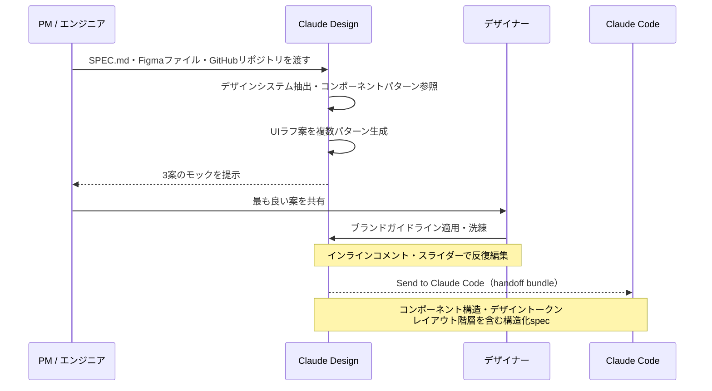

# AI による UI ラフ案の生成

> **この記事でわかること**：仕様書からいきなり Figma で作り込まない理由と、AI とデザイナーの分業点。

## 結論

> **仕様書からいきなり Figma で作り込むのではなく、AI に初期のラフ案を生成させてから、人間のデザイナーが洗練する。**

分業点は明確である。

| 担当 | 領域 |
| --- | --- |
| **AI** | **ブランド・コードベースに整合した UI の高速生成** |
| **人間のデザイナー** | ブランドの世界観やユーザー心理を踏まえた「**こだわり**」 |

AI は「それらしい画面」を速く出す。**そこから先の差別化は人間の仕事**である。

## 背景・課題

Figma で作り込んでからレビューすると、手戻りが高くつく。作り込むほど捨てにくくなり、判断が歪む。



**複数案を出せることが AI の価値である。** 人間が3案作るコストで、AI は10案出せる。

## 具体的な方法

### ツールの選択

| ツール | 特徴 | 推奨用途 |
| --- | --- | --- |
| **Claude Code + スクリーンショット** | HTML を生成 → ブラウザ表示 → スクショ撮影 → AI が自己評価 | **エンジニア主導のプロトタイピング** |
| **Claude Design** | Figma ファイルのインポートでデザインシステムを自動抽出。GitHub 連携で既存コンポーネントを参照。「Send to Claude Code」で handoff bundle 出力 | PM・デザイナー主導。**ブランド整合性とコード整合性を両立**したい場合 |

**エンジニアだけで方向性を決めるなら Claude Code で足りる。** HTML を生成してブラウザで見せれば、認識ズレは出る。

### ワークフロー



**handoff bundle で Claude Code へ直接引き渡せる**ため、モック → 実装の距離が短くなる。

### 生成させるプロンプト

```text
以下の仕様に基づいて、ダッシュボード画面のUIを3パターン設計してください。

仕様：@SPEC.md の「ダッシュボード画面」セクション
参照：インポートしたFigmaファイルのデザインシステム
参照：接続したGitHubリポジトリの既存コンポーネント
要件：
- サイドバーナビゲーション
- KPIカード（売上、ユーザー数、コンバージョン率）
- 直近7日間のチャートグラフ
- モバイルファースト設計

各パターンの設計意図（なぜそのレイアウトにしたか）も説明してください。
```

> **UI 操作はプロンプトに書かない。** 案が確定したら、**UI から Claude Code への引き渡し操作を人間が行う**。プロンプトに書いても実行されない。
>
> 機能名は本稿執筆時点（2026年8月）のものである。

**「設計意図も説明して」が要点である。** 意図が言語化されていないと、どの案を選ぶべきか判断できない。

### 既存資産を参照させる

AI に「ゼロから作らせない」ことが、実装コストを下げる。

| 参照させるもの | 効果 |
| --- | --- |
| **Figma のデザインシステム** | 色・タイポグラフィがブランドに揃う |
| **GitHub の既存コンポーネント** | **新規実装ではなく再利用**を選べる |

**2つ目が特に効く。** 「既存で足りるもの」と「新規作成が必要なもの」を分けさせれば、実装量が変わる。

### 生成の粒度

ラフ案の段階で作り込みすぎない。

| ❌ 作り込みすぎ | ✅ 適量 |
| --- | --- |
| 色・余白を詰める | レイアウトと情報構造だけ |
| 全画面を作る | 方向性が分かれる画面だけ |
| インタラクションを実装 | 静的な画面で足りる |

**目的は方向性の決定である。** 完成品ではない（→ [`../10_requirements/04_mock-first.md`](../10_requirements/04_mock-first.md)）。

## 実際のプロンプト例

```text
# Claude Code で軽量に複数案（エンジニア主導）
@docs/spec/SPEC.md の「注文履歴画面」から、
レイアウトの方向性が異なる3案を単一 HTML ファイルで作って。

各案について：
- 設計意図（なぜそのレイアウトか）
- 想定するユーザーの主な行動
- この案が不向きなケース

色や余白は詰めないで。情報構造の比較が目的。
```

```text
# 既存コンポーネントの再利用を優先させる
このモックを実装する前に、@src/components/ 配下に
流用できる既存コンポーネントがないか調べて。

「既存で足りるもの」「拡張が必要なもの」「新規作成が必要なもの」
の3分類で報告して。新規作成が最小になる案も併せて提示して。
```

```text
# 設計意図を言語化させる
生成された3案について、それぞれ次を明確にして。

- どのユーザー行動を最優先しているか
- 何を犠牲にしているか（トレードオフ）
- どういうプロダクトなら不向きか

「どれが良いか」は言わないで。選ぶのは私。
```

## 注意点

> **ラフ案は方向性を決めるためのもの。** 作り込むほど捨てにくくなり、判断が歪む。

> **設計意図を必ず言語化させる。** 「見た目が良い案」ではなく「意図が説明できる案」を選ぶ。

> **既存コンポーネントを参照させる。** ゼロから作らせると、実装量が無駄に増える。

> **Claude Design はトークン消費が大きい。** プランによっては利用制限がある。エンジニア間の合意なら Claude Code の HTML 生成で足りることが多い。

> **AI に「どれが良いか」を決めさせない。** 選択はブランド戦略とプロダクト方針の判断である。

## 参考リンク

- 関連：[`../10_requirements/04_mock-first.md`](../10_requirements/04_mock-first.md) — 要件定義でのモック活用
- 次に読む：[`01_design-review.md`](01_design-review.md) — 生成したデザインの評価
- 関連：[`04_design-tokens.md`](04_design-tokens.md) — 実装への引き渡し
