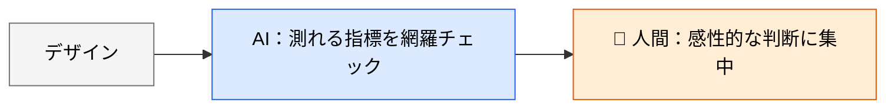
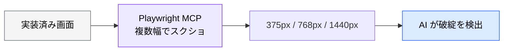

# AI によるデザインレビュー

> **この記事でわかること**：AI がチェックできる領域と、人間のデザイナーに委ねるべき領域の線引き。

## 結論

デザインレビューで AI が有効なのは、**機械的にチェック可能な指標**である。

> **コントラスト比・サイズ・一貫性といった測れる指標には強い。感性的な判断（ブランドとの適合性等）は人間のデザイナーに委ねる。**

役割は「人間のレビュー前に基本的な問題を除去するスクリーニング」である。

## 背景・課題

デザインレビューでは、指摘が2種類に分かれる。

| 種類 | 例 | 判定 |
| --- | --- | --- |
| **測れるもの** | コントラスト比が WCAG AA を満たすか | 機械的に判定できる |
| **測れないもの** | ブランドの世界観に合っているか | 人間の判断 |

**前者を人間が目視でチェックするのは非効率**である。しかも見落とす。AI に任せれば網羅的に検出できる。



## 具体的な方法

### レビュー観点とツール

| 観点 | AI がチェックできること | ツール |
| --- | --- | --- |
| **アクセシビリティ** | コントラスト比、ターゲットサイズ、代替テキストの有無 | **axe-core / Lighthouse**（測定）+ Claude（トリアージ） |
| **一貫性** | カラー・スペーシング・タイポグラフィがデザインシステムと一致しているか | Claude Code + Figma MCP |
| **ユーザビリティ** | Nielsen のヒューリスティクス（10原則）に基づく評価 | Claude（プロンプト） |
| **レスポンシブ** | モバイル / タブレット / デスクトップでのレイアウト破綻 | Playwright MCP |

**アクセシビリティが最も費用対効果が高い。** ただし**測定と判断を分ける**必要がある。

> **⚠️ 数値の実測を LLM にやらせない。** スクリーンショットからの色値抽出とコントラスト比計算は、**LLM が最も自信満々に外す領域の1つ**である。アンチエイリアス・半透明レイヤー・背景グラデーションがあると、人間でも目視では出せない。それらしい数値表が出てくるため、誰も疑わないまま未検証でリリースされる。

| 工程 | 担当 |
| --- | --- |
| **測定** | **axe-core / `@axe-core/playwright` / Lighthouse CI**（決定的ツール） |
| **トリアージ・優先度付け** | AI |
| **修正パッチの生成** | AI |
| **感性的な判断** | 👤 人間 |

**この分担にすると AI の価値も明確になる。** 検出結果は機械的に出るが、「どれから直すか」「この文脈で許容できるか」は判断が要る。CI への組み込みは [`../15_test/02_ci-integration.md`](../15_test/02_ci-integration.md) を参照する。

### レビュープロンプト

```text
添付したダッシュボード画面のスクリーンショットを、以下の観点でレビューしてください。

1. アクセシビリティ
   - コントラスト比は WCAG 2.1 AA（1.4.3：通常テキスト 4.5:1 / 大きいテキスト 3:1）を満たすか？
   - ターゲットサイズは WCAG 2.2 AA（2.5.8：24×24px）を満たすか？

2. ユーザビリティ（Nielsenの10原則）
   - 現在地の認識性（ユーザーが今どこにいるか分かるか）
   - エラー防止（操作ミスを防ぐUIになっているか）
   - 一貫性（同じ操作が同じ見た目で表現されているか）

3. 情報設計
   - 視線の流れ（Z/Fパターン）が自然か
   - 重要な情報が優先的に目に入る配置になっているか

問題点ごとに「深刻度（高/中/低）」と「具体的な改善案」を提示してください。
```

**「深刻度」を付けさせる**のが要点である。指摘に優先順位がないと、量が増えるほど読まれなくなる。

### レスポンシブ検証を自動化する

複数の画面幅でのレイアウト破綻は、Playwright MCP で機械的に検出できる。



**手動での確認は必ず漏れる。** 特にタブレット幅は見落とされやすい。

### AI に委ねないこと

| 領域 | なぜ人間か |
| --- | --- |
| **ブランドとの適合性** | 世界観は言語化しきれない |
| **感情的な体験** | 「気持ちよさ」は測れない |
| **戦略的な判断** | プロダクトの方向性に依存する |
| **文化的な適切さ** | 色やアイコンの意味は文化で変わる |

**AI が「問題なし」と言っても、デザイナーのレビューを省略しない。**

### 実装後の検証にも使う

デザインレビューは「デザインに対して」だけでなく、**実装に対しても**行う。

```text
実装した画面を Playwright MCP でスクリーンショットを撮って、
元のデザイン（Figma）と比較して。

差分を「余白 / 色 / タイポグラフィ / サイズ」に分類して列挙して。
デザイン側が誤っていると判断した場合は、修正せずに報告して。
```

視覚一致の検証ループは [`../15_test/03_vrt.md`](../15_test/03_vrt.md) を参照する。

## 実際のプロンプト例

```text
# アクセシビリティに絞ってレビュー
このスクリーンショットをアクセシビリティ観点だけでレビューして。

チェック項目と基準：
- コントラスト比：WCAG 2.1 AA（1.4.3）通常テキスト 4.5:1 / 大きいテキスト 3:1
- ターゲットサイズ：WCAG 2.2 AA（2.5.8）24×24px 以上
  ※ 44×44px は WCAG 2.1 AAA（2.5.5）および Apple HIG の推奨値
- 色のみに依存した情報伝達がないか（1.4.1）
- 本文フォントサイズ ※ WCAG の要件ではないが実務上の目安として 16px

**数値の実測は axe-core / Lighthouse の出力を貼るので、それを読んで判定して。**
スクリーンショットから色値やサイズを推測しないで。

各項目について「該当箇所」「基準」「判定」「修正案」を表で示して。
```

```text
# レスポンシブ破綻の検出
Playwright MCP で http://localhost:3000/dashboard を
375px / 768px / 1440px の3幅で開いてスクリーンショットを撮って。

各幅でレイアウトが破綻している箇所を検出して。
- はみ出し・横スクロールの発生
- テキストの重なり・切れ
- タップできないほど小さくなった要素

該当幅と該当要素を specific に示して。
```

```text
# 深刻度を付けさせる
このデザインレビューの指摘を、深刻度で3段階に分類して。

高：アクセシビリティ違反・操作不能・データ損失リスク
中：使いにくいが操作は可能
低：見た目の改善提案

「高」だけを先に、修正案とセットで提示して。
```

## 注意点

> **数値の実測は決定的ツールに任せる。** axe-core / Lighthouse で測り、AI は結果のトリアージに使う。スクリーンショットから数値を推測させない。

> **AI が「問題なし」と言ってもデザイナーのレビューを省略しない。** 測れない領域は判定できていない。

> **深刻度を必ず付けさせる。** 優先順位のない指摘は、量が増えるほど読まれなくなる。

> **WCAG の条項番号を確認してから使う。** ターゲットサイズ 44×44px は **AAA（2.5.5）** であり AA ではない。AA でターゲットサイズが入ったのは **WCAG 2.2 の 2.5.8（24×24px）**である。基準を取り違えると、監査で対応が取れなくなる。

> **文化依存の判断に注意する。** 色やアイコンの意味は文化で変わる。多言語展開するなら人間の確認が要る。

> **実装後の検証にも使う。** デザインと実装のズレは、視覚差分で機械的に検出できる。

## 参考リンク

- 関連：[`00_ui-draft-generation.md`](00_ui-draft-generation.md) — ラフ案の生成
- 関連：[`02_ux-auto-test.md`](02_ux-auto-test.md) — ペルソナ評価
- 関連：[`../15_test/03_vrt.md`](../15_test/03_vrt.md) — 視覚一致の検証
