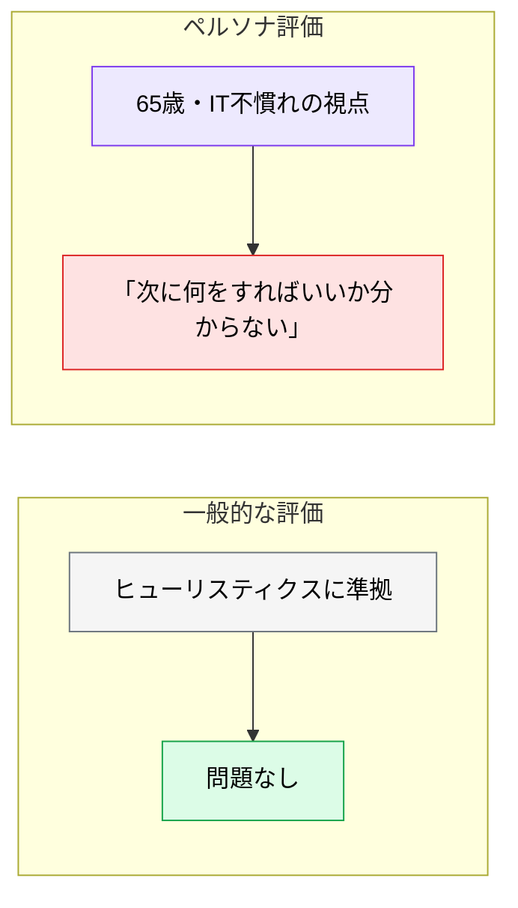
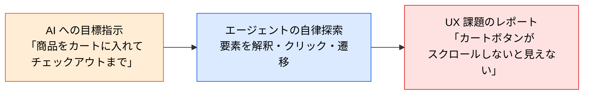
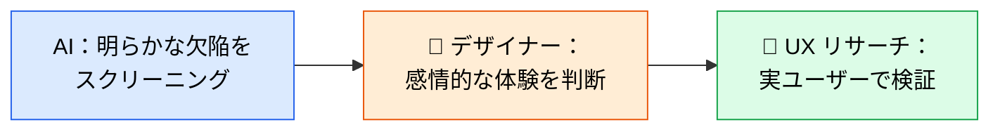

# UX 自動テストとペルソナ評価

> **この記事でわかること**：静的なスクリーンショット評価を超えて、AI に実際に操作させながら UX を評価させる方法。

## 結論

ペルソナ評価の目的は「正解を出すこと」ではない。

> **「AI の客観的な正解」ではなく「特定のユーザーにとっての摩擦（フリクション）」を発見するのが目的である。**

そして最も重要な前提がある。

> **AI によるレビューは「ヒューリスティック評価の自動化」と「ユーザーテスト前の明らかな欠陥の除去（スクリーニング）」である。** 最終的な意思決定・共感・戦略的判断は、人間のデザイナーと実際の UX リサーチに委ねる。

## 背景・課題

デザインレビューは「一般的に良いか」を見る。しかし実際のユーザーは一般人ではない。

- IT リテラシーが低い高齢者
- 急いでいるビジネスパーソン
- 片手でスマホを操作している人

**「一般的に良い UI」が、特定のユーザーには使えないことがある。** ペルソナ評価はこのズレを検出する。



## 具体的な方法

### ペルソナ駆動型 AI レビュー

特定のターゲットユーザーのコンテキストをプロンプトで定義し、**その視点で課題を抽出させる**。

```text
あなたは「ITリテラシーが低く、スマートフォンの操作に不慣れな65歳のユーザー」です。
提供されたスクリーンショット（会員登録画面）を見て、以下の観点で「あなたが感じる不安や迷い」をレビューしてください。

1. 次に何をすべきか直感的に理解できるか？
2. 入力項目の中に、専門用語や意味が分からない言葉はあるか？
3. エラーが起きたと仮定した場合、どうすれば直せるか理解できるか？

プロのデザイナーの視点ではなく、あくまで「このペルソナとしての率直な感想」と
「どこで操作をやめたくなるか（離脱ポイント）」を提示してください。
```

**「プロのデザイナーの視点ではなく」が要点である。** これがないと、AI は一般的なベストプラクティスの話に戻る。

### ペルソナの設計

抽象的なペルソナでは意味のある指摘が出ない。**具体的な制約を与える。**

| 抽象的 ❌ | 具体的 ✅ |
| --- | --- |
| 「初心者ユーザー」 | 「IT リテラシーが低く、スマホ操作に不慣れな65歳」 |
| 「忙しい人」 | 「移動中に片手でスマホを操作する営業職。30秒以内に用件を済ませたい」 |
| 「業務ユーザー」 | 「1日200件の申請を処理する経理担当。キーボードだけで完結させたい」 |

**「どこで操作をやめたくなるか」を必ず聞く。** 離脱ポイントが最も具体的な改善対象になる。

### 自律エージェントによる動的 UX テスト

静的なスクリーンショット評価の次段階として、**実際に操作させる**。



**静的な評価では出ない指摘が出る。**

| 静的評価で出るもの | 動的テストで出るもの |
| --- | --- |
| コントラスト比が低い | **スクロールしないとボタンが見えない** |
| ボタンが小さい | **エラーメッセージが専門的で解決方法が分からない** |
| 余白が不揃い | **戻るボタンで入力内容が消える** |

実装は Playwright MCP を使う（→ [`../15_test/04_exploratory-test.md`](../15_test/04_exploratory-test.md)）。

### 実行環境と停止条件

探索的テストと同じ制約が要る。

| 項目 | 設定 |
| --- | --- |
| 対象環境 | **ステージング**（本番では実行しない） |
| 外部影響 | 決済・メール送信は**無効化する** |
| **停止条件** | **時間と件数の両方で切る** |
| 出力形式 | 構造化して指定する |

**停止条件がないと止まらない。** アクセシビリティのスナップショットは1回で数千トークン規模になるため、コストが積み上がる。

### Human-in-the-Loop

AI は「規約への準拠」や「論理的な情報設計」の評価は得意だが、**最終的なユーザーの「感情的な体験」やプロジェクトの文脈を完全に理解することはできない**。



> **AI に全てを決定させない。** ユーザーテストの代替ではなく、**ユーザーテスト前のスクリーニング**として使う。実ユーザーに見せる前に、明らかな欠陥を除去するのが役割である。

### 複数ペルソナを並列で走らせる

1つのペルソナでは1つの視点しか出ない。**役割を分けて並列実行する**と網羅性が上がる（→ [`../04_multi-agent/02_persona-parallel-review.md`](../04_multi-agent/02_persona-parallel-review.md)）。

## 実際のプロンプト例

```text
# ペルソナ評価（具体的な制約を与える）
あなたは「移動中に片手でスマホを操作する営業職。30秒以内に用件を済ませたい」ユーザーです。

添付した経費申請画面を見て、次を率直に答えてください。

1. 30秒で申請を完了できそうか
2. 片手操作で届かない位置にある要素はあるか
3. どこで「後でやろう」と思ってやめるか

プロのデザイナーの視点ではなく、このペルソナとしての感想を書いてください。
「離脱ポイント」を最も重視して報告してください。
```

```text
# 動的 UX テスト（停止条件付き）
Playwright MCP で staging.example.com の
「新規登録 → 初回設定 → ダッシュボード到達」を実際に操作して。

観点：
1. 次に何をすべきか分からなくなる箇所
2. エラー時に復帰手段が示されない箇所
3. 5秒以上応答がない箇所

出力：問題ごとに { 深刻度, 発生箇所URL, 再現手順, 何に困ったか }
停止条件：30分経過、または5件見つかったら停止

決済・メール送信に至る操作は行わないで。
```

```text
# 複数ペルソナで並列評価
この画面を3つのペルソナで並列に評価して。各ペルソナは他の結果を参照しないで。

1. IT リテラシーが低い65歳（初回利用）
2. 1日200件処理する業務担当（キーボード操作中心）
3. 視覚に軽度の障害があり拡大表示を使う利用者

2人以上が指摘した項目を「高優先」として分類して。
1人のみの指摘も削除せず minority view として残して。
```

## 注意点

> **AI に全てを決定させない。** ユーザーテストの代替ではなく、その前のスクリーニングである。感情的な体験と戦略的判断は人間に委ねる。

> **ペルソナは具体的に定義する。** 「初心者ユーザー」では一般論に戻る。年齢・状況・制約・目的まで書く。

> **「プロのデザイナーの視点ではなく」を明示する。** これがないと AI はベストプラクティスの話に戻る。

> **停止条件を必ず指定する。** 時間と件数の両方で切らないと、コストが積み上がる。

> **本番環境で実行しない。** 意図的に異常な操作を試すため、実データへの副作用が読めない。

> **「離脱ポイント」を聞く。** 最も具体的で、最も改善に直結する指摘が出る。

## 参考リンク

- 関連：[`01_design-review.md`](01_design-review.md) — 静的なレビュー
- 関連：[`../15_test/04_exploratory-test.md`](../15_test/04_exploratory-test.md) — 探索的テスト
- 関連：[`../04_multi-agent/02_persona-parallel-review.md`](../04_multi-agent/02_persona-parallel-review.md) — 並列評価
