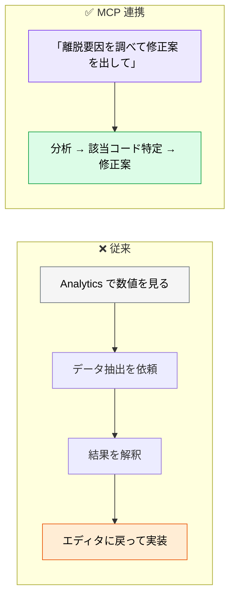
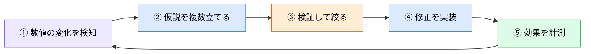

# 定量 UX・行動データ解析

> **この記事でわかること**：リリース後の行動データを AI に解析させ、そのまま改善コードまで繋げる方法。

## 結論

Analytics SaaS と AI の組み合わせで変わるのは**作業の担い手**である。

> **これまでデータサイエンティストが手動でデータを抽出・可視化していた作業を、AI が自然言語の対話を通して代行する。**

そして MCP を使うと、さらに一歩進む。

> **「本番環境のクリック率低下の原因」を探り、そのまま改善に向けたコードの修正案まで書かせられる。**

分析と実装の往復がなくなるのが最大の価値である。

## 背景・課題

リリース後の改善サイクルには断絶がある。



**ツール間の往復（コンテキストスイッチ）が消える。**

## 具体的な方法

### 主なツールと AI 活用法

| ツール | 特徴と AI の活用方法 |
| --- | --- |
| **Amplitude AI** | 「なぜコンバージョン率が下がったのか？」といった問いに対し、**AI が根本原因（Root Cause）を自動調査**してダッシュボードを生成。MCP サーバーを提供 |
| **Mixpanel AI** | SQL を知らなくても「過去30日間でカート落ちしたユーザーの共通点は？」と**自然言語で入力**するだけで、イベントデータとセッション動画からインサイトを生成 |
| **Hotjar AI / Contentsquare** | セッション録画から「最もフラストレーション（怒り・迷い・クリック連打）を感じている瞬間」を自動検出。NPS の自由記述を感情分析・カテゴリ分け |
| **GA4** | 過去の行動データから「7日以内の購入確率」「離脱確率」といった**予測的メトリクス**を自動算出 |

**Hotjar 系の「フラストレーション検出」が特徴的である。** 数値では見えない「怒り」の瞬間を、クリック連打などの行動から特定する。

### MCP を使ったインサイトループ

Amplitude などが提供する MCP サーバーと Claude Code を連携させると、**分析から改善コードまで一気通貫**になる。

```text
Amplitude MCP を使用して、直近1週間の「新規登録ボタン（signup_btn_click）」の
ファネル低下要因を調査してください。

特にモバイル環境での離脱が大幅に増えていれば、
@src/components/SignupForm.tsx のモバイルレイアウトの問題点を洗い出し、
クリック率を改善するための修正UIコードを提案してください。
```

**「〜であれば」という条件付きの指示**が効く。分析結果によって次のアクションが変わる場合、分岐を明示する。

### 分析と因果を混同しない

**最も注意すべき点である。** Analytics が示すのは相関であって因果ではない。

| ❌ | ✅ |
| --- | --- |
| 「モバイルの離脱が増えた → レイアウトが原因」 | 「モバイルの離脱が増えた。**考えられる要因を複数挙げて、検証方法も示して**」 |

AI は「もっともらしい原因」を1つ出しがちである。**複数の仮説と検証方法を出させる。**

```text
離脱率の変化について、考えられる要因を複数挙げて。
それぞれについて「この仮説が正しいなら他に何が観測されるはずか」も示して。

1つに断定しないで。
```

### 改善のループを閉じる

分析 → 修正で終わらせない。**効果を測るところまでを1セットにする。**



**⑤を飛ばすと、改善したかどうかが分からない。** 修正前の数値を必ず記録しておく。

### データの扱い

行動データには個人情報が含まれうる。

| 注意 | 対応 |
| --- | --- |
| **個人を特定できるデータ** | 集計値・セグメント単位で取得させる |
| **セッション録画** | 個別視聴ではなく AI の要約を使う |
| **取得範囲** | 期間とセグメントを必ず指定する |
| **権限** | 読み取り専用のスコープで接続する |

**「全ユーザーのデータを取得して」と指示しない。** コンテキストを圧迫するうえ、不要な個人情報が載る。

## 実際のプロンプト例

```text
# 仮説を複数出させる
Analytics MCP で直近2週間の新規登録ファネルを取得して、
離脱が増えているステップを特定して。

そのうえで、離脱増加の要因として考えられる仮説を3つ以上挙げて。
各仮説について：
- その仮説が正しいなら他に何が観測されるはずか
- どうすれば検証できるか

1つに断定しないで。「最も可能性が高い」という表現も避けて。
```

```text
# 分析から修正案まで
モバイルでの登録完了率が先週比で15%低下している。

1. Analytics MCP で、低下が始まった時期と該当セグメントを特定して
2. その時期の直近のデプロイ履歴と照合して
3. 関連しそうなコード変更があれば、@src/ から該当箇所を特定して
4. 修正案を提示して

ただし因果を断定しないで。「時期が一致する変更」として報告して。
```

```text
# 効果測定の準備
これから登録フォームの改善を実装する。

事前に測っておくべき指標と、その現在値を Analytics MCP で取得して。
改善後に比較できる形で記録して。

「どれだけ改善したら成功か」の基準も一緒に決めたいので、
判断材料を提示して。
```

## 注意点

> **相関と因果を混同しない。** Analytics が示すのは相関である。AI は「もっともらしい原因」を1つ出しがちなので、**複数の仮説と検証方法を出させる**。

> **修正前の数値を記録する。** 効果測定ができなければ、改善したかどうかも分からない。

> **取得範囲を必ず指定する。** 期間・セグメントを絞らないと、コンテキストを圧迫し、不要な個人情報が載る。

> **個人を特定できるデータを避ける。** 集計値・セグメント単位で扱う。セッション録画は AI の要約を使う。

> **`@サーバー名` はサーバー指定の記法ではない。** Claude Code の `@` はファイル参照が基本である。MCP は「Amplitude MCP を使って」と平文で書けばよい（→ [`../02_mcp/01_setup.md`](../02_mcp/01_setup.md)）。

> **読み取り専用で接続する。** Analytics の設定変更を AI に任せる理由はない。

> **予測メトリクスを鵜呑みにしない。** 「7日以内の購入確率」は過去データからの推定である。前提が変われば外れる。

## 参考リンク

- 関連：[`02_ux-auto-test.md`](02_ux-auto-test.md) — 定性的な評価
- 関連：[`../21_cicd-ops/02_aiops-monitoring.md`](../21_cicd-ops/02_aiops-monitoring.md) — 運用側の監視
- 関連：[`../02_mcp/`](../02_mcp/) — MCP の設定
