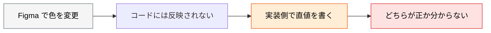
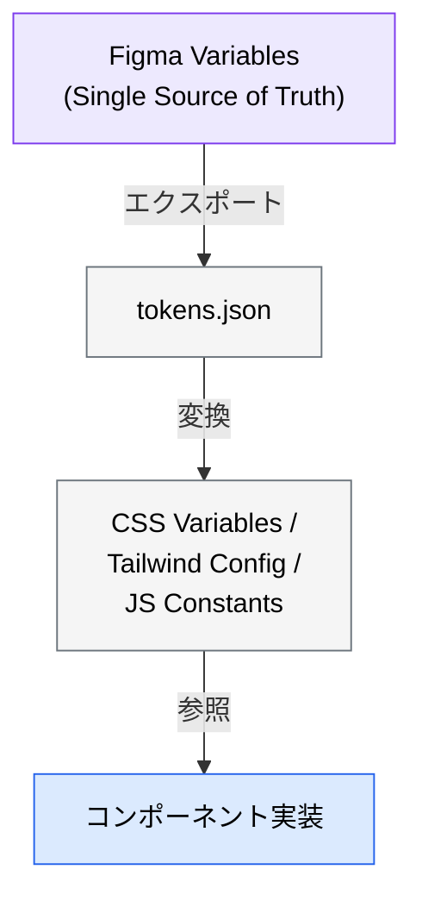
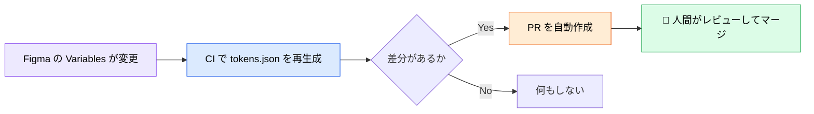

# デザイントークンワークフロー

> **この記事でわかること**：デザインとコードの乖離を構造的に防ぐ方法と、トークンを一方向に流す理由。

## 結論

デザイントークンの運用は1点に尽きる。

> **Figma Variables を Single Source of Truth とし、コードへ一方向に流す。**

双方向に編集すると必ず乖離する。そして乖離したトークンは、**どちらが正か誰も分からなくなる**。

さらに継続的に保つには仕組みが要る。

> **デザイントークンを Git で管理し、Figma の変更を自動的にコードに反映する CI/CD パイプラインを構築する。**

## 背景・課題

デザインとコードの乖離は、時間とともに必ず進行する。



**原因は「手で同期している」ことである。** 人間が同期する限り、必ずどこかで漏れる。

## 具体的な方法

### トークンの流れ



**矢印が一方向であることが要点である。** コード側から Figma へ戻す経路を作らない。

### 前提と引き渡しは MCP カタログに集約

**Figma ファイルの準備要件**（Variables・Auto Layout・意味のあるレイヤー名）、**トークンのエクスポート手順**、**実装への引き渡しプロンプト**は [`../02_mcp/30_figma.md`](../02_mcp/30_figma.md) に集約している。本記事では扱わない。

本記事では、**トークンを組織として維持する仕組み**に絞る。

### 直値を書かせない

トークン運用が崩れる最大の原因は、**実装側で直値を書くこと**である。

| ❌ | ✅ |
| --- | --- |
| `color: #3B82F6` | `color: var(--color-primary)` |
| `padding: 16px` | `padding: var(--spacing-md)` |
| `font-size: 14px` | `text-sm`（Tailwind のトークン） |

`CLAUDE.md` に明記して常時効かせる。

```markdown
# デザイントークン

- 色・余白・フォントサイズに直値を書かないこと
- 必ず @tokens.json から生成された変数を参照すること
- トークンに存在しない値が必要な場合は、実装せずにデザイナーに確認すること
```

**最後の1行が効く。** トークンにない値を実装者が勝手に足すと、デザインシステムが壊れる。

### CI で乖離を検知する

手で同期しない。**変更を検知する仕組みを作る。**



**自動マージにしない。** トークンの変更は全画面に影響する。人間のレビューを挟む。

### 視覚一致の検証と組み合わせる

トークンが揃っていても、実装が意図どおりとは限らない。**スクリーンショットで検証する**（→ [`../15_test/03_vrt.md`](../15_test/03_vrt.md)）。

| 検証 | 対象 |
| --- | --- |
| トークンの一致 | 色・余白の**値** |
| 視覚一致 | 実際の**見え方** |

**両方要る。** 正しいトークンを使っていても、適用箇所を間違えれば見た目は崩れる。

## 実際のプロンプト例

```text
# トークン化されていない直値を検出
@src/components/ 配下を読んで、デザイントークンを使わずに
直値で書かれている箇所を全て検出して。

対象：色（#hex / rgb）/ 余白（px）/ フォントサイズ / border-radius

各箇所について「対応するトークンがあるか」も判定して。
- トークンがある → 置き換え案を示す
- トークンがない → デザイナーに確認すべき項目としてリストにする
```

```text
# トークンの同期状況を確認
Figma MCP で最新の Variables を取得して、
現在の @tokens.json と差分を比較して。

差分を「追加 / 変更 / 削除」に分類して。
「削除」については、コード側で参照されている箇所も洗い出して。
まだファイルは更新しないで。
```

```text
# 実装後の視覚検証
@src/components/ProductCard.tsx を実装した。

Playwright MCP でレンダリングしてスクリーンショットを撮り、
Figma のデザインと比較して。

差分を「余白 / 色 / タイポグラフィ / サイズ」に分類して列挙して。
差分がトークンの誤用によるものか、適用箇所の間違いかも判定して。
修正は最大3回のループまで。
```

## 注意点

> **トークンは一方向に流す。** Figma → コードの方向を SSoT とし、コード側で直値を書かない。双方向に編集すると必ず乖離する。

> **Figma ファイルが整っていないと機能しない。** Variables・Auto Layout・意味のあるレイヤー名が前提である。MCP を入れる前にデザイナーと合意する。

> **「トークンにない値が必要なら確認する」を規約に入れる。** 実装者が勝手に足すと、デザインシステムが壊れる。

> **トークン変更を自動マージしない。** 全画面に影響する。人間のレビューを挟む。

> **トークンの一致と視覚一致は別物である。** 正しいトークンでも適用箇所を間違えれば崩れる。両方検証する。

> **公式 Figma MCP のライセンス条件を確認する。** リモート版は座席を問わず接続できるが、実務に耐えるレート制限を得るには Dev / Full シートが事実上必要になる。

## 参考リンク

- 関連：[`../02_mcp/30_figma.md`](../02_mcp/30_figma.md) — Figma MCP の設定
- 関連：[`../15_test/03_vrt.md`](../15_test/03_vrt.md) — 視覚一致の検証
- 関連：[`00_ui-draft-generation.md`](00_ui-draft-generation.md) — ラフ案からの引き渡し
