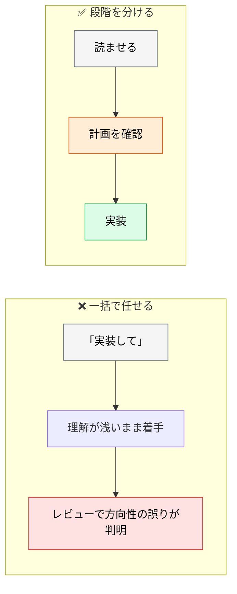
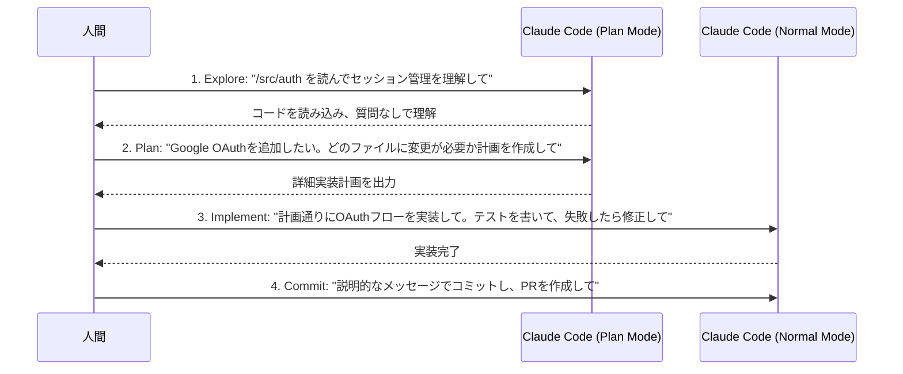

# 実装フェーズの進め方

> **この記事でわかること**：Explore → Plan → Implement → Commit の4ステップと、Plan Mode を使うべき場面の判断。

## 結論

実装は**段階を分ける**。1つのプロンプトで全部やらせない。

> **Explore（読む）→ Plan（計画）→ Implement（実装）→ Commit** の4ステップに分ける。

そして Plan Mode は常に使うものではない。

> **Plan Mode が必要なのは、変更が複数ファイルにまたがる場合、アプローチが不確かな場合、慣れていないコードを扱う場合。1文で差分を説明できるタスクは Plan をスキップしてよい。**

## 背景・課題

「機能を実装して」の一言で任せると、AI は理解が浅いまま書き始める。**書いてから方向性の誤りが判明する**のが最も高い手戻りになる。



**計画の段階なら修正が安い。** コードになってから直すのは高い。

## 具体的な方法

### 4ステップ



**②で人間が計画を確認する。** ここが最も安く誤りを直せる地点である。

### Plan Mode の判断

| 状況 | Plan |
| --- | --- |
| 変更が複数ファイルにまたがる | ✅ 使う |
| アプローチが不確か | ✅ 使う |
| 慣れていないコードを扱う | ✅ 使う |
| **1文で差分を説明できる** | ❌ **スキップ** |

**「タイポを直す」に計画は要らない。** 時間とトークンの無駄になる。

### コンテキスト効率化

読ませる範囲を絞ると、精度が上がりコストも下がる。

```bash
# ファイルを直接参照（AI に探させない）
> @./src/auth/session.ts をレビューして

# 2ファイルを比較させる
> @./old.js と @./new.js の実装を比較して

# 標準入力からデータを渡す
cat error.log | claude -p "このエラーの原因を分析して"

# git 履歴から背景を調べさせる
> ExecutionFactory の git 履歴を確認し、API がどう進化したか要約して
```

**`@` で対象を指定する**のが基本である。指定しないと AI が探索し、その過程がコンテキストを埋める。

### 調査をオフロードする

重い調査はサブエージェントに外注する。メインのコンテキストを汚さない。

```text
サブエージェントを使用して、現在の認証システムがトークンの更新（リフレッシュ）を
どのように処理しているか調査してください。
また、再利用できる既存の OAuth 関連ユーティリティがないか確認してください。
結果は「該当ファイル一覧」と「処理フローの要約3行」の形式で返してください。
```

**出力形式を固定する。** 形式がばらつくと、次のステップで使えない（→ [`../01_claude-code/05_sub-agents.md`](../01_claude-code/05_sub-agents.md)）。

### 1セッション1課題

複数の課題を1セッションに混ぜない。**PR も自然に小さくなる。**

| ❌ | ✅ |
| --- | --- |
| 1セッションで「認証修正 → UI 調整 → テスト追加」 | 課題ごとに `/clear` して切り分ける |
| 調査も実装もメインでやる | 調査はサブエージェント、実装はメイン |

コンテキスト使用率が 60〜70% 程度（経験則の目安）を超えたらセッションを切り替える（→ [`../01_claude-code/10_context-management.md`](../01_claude-code/10_context-management.md)）。

### Writer / Reviewer パターン

実装セッションとレビュー専用セッションを分けると、**レビュー側が実装時の文脈に引きずられにくくなる**。

| 手順 | セッション | やること |
| --- | --- | --- |
| 1 | **Writer** | 機能を実装させる |
| 2 | **Reviewer** | 実装後のファイルを指定してレビューさせる |
| 3 | **Writer** | Reviewer の出力を**そのまま貼り付けて**修正を依頼 |

手順3では `[レビュー結果]` のようなプレースホルダではなく、**実際のレビュー本文をコピーして渡す**。

> **コスト注意**：2つの独立したセッションを使うため、トークン消費が実質2倍になる。**コアロジックやセキュリティが重要なファイルに限定**する。

### 非対話モードでの自動化

```bash
# 非インタラクティブモード（CI/CD向け）
claude -p "すべてのLintエラーを修正して" --permission-mode acceptEdits

# ファイル一括処理
for file in $(cat files.txt); do
  claude -p "$file をReactからVueに移行して。結果としてOKかFAILを返して。" \
    --allowedTools "Edit,Bash(git commit *)"
done

# 構造化出力
claude -p "すべてのAPIエンドポイントをリストアップして" --output-format json
```

> **⚠️ 一括処理は必ず作業ブランチで実行する。** 上の `for` ループは失敗しても最後まで走り、壊れた変換がコミットとして積み上がる。次を守る。
>
> - 専用ブランチを切ってから実行する
> - **まず1ファイルで検証**してから全件に広げる
> - 失敗時に `break` する、または件数上限を設ける

> **`--permission-mode` の値は `default` / `acceptEdits` / `plan` / `bypassPermissions` である。** すべての確認を飛ばす `bypassPermissions`（および `--dangerously-skip-permissions`）を使う場合、最低限**次の3点をセットにする**。
>
> | 対策 | 内容 |
> | --- | --- |
> | **隔離実行** | devcontainer / 使い捨てコンテナで実行する |
> | **ネットワーク遮断** | `--network none`、または egress の許可リストに限定 |
> | **認証情報を渡さない** | `.env` や認証情報をマウントしない |
>
> 「隔離環境で使え」だけでは守られない。**具体を決めていないなら使わない。**

## 実際のプロンプト例

```text
# ① Explore（変更させない）
@src/auth を読んで、現在のセッション管理の仕組みを理解して。
まだ何も変更しないで。理解した内容を5行で要約して。
```

```text
# ② Plan（計画だけ）
Google OAuth を追加したい。
どのファイルにどんな変更が必要か、計画を作成して。

含めるもの：
- 変更するファイルと変更内容
- 新規作成が必要なファイル
- 既存の挙動への影響
- 判断が必要で私に確認すべき点

実装はまだしないで。
```

```text
# ③ Implement（検証手段つき）
計画どおりに実装して。

制約：
- 変更してよいのは計画に挙げたファイルのみ
- 実装後に npm test を実行して、失敗したら根本原因を直して
- テストを緩めて通すことはしないで
- 計画になかった判断が必要になったら、実装を止めて質問して
```

## 注意点

> **Plan Mode を常用しない。** 1文で差分を説明できるタスクで計画を挟むのは無駄である。

> **`@` で対象を指定する。** 指定しないと AI が探索し、その過程でコンテキストが埋まる。

> **計画の段階で確認する。** コードになってから直すより、計画を直すほうが圧倒的に安い。

> **1セッション1課題を守る。** PR が自然に小さくなり、レビューが機能する。

> **`bypassPermissions` をローカルで常用しない。** 上記3点の隔離が用意できない環境では使わない。

## 参考リンク

- 関連：[`../01_claude-code/00_what-is-claude-code.md`](../01_claude-code/00_what-is-claude-code.md) — Claude Code の基礎
- 関連：[`02_tdd.md`](02_tdd.md) — テストファーストで進める
- 関連：[`../01_claude-code/10_context-management.md`](../01_claude-code/10_context-management.md)
