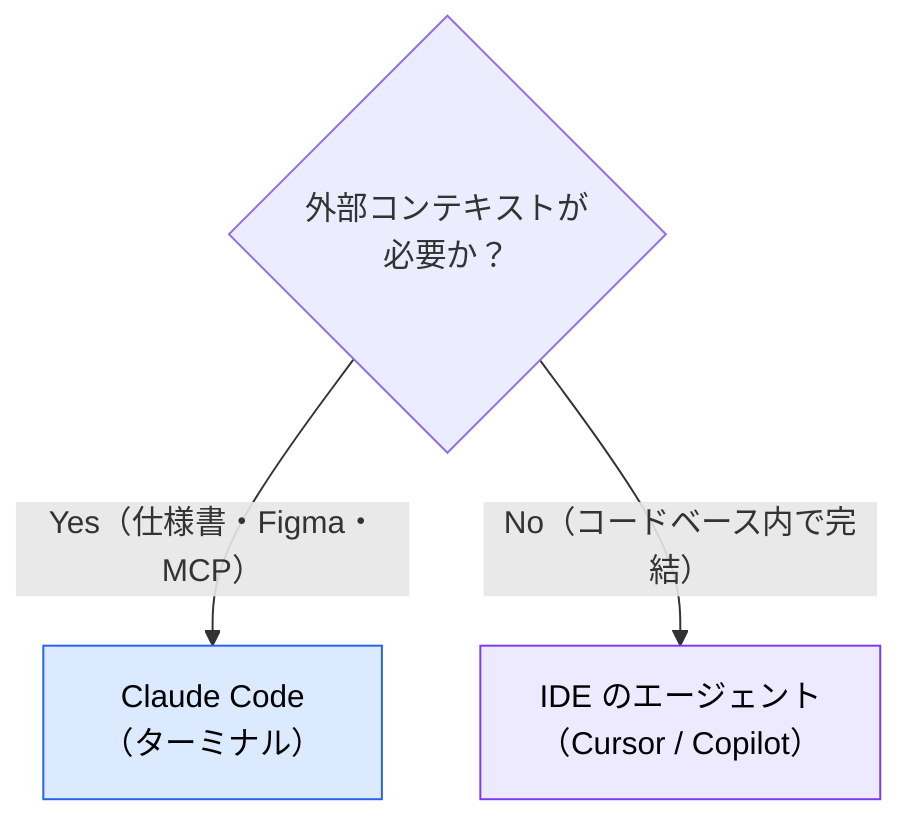
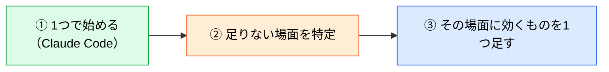

# AI コーディングツールの比較と使い分け

> **この記事でわかること**：ツールを「形態」で分類する軸と、Claude Code との境界線の引き方。

## 結論

ツール選定は**やりたいこと**で決まる。

| やりたいこと | ツール |
| --- | --- |
| **エディタ内で作業したい** | Cursor v3 / VS Code + Copilot / Windsurf 2.0 / Zed AI |
| **ターミナルで完結させたい** | Claude Code / OpenAI Codex CLI / Antigravity CLI |
| **エージェント群を管理したい** | Antigravity 2.0（デスクトップ）/ Cursor Cloud Agents / Copilot Workspace |
| **課金を定額に抑えたい** | シート課金型（Cursor / Copilot / Windsurf） |
| **クラウド完結で自律実行したい** | Devin 2.0 |

そして Claude Code との境界線は明確に引ける。

> **仕様書や Figma を読み込んで外部要件からコードを作るタスクは Claude Code。エディタ内のコンテキストだけで完結する作業は IDE のエージェント。**

## 背景・課題

複数のツールを併用すると「どれをいつ使うか」が曖昧になる。全部で同じことをしようとすると、どれも中途半端になる。

**分ける軸は「外部コンテキストが要るか」である。**



> **MCP を IDE に大量接続しない。** ツール定義がエディタ側のコンテキストを圧迫し、本来の補完・レビューまで劣化する。**重い外部接続は Claude Code に寄せる**（→ [`../02_mcp/02_tool-reduction.md`](../02_mcp/02_tool-reduction.md)）。

## 具体的な方法

### 課金モデルで見る

ツール選定では**形態と同じくらい課金モデルが効く**。稟議で必ず聞かれる。

| モデル | 例 | 特徴 |
| --- | --- | --- |
| **シート課金型** | Cursor / GitHub Copilot / Windsurf | 定額で**予測可能**。人数が増えると線形に増える |
| **従量課金型** | Cline（自前 API キー）/ Claude Code の API 利用 | 初期費用ゼロだが**変動する**。**上限設定が前提** |
| **ハイブリッド** | Devin（月額 + 従量の ACU） | 基本料 + 使った分 |

> **「Cline は OSS だから安い」は必ずしも正しくない。** 自前 API キーの従量課金は、**エージェント的な使い方をするとシート型を上回ることが多い**。初期費用がゼロなだけで、月末の請求で驚くことがある。**予算上限の設定を前提にする。**

> 価格は変動が速いため本記事には数値を書かない。**稟議前に各サービスの公式料金ページで確認する。**

### 形態による分類

| 形態 | 代表 | 得意なこと |
| --- | --- | --- |
| **CLI エージェント** | Claude Code / Codex CLI / Antigravity CLI | 外部コンテキストを伴う実装、CI 組み込み |
| **AI 内蔵エディタ** | Cursor v3 / Windsurf 2.0 / Zed AI | エディタ内の局所変更、差分確認 |
| **IDE 拡張** | VS Code + Copilot | インライン補完、PR レビュー |
| **エージェントオーケストレーター** | Antigravity 2.0 | 独立した長期タスクの並列管理 |
| **クラウド自律エージェント** | Devin 2.0 | 定型的・反復的タスクの委譲 |

### Cursor v3

**エディタ内の局所作業**で真価を発揮する。

> 以下は**本稿確認時点（2026年8月）**の機能名である。コマンド名は変わりやすいため、実際の名称はアプリ内で確認する。

| 機能 | 内容 |
| --- | --- |
| **サブ会話の並行実行**（Side Chat） | メイン会話を中断せずサブ質問・調査を並行実行 |
| **Cloud Agents** | 隔離クラウド VM で自律動作、複数リポジトリを並列処理 |
| **Agent Window** | 複数エージェントを並行実行。メインのコンテキストを汚さない |
| **JetBrains 対応** | IntelliJ・PyCharm・WebStorm 上で動作 |

> **Composer は「既存クラスの全ファイルリネーム」「使われていない変数の削除」など、コードベース内部のコンテキストだけで完結する作業**に専念させると、ハルシネーションなく最も力を発揮する。

**1セッション1タスクの原則**は Claude Code と同じである。機能実装やバグ修正が終わったら新しい Composer を開き直す。

### GitHub Copilot

複数エージェントにタスクを並列アサインできる GitHub ネイティブな作業スペースが提供されている。

> **GitHub のエージェント機能は再編が続いている。** 製品名と提供状態（プレビュー / GA）は変動が速いため、**現行の名称と提供形態は公式ドキュメントで確認する。**

インライン補完と PR レビューが主戦場である（→ [`../20_github-claude/03_auto-review.md`](../20_github-claude/03_auto-review.md)）。

### Antigravity 2.0

2026年5月に **IDE ではなくエージェントオーケストレーション専用のデスクトップアプリ**に再定義された。混同しやすいので整理する。

| サーフェス | 形態 | 主な用途 |
| --- | --- | --- |
| **Antigravity 2.0** | デスクトップアプリ | エージェント並列起動・監視・スケジュール実行 |
| **Antigravity IDE** | VSCode fork | 従来のコードエディタ体験（1.x 継続） |
| **Antigravity CLI** | Go 製 CLI | ターミナルからのエージェント操作 |
| **Antigravity SDK** | Python ライブラリ | カスタムエージェント構築 |

> **2.0 は「エディタ作業」ではなく「AI チームの管理」に最適化されている。** エディタ内で細かく編集したい場合は別のツールを併用し、長期・独立タスクを 2.0 に投げるハイブリッド運用になる。

### Devin 2.0

**クラウド上の VM で独立して動く自律型エージェント**である。ローカルのエディタで動く AI とは性質が違う。

| 項目 | Claude Code / Cursor | Devin |
| --- | --- | --- |
| 動作場所 | ローカル PC（エディタ内） | **クラウド VM** |
| 操作方法 | エディタのチャット画面 | **Slack / Web UI** |
| 得意なタスク | 設計判断を伴う実装 | **定型的・反復的タスク** |
| 人間の関与 | リアルタイムで対話 | 完了後に PR をレビュー |
| AI ゲートウェイ | 経由可能 | **経由不可**（SaaS 内部で完結） |
| **データ所在** | ローカル | **外部 VM 上にソースコードが置かれる** |
| **必要権限** | ローカルのファイルアクセス | **リポジトリへの広い権限**（clone / push / PR 作成） |
| 監査ログ | ローカルの hooks で取得可 | サービス側の提供に依存 |

| | 内容 |
| --- | --- |
| **向いているタスク** | マイグレーション、リファクタリング、テスト追加、ドキュメント更新 |
| **向いていないタスク** | 新規アーキテクチャ設計、**仕様の曖昧なタスク** |
| **必須ルール** | 本番投入するコードは、Devin 作成の PR でも**人間のレビューを MUST** |

**最終行の「ゲートウェイ経由不可」は導入判断に効く。** 規制業種では、SaaS 内部で LLM が呼ばれる構成が受け入れられないことがある（→ [`../22_security/04_ai-gateway.md`](../22_security/04_ai-gateway.md)）。

### その他の注目ツール

| ツール | 形態 | 特徴 |
| --- | --- | --- |
| **Windsurf 2.0** | AI IDE（Cognition 傘下） | 独自モデル SWE-1.5 と Codemaps を搭載 |
| **OpenAI Codex CLI** | CLI エージェント | `gpt-5-codex` をデフォルト。ChatGPT デスクトップと統合 |
| **Cline** | VS Code 拡張（OSS） | **自前 API キーで動作**。低コスト運用が可能 |
| **Zed AI + ACP** | Rust 製高速エディタ | **Agent Client Protocol** で Claude Code / Codex CLI / Cursor 等が Zed 上で統一動作 |
| **Lovable / Bolt.new / Replit Agent** | Web ベース No-code | 自然言語からアプリ生成 |
| **Aider** | ターミナル型 OSS | 相対的ポジションは縮小傾向 |

> **Agent Client Protocol（ACP）に注目する価値がある。** JetBrains と共同策定された標準で、**エディタとエージェントを分離**する。ツール選定のロックインが緩む方向に働く。

### ツールを増やしすぎない

複数入れると、どれをいつ使うかの判断コストが発生する。



**「エディタ内の差分を目で見たい」という具体的な不満が出てから IDE を足す。** 最初から全部揃えない。

## 実際のプロンプト例

```text
# ツール構成を診断させる
現在このプロジェクトで使っている AI ツール（[ツール一覧]）について、
役割が重複していないか診断して。

各ツールについて：
- 実際に使っている場面
- 他のツールで代替できるか
- 外すとしたら何が困るか

「1つに絞るなら何を残すか」も提案して。
```

```text
# 使い分けのルールを作らせる
Claude Code と Cursor を併用している。
「どちらでやるべきか」の判断基準をチーム向けに文書化して。

判断軸は「外部コンテキストが必要か」を主軸にして、
実際の作業例を10個挙げて、それぞれどちらを使うか示して。
```

## 注意点

> **MCP を IDE に大量接続しない。** ツール定義がエディタのコンテキストを圧迫し、補完・レビューまで劣化する。重い外部接続は CLI に寄せる。

> **ツールを増やしすぎない。** 判断コストが発生する。具体的な不満が出てから足す。

> **Devin は AI ゲートウェイを経由できない。** 規制業種では導入判断に直接影響する。

> **Devin に仕様の曖昧なタスクを渡さない。** 定型的・反復的タスク向けである。設計判断を伴うものは対話できるツールで行う。

> **Antigravity 2.0 は IDE ではない。** 1.x 系（IDE）と混同しやすい。何を導入しようとしているか確認する。

> **バージョン情報は陳腐化が速い。** この領域は数ヶ月で状況が変わる。導入前に最新の公式情報を確認する。

## 参考リンク

- 関連：[`00_claude-code-practice.md`](00_claude-code-practice.md) — 実装フェーズの進め方
- 関連：[`../01_claude-code/00_what-is-claude-code.md`](../01_claude-code/00_what-is-claude-code.md) — Claude Code の位置づけ
- 関連：[`../02_mcp/02_tool-reduction.md`](../02_mcp/02_tool-reduction.md) — IDE への接続を絞る
