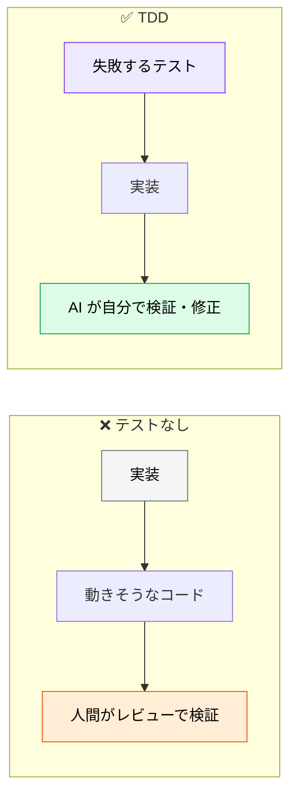
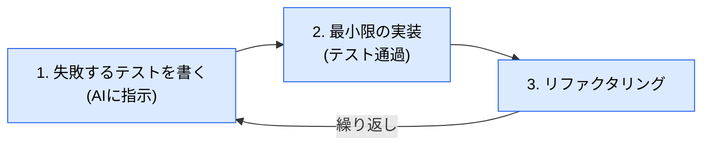
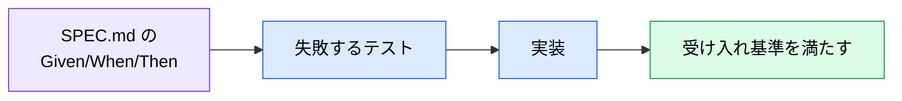

# AI とテスト駆動開発（TDD）

> **この記事でわかること**：TDD が AI と特に相性がよい理由と、全機能に適用しないという判断。

## 結論

TDD が AI と相性がよい理由は1つである。

> **テストが「検証手段」そのものになるため、AI が自己修正ループを閉じられる。**

ただし全機能には適用しない。

> **全機能への厳密な TDD 強制は開発速度を著しく落とす。品質インパクトが大きい箇所に絞って適用する。**

## 背景・課題

AI に「実装して」と頼むと、AI は「動きそうなコード」を書く。正しさの基準がないためである。

**テストを先に書かせると、基準が確定する。**



**AI 駆動開発の3大原則の2つ目「検証手段をセットで渡す」**が、TDD では構造的に満たされる（→ [`../00_overview/00_what-is-ai-driven-dev.md`](../00_overview/00_what-is-ai-driven-dev.md)）。

## 具体的な方法

### AI-TDD のサイクル



**「1のテストが失敗することを確認してから2に進む」**を明示する。これがないと、AI はテストと実装を同時に書き、通ることだけを確認する。

### プロンプト例

```text
validateEmail 関数の失敗するテストを作成してください。
テストケースには以下を網羅する必要があります：
- 有効（Valid）：user@example.com, user+tag@domain.co.jp
- 無効（Invalid）：空文字、@がない、ドメインがない、@が2つある
テスト作成後、すべてのテストを通過するように関数を実装してください。
既存のメールバリデーションライブラリは絶対に使用しないでください。
```

要点は3つある。

| 要素 | 役割 |
| --- | --- |
| **具体的なテストケースの列挙** | 何を検証するかを確定させる |
| **有効・無効の両方** | 正常系だけの実装を防ぐ |
| **`Do NOT` の制約** | 意図しないショートカットを排除 |

### 適用範囲を絞る

**全機能に厳密な TDD を強制しない。** 開発速度が著しく落ちる。

| 対象 | TDD |
| --- | --- |
| **ビジネスロジック** | ✅ 適用する |
| **API エンドポイント** | ✅ 適用する |
| **セキュリティ関連** | ✅ 適用する |
| UI の微調整 | ❌ 事後テストで十分 |
| 文言修正 | ❌ 不要 |

**判断基準は「品質インパクトの大きさ」である。** 間違えたときの被害が大きい箇所に絞る。

### テストを書かせる相手を分ける

実装した AI にそのままテストを書かせると「自分の実装が通るテスト」を書く傾向がある（→ [`../15_test/00_test-strategy.md`](../15_test/00_test-strategy.md)）。

**TDD ならこの問題が構造的に軽減される。** テストが先にあれば、実装を通すためにテストを緩める余地が減るためである。

ただし AI は失敗したテストを通すために**テストを書き換える**ことがある。禁止を明示する。

```text
テストが失敗したら、実装を直して。
テストのアサーションを弱める、期待値を変える、といった対処は禁止。

テストが誤っていると判断した場合は、修正せずに理由を報告して。
```

### 仕様との接続

BDD 形式の受け入れ基準は、**そのままテストケースになる**。



仕様 → テスト → 実装が一直線に繋がる（→ [`../10_requirements/01_requirements-with-ai.md`](../10_requirements/01_requirements-with-ai.md)）。

### hooks で強制する

「テストを実行して」を毎回書くのは非効率である。**Stop hook に置く。**

| タイミング | 処理 |
| --- | --- |
| 編集直後（PostToolUse） | 該当ファイルの lint（**1秒以内に終わるもののみ**） |
| 応答完了時（**Stop hook**） | 型チェック・テスト実行 |

PostToolUse に重い処理を置くと、多ファイル編集で破綻する（→ [`../01_claude-code/06_hooks.md`](../01_claude-code/06_hooks.md)）。

## 実際のプロンプト例

```text
# テストが失敗することを確認させる
calculateDiscount 関数に対して、まず失敗するテストを書いて。

テストケース：
- 通常価格 1000円、割引率 20% → 800円
- 通常価格 0円 → 0円
- 割引率 0% → 通常価格のまま
- 割引率 100% → 0円
- 割引率が負の数 → エラーを投げる
- 通常価格が負の数 → エラーを投げる

テストを実行して、全て失敗することを確認してから報告して。
実装はまだしないで。
```

```text
# 実装（テストを緩めさせない）
先ほどのテストが全て通るように実装して。

制約：
- テストのアサーション・期待値を変更することは禁止
- 実装は最小限に留める（過剰な抽象化をしない）
- テストが誤っていると判断した場合は、修正せずに理由を報告して

実装後にテストを実行して、結果を報告して。
```

```text
# 仕様からテストを起こす
@docs/spec/SPEC.md の「クーポン適用」の受け入れ基準（Given/When/Then）を読んで、
そのままテストケースに変換して。

受け入れ基準に書かれていないケース（境界値・異常系）が必要だと判断したら、
テストを追加する前に「仕様に追記すべき項目」として報告して。
```

## 注意点

> **全機能に TDD を強制しない。** 開発速度が著しく落ちる。品質インパクトが大きい箇所に絞る。

> **「テストが失敗することを確認してから実装に進む」を明示する。** これがないと、AI はテストと実装を同時に書く。

> **テストを緩めて通させない。** アサーションを弱める・期待値を変える対処を明示的に禁止する。

> **`Do NOT` の制約を入れる。** 「既存ライブラリを使わないで」のような制約がないと、意図しないショートカットを取る。

> **実装者とテスト作成者を分けると更に良い。** TDD なら順序が逆なので構造的に軽減されるが、重要な箇所では QA 役のサブエージェントに書かせる。

## 参考リンク

- 関連：[`00_claude-code-practice.md`](00_claude-code-practice.md) — 実装フェーズの進め方
- 関連：[`../15_test/00_test-strategy.md`](../15_test/00_test-strategy.md) — テスト戦略
- 関連：[`../10_requirements/01_requirements-with-ai.md`](../10_requirements/01_requirements-with-ai.md) — BDD からテストへ
