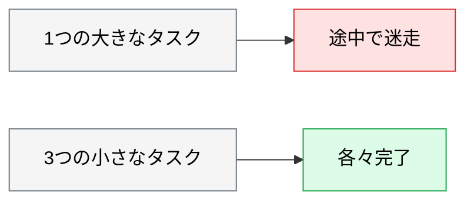

# AI が失敗したときの立て直し

> **この記事でわかること**：間違った方向に進んだセッションをどう畳むか。そして「同じ誤りを繰り返す」状態からの脱出手順。

## 結論

現場で最も時間を溶かすのは、**失敗そのものではなく「立て直しの判断が遅れること」**である。

> **AI が同じ間違いを2回繰り返したら、直させるのをやめて捨てる。**

3回目を試すコストは、捨てて作り直すコストより高い。

そして判断の優先順位はこうなる。

| 段階 | 手段 |
| --- | --- |
| **1** | **コンテキストを捨てる**（`/clear` して指示を書き直す） |
| **2** | **変更を捨てる**（`git` で戻す） |
| 3 | 前提を変える（別モデル、人間が手で直して差分を見せる） |
| 4 | 分解する（タスクが大きすぎる） |

## 背景・課題

AI が失敗したとき、人間は「もう少し説明すれば直る」と考えて追加指示を重ねる。**これが最も高くつく。**

追加指示を重ねるほど、失敗の履歴がコンテキストを埋め、AI は自身の過去のミスに引きずられる。**指示の書き方の問題ではなく、コンテキストの汚染である**（→ [`../01_claude-code/10_context-management.md`](../01_claude-code/10_context-management.md)）。


本記事では、**そこからどう立て直すか**に絞る。

## 具体的な方法

### 症状から手段を選ぶ

| 症状 | 手段 |
| --- | --- |
| **同じ間違いを2回繰り返す** | `/clear` して、**より詳細なプロンプトで最初からやり直す** |
| 無関係な方向に進んでいる | `/clear` してタスクを再定義する |
| **変更が広範囲に及んでしまった** | **`git` で戻す**。部分的に救おうとしない |
| 直前の1手だけ戻したい | `/rewind` でチェックポイントに戻る（**限界あり・後述**） |
| 何度説明しても理解しない | **前提が足りない**（後述） |
| 途中まで良いが完成しない | **タスクが大きすぎる**。分解する |

### 段階1：コンテキストを捨てる

最も安く、最も効く。

```text
/clear
```

そのうえで**指示を書き直す**。同じ指示を繰り返さない。失敗したということは、指示に不足があったということである。

| 失敗前の指示 | 書き直した指示 |
| --- | --- |
| 「認証を修正して」 | 「`@src/auth/session.ts` の `refreshToken` が期限切れ時に例外を投げる問題を直して。`@tests/auth.test.ts` の該当テストが通ることを確認して」 |

**具体的なファイル・具体的な症状・検証手段**を足す。

### 段階2：まず退避、それから捨てる

**いきなり破棄しない。** AI の変更に人間の手直しが混ざっていることがあり、退避が唯一の保険になる。

#### 2-a. 退避する

```bash
# 現状を確認する（未追跡ファイルが残っていないか）
git status --short

# 未追跡ファイルも含めて退避
git stash push -u -m "AI: 認証リファクタ失敗 2026-08-30"
```

**`-u` を必ず付ける。** AI は新規ファイルを大量に作るため、これがないと未追跡ファイルが残る。

> **退避したものは1週間見なかったら消す。** `git stash list` が溜まると、どれが何か分からなくなる。

#### 2-b. 捨てる

| 状況 | コマンド | 破壊の範囲 |
| --- | --- | --- |
| **未コミットの変更を戻す** | `git checkout HEAD -- .` | staged / unstaged の**追跡ファイルのみ** |
| **未追跡ファイルを消す** | `git clean -nd` → 確認 → `git clean -fd` | 未追跡ファイル |
| **共有ブランチのコミットを取り消す** | `git revert <sha>` | **履歴を残す。共有ブランチではこれ一択** |
| 自分だけのコミットを取り消す（変更は残す） | `git reset --soft HEAD~1` | コミットのみ |
| 自分だけのコミットと変更を消す | `git reset --hard HEAD~1` | **コミット + 未コミットの変更** |

> **⚠️ `git checkout .` は「変更を全て破棄」ではない。** ワークツリーを index から復元する操作であり、**未追跡ファイルは消えず、`git add` 済みの変更も消えない**。AI が作った新規ファイルが残り、次のセッションで既存実装と誤認される。

> **⚠️ `git clean` は必ず `-nd` で dry-run してから。** 消えたら戻せない。`.env` などが未追跡のまま置かれていると一緒に消える。

> **⚠️ `git reset --hard` を push 済みブランチに使わない。** force push が必要になり、共有ブランチでは他人の作業を飛ばす。**共有ブランチでは `git revert` を使う。**

> **消したつもりでも `git reflog` から戻せる。** `git reflog` で直前の HEAD を探し、`git reset --hard <sha>` で復帰できる（コミット済みの内容に限る）。

### 隔離して試す

大きな変更を試すときは、**`git worktree` で別ディレクトリに切り出す**と、失敗しても本体に影響しない。

```bash
# 別ディレクトリに作業ツリーを作る
git worktree add ../myproject-experiment -b experiment/auth-refactor

# そこで Claude Code を起動して試す
cd ../myproject-experiment

# 失敗したら丸ごと捨てる
cd ../myproject
git worktree remove --force ../myproject-experiment
git branch -D experiment/auth-refactor
```

**「捨てやすくしておく」ことが、大胆に試せる条件になる。**

> **⚠️ worktree の初回セットアップにはコストがかかる。** 新しい作業ツリーには `.env` / `node_modules` / `.venv` / ビルド成果物が**存在しない**。加えて開発サーバーのポート競合、Docker のコンテナ名・ボリューム衝突、IDE が2つのツリーを混同する問題がある。
>
> **セットアップが重いプロジェクトでは、ブランチを切って `git stash` で往復するほうが速い。**

### `/rewind` の限界

`/rewind` はチェックポイントに戻すが、**戻らないものがある**。

| 戻る | 戻らない |
| --- | --- |
| Claude が編集したファイル | **Bash 経由で起きた副作用**（`git commit` / DB マイグレーション / パッケージインストール / ファイル削除） |
| 会話 | **人間が手で行った編集** |

> **最終防衛線は git であって `/rewind` ではない。** 「git と同等に巻き戻せる」と考えると、スキーマが変わったまま原因不明の不整合を追うことになる。

### 段階3：前提を変える

`/clear` しても直らないなら、**指示の問題ではなく前提の問題**である。

| 疑うこと | 確認方法 |
| --- | --- |
| **必要な情報を渡していない** | 仕様書・既存実装・エラー全文を渡しているか |
| **検証手段がない** | テストコマンドを渡しているか |
| ライブラリの知識が古い | Context7 で最新仕様を取得させる |
| モデルの能力不足 | `opus` に上げる（**ただし最後の手段**） |
| **そもそも仕様が曖昧** | 人間側で決まっていないことを AI が埋めようとしている |

**最後の行が最も多い。** 「AI が理解しない」のではなく、**まだ決まっていないことを聞かれている**ケースである。

### 人間が手で直して差分を見せる

言葉で説明できない場合、**手本を見せる**のが最短である。

```text
この部分を私が手で直した。差分を見て、同じ方針で残りを直して。

git diff を確認して、私が何を意図したかを説明してから作業を始めて。
```

**「意図を説明させる」**のが要点である。理解が違っていれば、着手前に気づける。

### 段階4：分解する

「途中まで良いが完成しない」は、**タスクが大きすぎる**サインである。



分解の目安は **1タスク = 1 PR で閉じられること**である。

### 失敗を記録する

同じ失敗を繰り返さないために、**何が効かなかったかを残す**。

| 記録先 | 内容 |
| --- | --- |
| `CLAUDE.md` | 繰り返し発生する誤りを禁止事項として追記 |
| コマンド | 有効だった指示をコマンド化 |
| チームの共有 | 「このパターンは AI に向かない」という知見 |

**「AI に向かないタスク」のリストは、実は最も価値がある。** 期待値の管理になる。

## 実際のプロンプト例

```text
# 立て直し前の状況整理（/clear する前に）
ここまでの作業で、何がうまくいって何がうまくいかなかったかを整理して。

- 完了したこと
- 失敗した箇所とその原因の推測
- 次に試すなら何を変えるべきか

この要約だけをコピーして新しいセッションで使いたいので、
簡潔に、かつ再開に必要な情報を落とさずに書いて。
```

```text
# 前提の不足を洗い出させる
このタスクで何度か失敗している。

私が渡していない情報で、あなたが推測で埋めている箇所を全て挙げて。
「もっと詳しく指示してほしい点」を、私への質問の形で提示して。

コードは書かないで。何が足りないかだけ教えて。
```

```text
# 手本を見せる
@src/api/users.ts を私が手で直した。git diff を確認して、
私が何を意図したかを説明して。

説明が私の意図と合っていることを確認してから、
同じ方針で @src/api/orders.ts と @src/api/products.ts を直して。
```

## 注意点

> **2回失敗したら捨てる。** 3回目を試すコストは、作り直すコストより高い。追加指示を重ねるほどコンテキストが汚染される。

> **部分的に救おうとしない。** 選別する作業のほうが、作り直すより時間がかかることが多い。

> **作業ブランチを切ってから始める。** 捨てる決断が軽くなる。大きな変更は `git worktree` で隔離する。

> **`/clear` する前に要約を作らせる。** 再開に必要な情報だけを持ち越す。ただし**過去セッションは `claude --resume` で参照できる**ため、要約を忘れても詰まない。

> **「AI が理解しない」の多くは、仕様が決まっていない。** モデルを上げる前に、人間側で決まっていないことがないか確認する。

> **モデルを上げるのは最後の手段。** 情報不足・検証手段の欠如・仕様の曖昧さを先に潰す。

> **捨てて作り直すほうがトークン消費も安いことが多い。** 追加指示を重ねると、失敗の履歴を毎ターン再送し続けることになる（→ [`../21_cicd-ops/06_finops.md`](../21_cicd-ops/06_finops.md)）。

## 参考リンク

- 関連：[`00_claude-code-practice.md`](00_claude-code-practice.md) — 段階を分けた進め方
- 関連：[`../01_claude-code/10_context-management.md`](../01_claude-code/10_context-management.md) — コンテキストの汚染
- 関連：[`04_legacy-code.md`](04_legacy-code.md) — 既存コードでの失敗パターン
