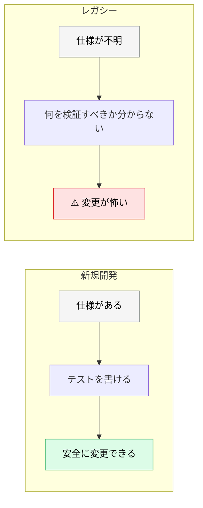
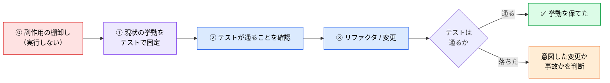
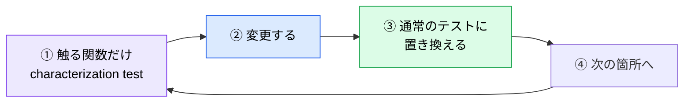

# レガシーコードへの適用

> **この記事でわかること**：テストのない既存コードを AI で触るときの手順と、characterization test という定番手法。

## 結論

現場のプロジェクトの大半は新規ではない。**テストのない既存コードを触るケースが圧倒的に多い。**

そこでの原則は1つである。

> **改変する前に、現状の挙動を固定するテスト（characterization test）を AI に書かせる。**

これがないと、**「直したつもりが壊した」を検出できない**。

## 背景・課題

新規開発では「仕様 → テスト → 実装」の順で進める。レガシーコードにはこれが使えない。

- 仕様書がない、あっても古い
- テストがない
- **現在の挙動が正しいのかバグなのか分からない**



**AI は速いので、この状態で改変させると被害も速い。** 先に安全網を張る。

## 具体的な方法

### characterization test とは

**「正しい挙動」ではなく「現在の挙動」を固定するテスト**である。

| 通常のテスト | characterization test |
| --- | --- |
| 仕様どおりか検証する | **今どう動くかを記録する** |
| 期待値は仕様から決まる | **期待値は実行結果から決まる** |
| 失敗＝バグ | **失敗＝挙動が変わった** |

バグも含めて現状を固定する。**「バグを直す」のは、挙動の変化を検知できるようになってからである。**

### 手順



**最後の分岐で「意図した変更か事故か」を人間が判断する。** ここが最も重要な工程である。

### ⓪ 副作用を棚卸しする（実行する前に）

**テストを書かせる前に、その関数が何をするかを確認する。**

```text
@src/services/pricing.ts の calculateTotal が行う副作用を全て列挙して。

- 外部 API の呼び出し
- DB への書き込み
- メール・通知の送信
- ファイルの読み書き
- グローバル状態の変更

**この段階では実行しないで。** 静的に読んで列挙するだけにして。
```

> **⚠️ レガシー関数は課金 API やメール送信を内包していることがある。** 接続先次第では**実害が出る**。「接続先が隔離環境であること」を人間が確認してから実行させる。

### テストを書かせるプロンプト

```text
@src/services/pricing.ts の calculateTotal 関数に対して、
現在の挙動を固定する characterization test を書いて。

条件：
- 「正しい挙動」ではなく「今どう動くか」を記録すること
- 実際に関数を実行して、返り値をそのまま期待値にすること
- 明らかにバグに見える挙動も、そのまま固定すること
  （バグ修正は別タスクにする）
- 境界値・異常系も含めて、通る経路をできるだけ網羅すること

書いたテストを実行して、全て通ることを確認してから報告して。
```

**「バグに見えても固定する」を明示する。** これがないと、AI は親切に「正しい挙動」に直したテストを書き、変更後に落ちる原因が分からなくなる。

### 非決定的な値を固定する

**characterization test の導入が失敗する最大の原因がこれである。** 初日は全部通り、翌日または CI（別タイムゾーン）で落ちる。

| 非決定要素 | 対処 |
| --- | --- |
| **時刻** | fake timers で固定する |
| **乱数・UUID** | seed を固定するか DI で差し替える |
| タイムゾーン・ロケール | テスト実行時に固定する |
| 浮動小数の丸め | 許容誤差でアサートする |
| Map / Set の反復順 | ソートしてから比較する |
| DB の連番 ID | アサーション対象から外す |

```text
テストを書く際、次を必ず守って。

- 時刻・乱数・ID 生成は固定する（fake timers / seed 固定 / DI 差し替え）
- 固定できない値はアサーション対象から外し、その旨をコメントに残す
- タイムゾーンを固定する（CI と手元で結果が変わらないように）
```

### スナップショットで書く場合

`toMatchSnapshot` 等は characterization test の実装形態として最も普及している。ただし**AI 特有の罠がある**。

> **⚠️ `-u` / `--update-snapshot` を AI に実行させない。** テストが落ちたとき、AI はスナップショットを更新して「通しました」と報告することがある。**検知したかった挙動変化が、期待値ごと上書きされる**。しかも diff はスナップショットファイルなのでレビューで流し読みされる。
>
> `permissions.deny` で `Bash(jest -u:*)` `Bash(npx jest --updateSnapshot:*)` 等を禁止する（→ [`../15_test/05_test-debt.md`](../15_test/05_test-debt.md)）。

### 変更が怖い箇所を特定する

全部にテストを書くのは現実的でない。**触る範囲に絞る。**

```text
@src/services/pricing.ts を変更したい。

まず、この変更で影響を受ける範囲を特定して。
- この関数を呼んでいる箇所
- この関数が依存している箇所
- 間接的に影響しそうなテストがない箇所

「テストを書いてから触るべき箇所」を優先度順に挙げて。
まだ変更はしないで。
```

**影響範囲の特定に Serena MCP が効く。** symbol 単位で参照元を辿れる（→ [`../02_mcp/11_serena.md`](../02_mcp/11_serena.md)）。

### 既存コードから仕様を起こす

設計書がない場合、**コードから起こす**。ただし推測させない。

```text
@src/services/pricing.ts を読んで、仕様書の下書きを作って。

条件：
- 「コードがこうなっている」という事実だけを書くこと
- 「なぜそうなっているか（意図）」が不明な箇所は、
  推測せず「要確認」としてリストにすること
- バグに見える箇所は「意図不明」として分けること

意図の推測は絶対にしないで。
```

**「要確認」リストが成果物である。** ここに、その後の調査や有識者へのヒアリングが必要な項目が集まる。

### AI に向かない場面

レガシーコードでも、AI に向かないケースがある。

| 状況 | 理由 |
| --- | --- |
| **暗黙の前提が大量にある** | コードに書かれていない業務ルールは読み取れない |
| 実行できない環境 | テストを走らせられないと自己検証ループが閉じない |
| **暗黙の前提が大量にある** | コードに書かれていない業務ルールは読み取れない |

**「実行できるか」が分かれ目である。** テストが走らせられない環境では、AI の最大の利点（自己修正）が使えない。

### 副作用を切り離してからテストする

**AI に向かないのは「副作用のあるコード」ではなく、「副作用を切り離す設計判断」のほうである。** 切り離しさえすれば、その先は AI が得意な領域になる。

| 手法 | 内容 |
| --- | --- |
| **依存を注入に変える** | 外部呼び出しを引数・コンストラクタ経由にして差し替え可能にする |
| **新規部分を切り出す**（sprout） | 既存を触らず、新しい関数・クラスとして追加してテストする |
| **既存を包む**（wrap） | 呼び出しをラッパー越しにして、ラッパー側をテストする |
| **テストダブル** | 外部 API をモック / スタブに置き換える |
| **トランザクションでロールバック** | DB 書き込みをテスト後に巻き戻す |

**切り離す設計判断は人間が行い、切り離した後のテスト作成を AI に任せる。** この分担が最も効率がよい。

### 段階的に安全網を広げる



**③を忘れない。** characterization test は「現状固定」なので、仕様が明確になったら**仕様ベースのテストに置き換える**。そのまま残すと、バグを永久に固定することになる。

### 移行タスクは AI に向く

レガシー対応の中でも、**機械的な移行は AI が得意な領域**である。

| 向いている | 向いていない |
| --- | --- |
| ライブラリのバージョンアップ対応 | アーキテクチャの再設計 |
| 構文の一括変換（CommonJS → ESM 等） | 業務ロジックの整理 |
| 型定義の追加 | 仕様の曖昧な箇所の判断 |
| 命名の統一 | 削除してよいコードの判断 |

**「削除してよいか」の判断は AI にさせない。** 使われていないように見えて、動的に呼ばれていることがある。

### レガシー特有のハマり

| 罠 | 対処 |
| --- | --- |
| **数千行のファイルがコンテキストを食い潰す** | Serena MCP で symbol 単位に絞る |
| **AI が無関係箇所を勝手に整形・リネームする** | **整形は別 PR にする**と `CLAUDE.md` に明記 |
| **文字コード・改行コードを書き換える**（Shift_JIS / CRLF） | 変更禁止を明記。`.gitattributes` で固定 |
| ビルド環境を再現できない | 古いランタイム・lockfile なし・社内 registry の確認を先に行う |
| コメントアウトされた死にコードを仕様と誤読する | 「コメントアウトされた記述は仕様として扱わない」と指示 |

> **上の2つ（整形・文字コード）が最も嫌われる。** どちらも**レビュー不能な巨大 diff** を生み、`git blame` を壊す。1回やると信頼を失う。

## 実際のプロンプト例

```text
# 安全網を張ってから変更する
@src/services/pricing.ts の calculateTotal をリファクタしたい。

手順：
1. まず現在の挙動を固定する characterization test を書く
   （バグに見える挙動もそのまま固定する）
2. テストを実行して全て通ることを確認する
3. そこで一度止まって報告する

3 で私が確認するまで、リファクタは始めないで。
```

```text
# 変更後の差分を判断させる
リファクタ後にテストが3件落ちた。

各テストについて次を判定して。
- 意図した挙動の変更か（リファクタの結果として妥当）
- 事故か（意図せず壊した）

「意図した変更」と判断したものは、なぜそう言えるかの根拠を示して。
判断がつかないものは「要確認」として私に回して。
テストを勝手に書き換えないで。
```

```text
# 削除候補の調査（削除はしない）
@src/legacy/ 配下で使われていないように見えるコードを洗い出して。

ただし次を必ず確認して：
- 動的に呼ばれていないか（文字列でのメソッド名指定、リフレクション）
- 設定ファイルやDIコンテナから参照されていないか
- テストからのみ使われていないか

「確実に未使用」「未使用に見えるが確認が必要」に分類して。
削除は一切しないで。
```

## 注意点

> **改変前に characterization test を書く。** これがないと「直したつもりが壊した」を検出できない。

> **バグに見える挙動もそのまま固定する。** 「正しく直す」のは、変化を検知できるようになってからである。

> **characterization test をそのまま残さない。** 仕様が明確になったら仕様ベースのテストに置き換える。残すとバグを永久に固定する。

> **「削除してよいか」を AI に判断させない。** 動的に呼ばれているコードは静的解析で見つからない。

> **テストが走らせられない環境では効果が半減する。** 自己修正ループが閉じないため、AI の最大の利点が使えない。

> **意図の推測をさせない。** 「なぜそうなっているか」が不明な箇所は「要確認」として残す。推測で仕様書を作ると、誤った前提が固定される。

## 参考リンク

- 関連：[`02_tdd.md`](02_tdd.md) — 新規開発での TDD
- 関連：[`03_recovery.md`](03_recovery.md) — 失敗したときの立て直し
- 関連：[`../02_mcp/11_serena.md`](../02_mcp/11_serena.md) — 影響範囲の特定
- 関連：[`../10_requirements/00_spec-driven-development.md`](../10_requirements/00_spec-driven-development.md) — 仕様書の役割
- 関連：[`../15_test/05_test-debt.md`](../15_test/05_test-debt.md) — テストを緩めさせない
- 関連：[`../11_design/06_keeping-docs-in-sync.md`](../11_design/06_keeping-docs-in-sync.md) — 起こした文書を腐らせない
