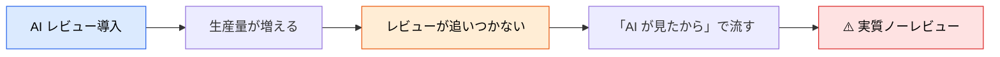
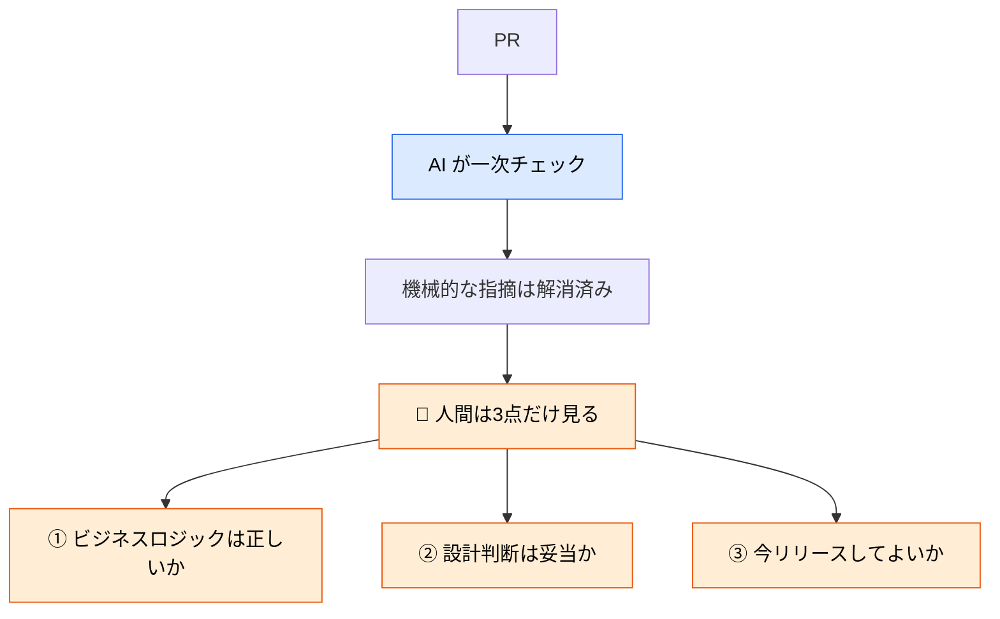
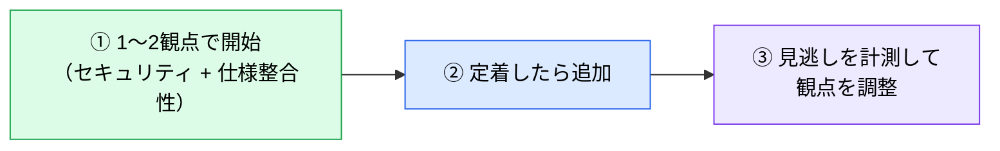

# AI と人間のレビュー分担

> **この記事でわかること**：何を AI に任せ、何を人間が見るか。そして「全部見る」がなぜ機能しないか。

## 結論

分担の基準は1つである。

> **AI には「照合できること」を、人間には「判断が要ること」を。**

そして最終的な責任分界は動かない。

> **最終判断・リリース可否は人間が持つ。**

## 背景・課題

AI レビューを導入すると、逆説的に人間のレビューが甘くなる。「AI が見たから大丈夫」という心理が働くためである。

さらに AI で生産量が増えるとレビューがボトルネックになり、「全部見るのは無理だから」と省略が始まる。



**「全部見る」は実行されない。** 人間が見る範囲を明示的に絞ることでしか、レビューは機能しない。

## 具体的な方法

### 分担表

| 担当 | 役割 | ツール |
| --- | --- | --- |
| **GitHub Copilot** | バグ・コーディング規約・パフォーマンス・セキュリティの自動チェック | PR Reviewer |
| **Claude Code** | 仕様書との整合性・設計方針のブレ・全体アーキテクチャ整合性 | Claude Code（GitHub MCP / gh CLI 経由で PR 参照） |
| **人間** | **最終判断・ビジネスロジックの正確性・リリース可否** | **必須** |

### なぜこの分担になるか

判断の性質で分けると理由が見える。

| 性質 | 例 | 担当 |
| --- | --- | --- |
| **既知パターンとの照合** | SQL インジェクション、命名規約違反 | Copilot / SAST |
| **文書との照合** | 仕様書と実装の乖離、設計方針からのブレ | Claude |
| **正解が文書化されていない判断** | 「この業務ルールは正しいか」「今これを入れるべきか」 | **人間** |

**AI は「書いてあることとの照合」が得意で、「書かれていないことの判断」ができない。** 分担はここで切れる。

### 人間が見る観点を絞る



**3点に絞れば、レビュー時間は現実的な範囲に収まる。** 逆に絞らなければ、時間が足りずに全部が甘くなる。

### AI に指摘させるときの形式

指摘に重要度がないと、量が増えるほど読まれなくなる。

| 分類 | 意味 |
| --- | --- |
| `[Blocker]` | マージ前に必ず修正が必要 |
| `[Suggestion]` | 改善推奨だが必須ではない |
| `[Nit]` | 軽微なスタイル・命名の提案 |

**`[Nit]` を出させること自体は悪くない。** 分類されていれば読み飛ばせる。分類がないことが問題である。

### 責任分界を設定で担保する

**ルールとして書くだけでは守られない。**

| 担保したいこと | 手段 |
| --- | --- |
| 人間の Approve なしにマージされない | Branch Protection Rule（Approve 1名以上） |
| 直接 push されない | Branch Protection Rule |
| AI がレビュー中にコードを変更しない | `--allowedTools` を読み取り専用に絞る |

> **AI に Approve 権限を与えない。** 技術的に可能な構成でも、責任分界が崩れる（→ [`../22_security/02_vibe-coding-risk.md`](../22_security/02_vibe-coding-risk.md)）。

### 観点を増やす前に減らす

導入時にありがちなのが「全観点を一度に有効化する」ことである。指摘が溢れて誰も読まなくなる。



**最初はセキュリティと仕様整合性の2つで十分**である。

## 実際のプロンプト例

```text
# 人間が見るべき論点だけを抽出させる
この PR について、次を分けて報告して。

A: 機械的に判定できる指摘（規約違反・既知の脆弱パターン・型の問題）
B: 人間の判断が必要な論点（業務ルールの妥当性・設計上のトレードオフ・リリース判断）

A は件数と概要のみ。B は判断に必要な材料（背景・選択肢・影響範囲）を添えて詳しく。
承認可否の断定はしないで。判断は私がする。
```

```text
# 仕様との整合性チェック（Claude の担当領域）
この PR を @docs/spec/SPEC.md と @docs/basic_design/BASIC_DESIGN.md に照らして、
仕様との乖離・設計方針からのブレがないか確認して。

「実装が正しく仕様が古い」可能性も考慮して、
どちらが正しいかは判断せず、差分と根拠だけ示して。
```

```text
# 分担の見直し
過去1ヶ月のレビューコメントを gh で取得して、
人間が指摘した内容を分類して。

そのうち「AI でも指摘できたはずのもの」を特定して、
AI レビューのプロンプトに追加すべき観点を提案して。
```

## 注意点

> **AI レビュー導入時こそ、人間が見る観点を定義する。** 定義しないと「AI が見たから」で流れる。

> **最終 Approve は人間が持つ。** Branch Protection Rule で技術的に強制する。ルールとして書くだけでは、忙しい日に飛ばされる。

> **観点を最初から全部有効化しない。** 指摘が溢れると読まれなくなり、レビュー自体が形骸化する。

> **レビュー用のツール権限は読み取り専用にする。** `--allowedTools "Read,Grep,Glob"` に絞れば、AI がどう振る舞ってもコードは変わらない。

> **「AI が問題なしと言った」は Approve の理由にならない。** 偽陰性は必ず存在する。

## 参考リンク

- 関連：[`01_design-review.md`](01_design-review.md) — 設計観点のレビュー
- 関連：[`02_secure-review.md`](02_secure-review.md) — セキュリティ観点
- 関連：[`../20_github-claude/03_auto-review.md`](../20_github-claude/03_auto-review.md) — 自動化の設定
- 関連：[`../04_multi-agent/02_persona-parallel-review.md`](../04_multi-agent/02_persona-parallel-review.md) — 観点を並列化する
