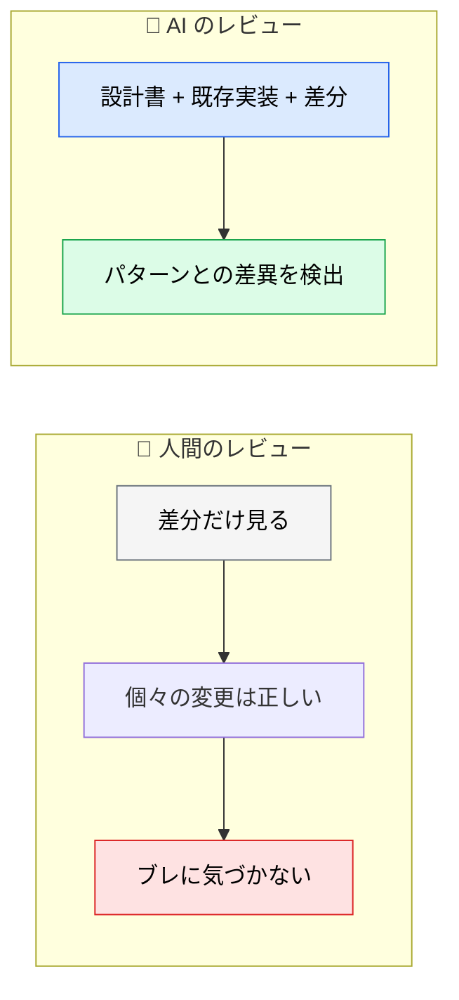

# 設計レビューのプロンプト

> **この記事でわかること**：仕様書と設計書を参照させて「設計方針からのブレ」を検出させる方法。

## 結論

設計レビューを AI に任せる価値は、**差分だけでは分からないことを見る**点にある。

> **設計書と実装を突き合わせられるのは、両方を読める AI だけである。**

人間は差分しか見ない（設計書まで開き直さない）。ここに AI の役割がある。

そして必ず添えるのが次の一文である。

> **比較のために、既存の実装パターンを参照してください。**

## 背景・課題

コードレビューで最も見落とされるのが「**設計方針からのブレ**」である。

- 個々の変更は正しいが、既存パターンと違う書き方になっている
- 設計書で決めた層構造を跨いでいる
- 依存の方向が逆になっている

これらは**差分だけを見ても分からない**。設計書と既存実装の両方を知っていて初めて気づける。



## 具体的な方法

### 基本形

```text
あなたはシニアソフトウェアアーキテクトです。@docs/spec/SPEC.md の仕様書と @docs/basic_design/BASIC_DESIGN.md のアーキテクチャを踏まえて、この PR（プルリクエスト）をレビューしてください。

以下の点を確認してください：
1. 実装は仕様と一致しているか？
2. アーキテクチャ上の矛盾や一貫性の欠如はないか？
3. セキュリティ：インジェクションのリスク、認証の欠陥、機密情報の露出、安全でないデータ処理がないか？
4. テストでカバーされていないエッジケースはないか？
5. パフォーマンスのボトルネックになる部分はないか？

比較のために、@src/middleware/ の既存の実装パターンを参照してください。
```

### なぜこの形なのか

| 要素 | 役割 |
| --- | --- |
| `@docs/spec/SPEC.md` | **正解の定義**。これがないと「良さそう」しか言えない |
| `@docs/basic_design/BASIC_DESIGN.md` | **構造の定義**。層構造・依存方向の判断基準 |
| 5つの確認項目 | **観点の固定**。指定しないと表面的なスタイル指摘に偏る |
| `@src/middleware/` の参照 | **既存パターンの提示**。「このプロジェクトらしさ」の基準 |

**最後の「既存パターンの参照」が効く。** 一般論としての良し悪しではなく、**このプロジェクトの中での一貫性**を見られるようになる。

### 観点を絞る

5項目すべてを毎回やらせない。**PR の性質で絞る。**

| PR の性質 | 重点を置く観点 |
| --- | --- |
| 新機能追加 | ①仕様一致 ②アーキテクチャ整合性 |
| リファクタリング | ②アーキテクチャ整合性 ⑤性能 |
| バグ修正 | ④エッジケース |
| 外部連携の追加 | ③セキュリティ ⑤性能 |

### 過剰設計を見させる

設計レビューで見落とされやすいのが**過剰設計**である。「足りない」は指摘されるが、「多すぎる」は指摘されにくい。

```text
このアーキテクチャを次の観点でレビューして。

1. スケーラビリティのボトルネック
2. セキュリティ上の懸念
3. 過剰設計（今は要らない抽象化・将来のための拡張ポイント）

3つ目を特に厳しく見て。
「将来必要になるかもしれない」は残す理由にしないで。
```

**「将来必要になるかもしれない」を理由として認めない**と指示するのが要点である。これを言わないと、AI は擁護する側に回る。

### 判断させず、材料を出させる

設計判断には「正解が1つでない」ものが多い。

```text
この設計判断について、次の形式で報告して。

| 論点 | 現在の実装 | 代替案 | それぞれのトレードオフ |

どちらが良いかの結論は書かないで。判断材料だけ揃えて。
```

**AI に結論を出させると、もっともらしい理由で片方に寄せる。** 判断は人間が行う（→ [`00_ai-human-split.md`](00_ai-human-split.md)）。

### 設計書がない場合

多くのプロジェクトには設計書がない。その場合は**既存実装をパターンの基準にする**。

```text
@src/api/users/ の実装パターンを読んで、このプロジェクトの設計方針を推測して。

そのうえで、この PR がその方針に沿っているか確認して。
方針から外れている箇所があれば、意図的な逸脱か事故かを判断できる材料を示して。
```

## 実際のプロンプト例

```text
# 標準の設計レビュー
@docs/spec/SPEC.md と @docs/basic_design/BASIC_DESIGN.md を踏まえて、
この PR をレビューして。

観点：
1. 仕様との一致
2. アーキテクチャ上の一貫性（層構造・依存方向）
3. 既存パターンとの整合性（@src/api/ を参照）

指摘は [Blocker] / [Suggestion] / [Nit] で分類して。
承認可否の断定はしないで。
```

```text
# 過剰設計の検出
この PR に含まれる抽象化・拡張ポイントを全て列挙して、
それぞれ「今この変更で必要か」を判定して。

「将来必要になるかもしれない」は必要の理由にしないで。
現時点で使われていない抽象化は、削除した場合の差分も示して。
```

```text
# 影響範囲の確認
この PR で変更されたインターフェースを使っている箇所を全て洗い出して、
影響を受ける範囲を表にして。

テストでカバーされていない参照箇所は明示して。
```

## 注意点

> **設計書がないと「良さそう」しか返らない。** 正解の定義がなければ照合できない。設計書がないなら、既存実装をパターンの基準として渡す。

> **「既存パターンを参照」を必ず入れる。** 一般論のレビューは公式ドキュメントで足りる。**このプロジェクトの中での一貫性**が AI レビューの価値である。

> **設計判断の結論を AI に出させない。** トレードオフの判断は人間の責務である。材料を揃えさせるまでに留める。

> **設計書と実装が食い違うとき、どちらが正かを AI に決めさせない。** 実装のほうが正しく、設計書が古いケースは多い。差分と根拠だけ出させる。

## 参考リンク

- 関連：[`00_ai-human-split.md`](00_ai-human-split.md) — 分担の設計
- 関連：[`../11_design/`](../11_design/) — 設計書の作り方
- 関連：[`../05_prompt-engineering/01_cheatsheet.md`](../05_prompt-engineering/01_cheatsheet.md) — 定型プロンプト
