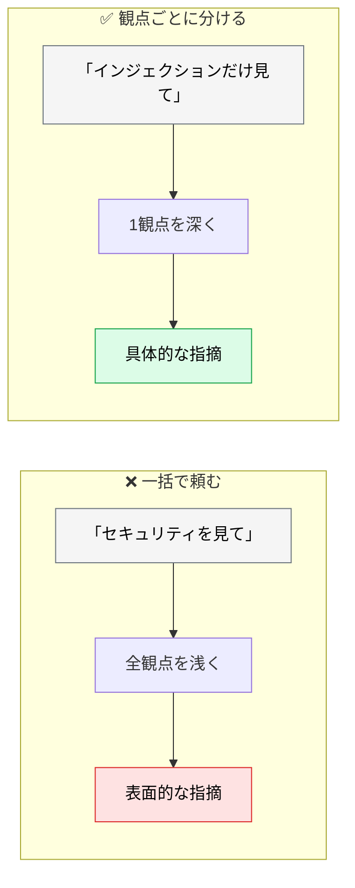
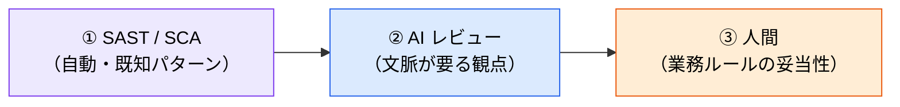

# セキュアコードレビューのプロンプトライブラリ

> **この記事でわかること**：観点ごとに分けたセキュリティレビューのプロンプトと、それを使う前に済ませておくべきこと。

## 結論

セキュリティレビューは**観点を分けて別々に実行する**。

> **「セキュリティを見て」という1回の指示より、観点ごとに分けた3回の指示のほうが検出精度が高い。**

そして重要な前提がある。

> **AI レビューは SAST の代替ではない。既知パターンの検出は CodeQL / Snyk / Semgrep に任せ、AI は文脈が要る判断に使う。**

## 背景・課題

「セキュリティ観点でレビューして」と頼むと、返ってくるのは表面的な指摘に偏る。理由は単純で、**観点が広すぎて優先順位が決まらない**からである。

観点を1つに絞ると、その領域を深く見る。



## 具体的な方法

### プロンプトライブラリ

```text
# インジェクション脆弱性チェック
@file.ts のインジェクション脆弱性（SQLインジェクション、XSS、コマンドインジェクション、パストラバーサル）をレビューしてください。具体的な行番号と修正案を提示してください。

# 認証・認可チェック
@src/auth/ の認証フローをレビューしてください。以下の点を確認してください：
- 安全でないセッション管理
- 認可（権限）チェックの漏れ
- JWTの脆弱性
- 権限昇格のリスク

# シークレット露出チェック
@./src 内にハードコードされたシークレット、APIキー、パスワード、または認証情報（クレデンシャル）がないかスキャンしてください。
また、機密データを誤ってログ出力してしまうようなパターンがないかも確認してください。
```

**シークレット露出チェックの後半（ログ出力）が効く。** ハードコードは Secret Scanning で自動検出できるが、**「機密データをログに出している」は静的解析で拾いにくい**。ここが AI の担当領域である。

### AI が得意な領域と SAST に任せる領域

| 領域 | 担当 | 理由 |
| --- | --- | --- |
| 既知の脆弱パターン | **SAST**（CodeQL / Snyk / Semgrep） | 網羅性と再現性で勝る |
| 依存関係の CVE | **SCA**（Dependabot） | データベース照合 |
| **機密データのログ出力** | **AI** | 「何が機密か」の判断が要る |
| **認可チェックの漏れ** | **AI** | 業務ロジックの理解が要る |
| **外部入力の追跡** | AI（+ SAST） | データフローの文脈 |

> **SAST を入れずに AI レビューだけで済ませない。** 既知パターンの検出は自動化された仕組みのほうが確実である（→ [`../22_security/03_security-scan.md`](../22_security/03_security-scan.md)）。

### 観点の追加

上記3つに加えて、変更内容に応じて足す。

```text
# 外部入力の検証
この差分で外部から受け取っている値（リクエストパラメータ、環境変数、
外部 API のレスポンス、ファイル内容）を全て列挙して、
それぞれ検証されているか確認して。

未検証のまま下流（DB / シェル / HTML / ファイルパス）に渡している箇所を特定して。
```

```text
# LLM 出力の扱い（自作 AI アプリの場合）
LLM の出力をそのまま下流システムに渡している箇所がないか確認して。

特に次を重点的に：
- 生成された SQL を実行している
- 生成されたコマンドをシェルで実行している
- 生成された HTML をそのまま描画している

OWASP LLM05（不適切な出力処理）の観点で評価して。
```

**自作の AI アプリでは LLM05 が最も危険である**（→ [`../22_security/00_ai-code-risks.md`](../22_security/00_ai-code-risks.md)）。

### 実行順序



**①を先に済ませる。** 機械的に検出できるものが残った状態で AI にレビューさせると、同じ指摘が重複して埋もれる。

### コマンド化する

セキュリティレビューは繰り返し使う。`.claude/commands/` に置いて標準化する（→ [`../05_prompt-engineering/02_versioning.md`](../05_prompt-engineering/02_versioning.md)）。

`.claude/commands/secure-review.md` として置く（**コマンド名はファイル名から決まる。frontmatter に `name` キーはない**）。

```markdown
---
description: セキュリティ観点でコードをレビューする。認証・入力処理・外部連携を含む変更後に使う
allowed-tools: Read, Grep, Glob
---

# セキュアレビュー

以下の観点を**独立して**実行し、結果を統合する。

1. インジェクション（SQL / XSS / コマンド / パストラバーサル）
2. 認証・認可（セッション管理、権限チェック漏れ、権限昇格）
3. シークレット露出（ハードコード、ログ出力）

## 出力形式

| 重大度 | 観点 | 該当箇所（file:line） | 内容 | 修正案 |

重大度は Critical / High / Medium / Low の4段階。
**Critical / High は必ずシニアエンジニアのレビューに回す**と明記して報告する。
```

### レビュー用エージェントの権限

セキュリティレビューに `Edit` は要らない。**読み取り専用に絞る。**

```markdown
---
name: security-reviewer
description: セキュリティ脆弱性のコードレビューを行う。認証・入力処理・外部連携を含む変更後に使う
tools: Read, Grep, Glob
model: opus
---
```

`tools` を絞れば、AI がどう振る舞ってもコードは変わらない。**これが最も確実なガードレールである**（→ [`../01_claude-code/05_sub-agents.md`](../01_claude-code/05_sub-agents.md)）。

## 実際のプロンプト例

```text
# 3観点を分けて実行させる
この PR を次の3観点で、それぞれ独立してレビューして。
1つの観点を終えてから次に進んで。まとめて見ないで。

1. インジェクション脆弱性（SQL / XSS / コマンド / パストラバーサル）
2. 認証・認可（セッション管理・権限チェック漏れ・権限昇格）
3. シークレット露出（ハードコード・ログ出力）

各指摘に「該当行」「攻撃シナリオ」「修正案」を必ず添えて。
攻撃シナリオが書けない指摘は、推測なので除外して。
```

**「攻撃シナリオが書けない指摘は除外」**が効く。具体的な悪用経路を説明できない指摘は、多くの場合ノイズである。

```text
# 修正の検証
指摘された脆弱性の修正が正しいか確認して。

1. 修正が実際に脆弱性を塞いでいるか
2. 迂回経路が残っていないか（別の入口から同じ処理に到達できないか）
3. 修正で別の問題が生まれていないか

「塞げている / 不十分」で判定し、根拠を示して。
```

```text
# 既存コードベースの棚卸し
@src/api/ 配下で外部入力を受け取っている箇所を全て列挙して、
それぞれの検証状況を表にして。

| エンドポイント | 受け取る入力 | 検証あり/なし | 危険度 |

危険度の高い順に並べて。修正はまだしないで。
```

## 注意点

> **AI レビューは SAST の代替ではない。** 既知パターンの網羅的検出は自動化ツールに任せる。AI は「文脈が要る判断」に使う。

> **観点を1回のプロンプトにまとめない。** 分けて実行するほうが検出精度が高い。

> **「攻撃シナリオを書けない指摘」は除外させる。** 具体的な悪用経路を示せない指摘はノイズになりやすく、量が増えると本物が埋もれる。

> **Critical / High は人間のレビューに回す。** AI の判定だけでマージ可否を決めない（→ [`../22_security/03_security-scan.md`](../22_security/03_security-scan.md)）。

> **レビュー用エージェントに書き込み権限を渡さない。** `tools: Read, Grep, Glob` に絞る。

## 参考リンク

- 関連：[`00_ai-human-split.md`](00_ai-human-split.md) — 分担の設計
- 関連：[`../22_security/00_ai-code-risks.md`](../22_security/00_ai-code-risks.md) — OWASP Top 10 for LLMs
- 関連：[`../22_security/03_security-scan.md`](../22_security/03_security-scan.md) — 自動検知との組み合わせ
- 関連：[`../05_prompt-engineering/02_versioning.md`](../05_prompt-engineering/02_versioning.md) — コマンド化
