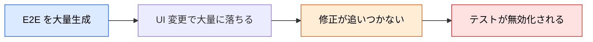
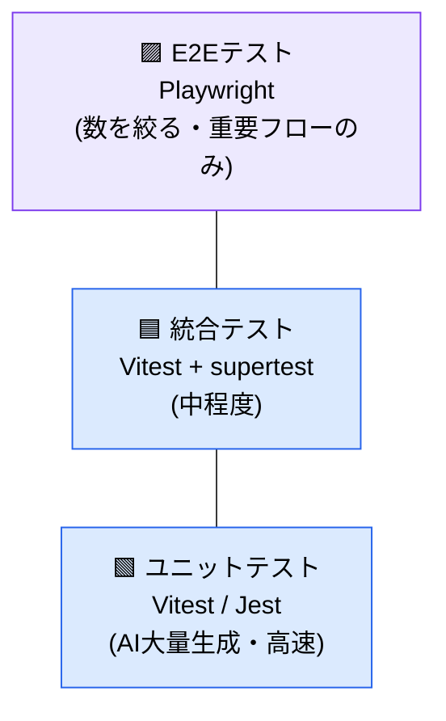
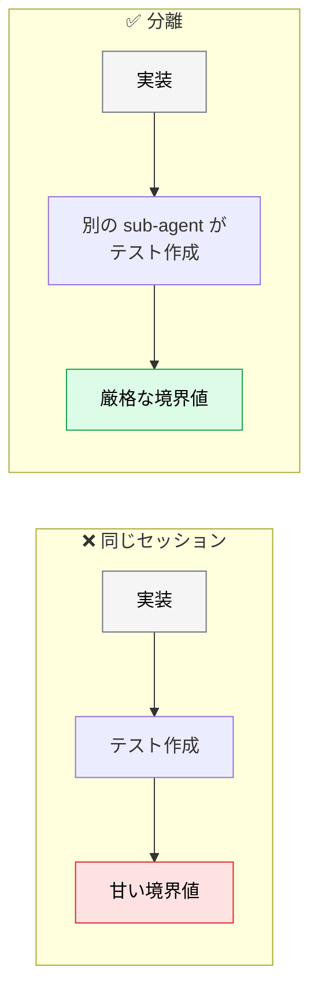

# AI × テスト戦略

> **この記事でわかること**：AI 生成の比率をどの層で高めるか、そしてフレームワークの選び方。

## 結論

戦略は1行に集約できる。

> **ピラミッドの下層ほど AI 生成の比率を高める。上層（E2E）は数を絞り、重要な業務フローのみをカバーする。**

AI は大量のテストを高速に生成できる。**その能力が有害に働くのが E2E 層**である。壊れやすく、保守コストが高い層で数を増やすと、テストスイート全体が信用されなくなる。

## 背景・課題

「AI でテストを書けば網羅性が上がる」と考えると、E2E を大量生成しがちである。しかし E2E は次の性質を持つ。

- UI の小さな変更で壊れる
- 実行が遅い
- 壊れたときの原因特定が難しい

**壊れやすいものを大量に持つと、誰も直さなくなる。** 結果としてテスト全体が無効化される。



## 具体的な方法

### AI × テストピラミッド



| 層 | AI 生成の比率 | 理由 |
| --- | --- | --- |
| **ユニット** | **高い（大量生成してよい）** | 高速・独立・壊れにくい |
| **統合** | 中程度 | 主要な連携パスに絞る |
| **E2E** | **低い（絞る）** | 壊れやすく保守コストが高い |

### フレームワークの選択

| フレームワーク | 用途 | AI 活用方法 |
| --- | --- | --- |
| **Vitest** | ユニット・コンポーネントテスト | ESM ネイティブ・高速。AI によるテストケース生成と相性がよい |
| **Jest** | ユニット・統合テスト | 既存資産が多い場合に継続利用 |
| **Playwright** | E2E テスト・ブラウザ自動化 | Playwright Agents（v1.56〜）で AI が自律テスト |
| **Cypress** | E2E テスト | コンポーネントテストも可能 |

**2026年時点の選択指針**

| 状況 | 推奨 |
| --- | --- |
| 新規プロジェクト | **Vitest + Playwright** |
| 既存の Jest 資産が多い | Jest + Playwright（無理に移行しない） |
| コンポーネントテスト | Vitest or Storybook |

> **選定軸は「既存資産・ESM 対応・実行速度」である。** ビルドツール（Vite / Webpack）との紐づけは必須ではない。

### ユニットテストの生成

```text
Vitestを使用して、@./src/utils/validation.ts の網羅的なユニットテストを作成してください。

要件（Requirements）:
- exportされているすべての関数をカバーすること
- 正常系（ハッピーパス）、エッジケース、エラーシナリオを含めること
- 次のパターンに従った説明的なテスト名を使用すること：「[condition] の場合、[behavior] であるべき」
- 必要な場合を除き、Mock（モック）は絶対に使用しないこと
- 90%以上のカバレッジを目指すこと
```

**「Mock は最小限に」を明示する**のが要点である。指示しないと AI は Mock を多用し、実装の詳細に依存した脆いテストを書く。

### 統合テストの生成

```text
ユーザー認証フローの統合テストを作成してください。
関連ファイル：@src/api/auth.ts, @src/middleware/session.ts, @src/db/users.ts

テストシナリオ：
1. 有効な認証情報を使用したログイン成功
2. 無効なパスワードでのログイン失敗（5回失敗後のレート制限処理の確認）
3. トークン更新（リフレッシュ）フロー
4. ログアウト処理およびセッションの無効化

HTTPテスト用として Vitest と supertest を使用してください。
```

**シナリオを明示する**。「統合テストを書いて」だけだと、何を検証すべきかを AI が推測する。

### 実装者とテスト作成者を分ける

実装した AI にそのままテストを書かせると、**「自分の実装が通るテスト」**を書く傾向がある。



QA という独立した人格に書かせることで、境界値やエラーケースが厳しくなる（→ [`../01_claude-code/05_sub-agents.md`](../01_claude-code/05_sub-agents.md)）。

## 実際のプロンプト例

```text
# 現状のカバレッジ分析
このリポジトリのテスト構成を分析して、テストピラミッドの各層の比率を報告して。

E2E が多すぎる、ユニットが少なすぎる、といった偏りがあれば指摘して。
偏りの是正案を、具体的なファイル単位で提案して。
```

```text
# 実装者と分離してテストを書かせる
サブエージェントを使って @src/services/pricing.ts のテストを書いて。

そのエージェントには「QA として、実装のバグを見つけることが目的」と伝えて。
実装が通ることではなく、仕様どおりかを検証するテストにして。
境界値・異常系を必ず含めて。
```

```text
# 意味のあるテストに絞る
このテストファイルを読んで、次を分類して。

A: 仕様を検証している（残す）
B: 実装の詳細を検証している（リファクタで壊れる。書き直す）
C: 他のテストと重複している（削除候補）

B と C について、具体的な修正案を示して。
```

## 注意点

> **カバレッジより意味のあるテストを優先する。** 100% カバレッジより、重要なビジネスロジックの検証を重視する。AI はカバレッジ目標を渡すと、それを満たすためだけの薄いテストを書く。

> **E2E を大量生成しない。** 生成量は「実際に維持できる量」に抑える（→ [`05_test-debt.md`](05_test-debt.md)）。

> **Mock を最小限にさせる。** 指示しないと多用する。過度な Mock はテストを脆弱にし、保守コストを上げる。

> **AI 生成テストもレビューする。** 不要なテストや重複テストを剥ぎ落とす工程が要る。

## 参考リンク

- 次に読む：[`01_e2e-automation.md`](01_e2e-automation.md) — E2E の自動化
- 関連：[`05_test-debt.md`](05_test-debt.md) — 生成しすぎを防ぐ
- 関連：[`../13_implementation/02_tdd.md`](../13_implementation/02_tdd.md) — テストファースト
