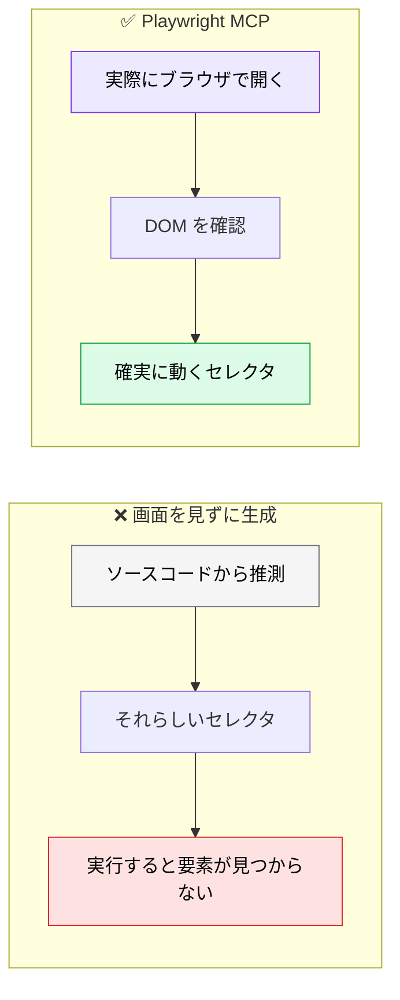

# E2E 自動化 ― Playwright MCP / Chrome DevTools MCP

> **この記事でわかること**：AI に E2E を書かせるときの最大の落とし穴（セレクタの推測）と、Healer を CI で使ってはいけない理由。

## 結論

E2E を AI に書かせるとき、成否を分けるのは1点である。

> **画面を実際に見せてからセレクタを決めさせる。**

ソースコードだけを渡すと、AI は「それらしいセレクタ」を推測する。実行して初めて要素が見つからないと分かる。

そして運用上の最重要ルール。

> **Healer（自動修復）を CI で有効にしない。** 本来検知すべき退行まで「修正」してしまう。

## 背景・課題

E2E テストが定着しない理由は、書くコストではなく**壊れるコスト**にある。

- UI が少し変わるとセレクタが壊れる
- 壊れたテストの修正が後回しになる
- やがて全体が信用されなくなり、無効化される

AI にテストを書かせても、**画面を見ずに書けばセレクタは推測**になる。この問題を解くのが Playwright MCP である。



## 具体的な方法

### Playwright Agents（概要）

v1.56 以降、Planner / Generator / Healer の3エージェントが提供される。`npx playwright init-agents --loop=claude` でエージェント定義一式をスキャフォールドする方式である。

> **セットアップ手順・Healer の opt-in 設定（`agents: { healer: true }`）・環境依存の注意点は [`../02_mcp/20_playwright.md`](../02_mcp/20_playwright.md) に集約している。** 本記事では扱わない。

**運用上の最重要ルールだけ再掲する。**

> **CI 用の設定では Healer を有効化しない。** セレクタの軽微な変更に追従してくれるのは有用だが、**本来検知すべき退行まで「修正」してしまう**。CI で自動的に走らせると、テストが存在する意味が失われる。人間がローカルで保守作業をするときだけ有効化する。

### Playwright MCP と Chrome DevTools MCP

役割が違う。**用途が明確に分かれていない限り、片方に絞る。**

| | Playwright MCP | Chrome DevTools MCP |
| --- | --- | --- |
| 主目的 | **テストの生成・実行** | **調査・デバッグ・計測** |
| 成果物 | 再実行可能なテストコード | その場の分析結果 |
| 強み | CI に組み込める | Performance / Network / Console にアクセスできる |

E2E を作るなら Playwright、「なぜ遅いか」を調べるなら Chrome DevTools である（→ [`../02_mcp/21_chrome-devtools.md`](../02_mcp/21_chrome-devtools.md)）。

### セレクタの方針

生成前に方針を渡す。渡さないと、その場で見つかった何かを使う。

| 優先順位 | セレクタ |
| --- | --- |
| 1 | `data-testid`（変更に強い） |
| 2 | ロール + アクセシブルネーム（`getByRole`） |
| 3 | テキスト（多言語対応では脆い） |
| ✕ | CSS クラス・XPath の絶対パス |

**`data-testid` が無いなら、まず付ける提案をさせる**ほうが長期的に安い。

### 環境の注意

> **WSL2 や CI コンテナ環境では Chromium の起動が不安定になり、スクリーンショットが欠損することがある。** Playwright MCP 起動前に `npx playwright install --with-deps` でブラウザ依存を確実にインストールし、失敗時はリトライ回数を上限付きで設定する。

## 実際のプロンプト例

```text
# 仕様書からテストを生成する
@docs/spec/SPEC.md のログイン機能の受け入れ基準を読んで、
Playwright MCP で実際に http://localhost:3000 を操作しながら
E2E テストを作成して。

条件:
- セレクタは実際の DOM を確認してから決めること（推測しない）
- data-testid があれば優先。無ければ getByRole を使う
- 正常系・異常系（パスワード誤り・未入力）を網羅すること
- 各テストは独立して実行できること
```

```text
# 既存テストの修正（緩めさせない）
このテストが失敗している。Playwright MCP で実際に画面を開いて、
現在の DOM 構造を確認したうえで原因を特定して。

セレクタの問題なら修正し、アプリ側のバグなら
「テストは正しい。アプリ側の問題」と報告して。

勝手にテストを緩めないで。待機時間を伸ばす、アサーションを弱める、
といった対処は禁止。
```

```text
# 探索してから計画を立てさせる
Playwright MCP で商品購入フローを一通り操作して、
テストすべき観点を洗い出して。

特に「エラーになりそうな入力」「途中で離脱した場合」を重点的に。
まだコードは書かないで、観点の一覧だけ出して。
私が確認してから生成に進んで。
```

## 注意点

> **「テストを通す」ためにテストを緩めさせない。** AI は失敗したテストを通すために、アサーションを弱める・待機時間を伸ばすという近道を取る。**「テストが正しくアプリが間違っている可能性」を常に検討させる**指示を明示する。

> **Healer を CI で有効にしない。** 退行を自動で「修正」してしまうと、テストが存在する意味が失われる。ローカルでの保守に限定する。

> **ローカルサーバーが必要である。** 対象アプリが起動していないと何もできない。CI で使う場合はアプリの起動を先行させる。

> **生成量を絞る。** E2E は最も壊れやすい層である。大量に生成して放置すると、保守されないテスト群が積み上がる（→ [`05_test-debt.md`](05_test-debt.md)）。

> **v1.56 時点の情報である。** CLI・設定仕様は変わりうる。導入前に公式ドキュメントで確認する。

## 参考リンク

- [Playwright Test Agents](https://playwright.dev/docs/test-agents)
- 関連：[`../02_mcp/20_playwright.md`](../02_mcp/20_playwright.md) — MCP としての設定
- 関連：[`03_vrt.md`](03_vrt.md) — 視覚差分の検証
- 関連：[`04_exploratory-test.md`](04_exploratory-test.md) — 探索的テスト
