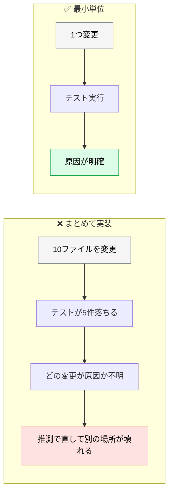
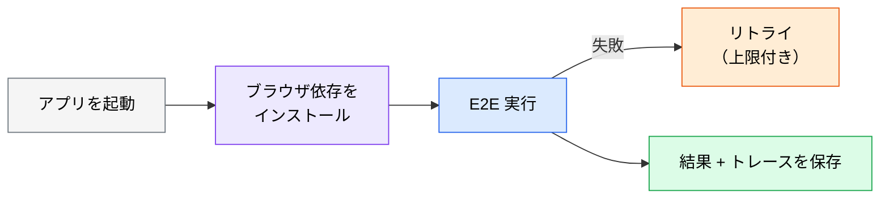

# CI への組み込み

> **この記事でわかること**：テストを CI に載せる基本形と、「実装 → テスト → 修正」を最小単位で回す理由。

## 結論

CI の構成自体は単純である。重要なのは**開発中のループの回し方**にある。

> **「実装 → テスト → 修正」を最小単位で繰り返すことで AI の連鎖バグを防ぐ。**

まとめて実装してから一気にテストすると、どの変更が原因かが分からなくなる。AI は原因を推測して、さらに別の場所を壊す。

## 背景・課題

AI は一度に大量のコードを書ける。しかし**まとめて書いてまとめて検証する**と、失敗時の切り分けが難しくなる。



**これが「連鎖バグ」である。** CI は最後の砦であって、開発中のループの代わりにはならない。

## 具体的な方法

### 基本のワークフロー

```yaml
# .github/workflows/test.yml
name: Tests
on: [push, pull_request]
jobs:
  test:
    runs-on: ubuntu-latest
    steps:
      - uses: actions/checkout@v4
      - uses: actions/setup-node@v4
        with:
          node-version: 22
          cache: npm
      - run: npm ci
      - run: npm run test:unit          # Vitest（高速）
      - run: npx playwright install --with-deps
      - run: npm run test:e2e           # Playwright（並列実行）
      - run: npm run test:coverage      # カバレッジレポート
      - uses: actions/upload-artifact@v4
        if: failure()
        with:
          name: playwright-report
          path: playwright-report/
```

**実行順序が速い順になっている**のが要点である。ユニットで落ちるなら、遅い E2E を実行する前に止まる。

### 開発中のループ

CI は変更が確定してから走る。**開発中は AI 自身にループを回させる。**

```text
[機能] を実装して。

1ファイル変更するごとに npm run test:unit を実行して、
失敗したらその場で直してから次に進んで。

まとめて実装してから一括でテストすることはしないで。
```

**「まとめてやるな」を明示する。** 指示しないと、AI は効率を優先して一括で書く。

### hooks で強制する

プロンプトでの指示は「お願い」である。確実にしたいなら hooks に落とす。

| タイミング | 処理 | 置き場所 |
| --- | --- | --- |
| ファイル編集後 | 該当ファイルの lint | **PostToolUse** |
| 応答完了時 | 型チェック・テスト実行 | **Stop hook** |

> **PostToolUse に重い処理を置かない。** 編集のたびに毎回走るため、多ファイル編集で破綻する。ここに置いてよいのは**単一ファイル対象で1秒以内**に終わる処理だけ（→ [`../01_claude-code/06_hooks.md`](../01_claude-code/06_hooks.md)）。

### E2E を CI に載せるときの注意



| 項目 | 対応 |
| --- | --- |
| ブラウザ依存 | `npx playwright install --with-deps` を先行実行 |
| **Healer** | **CI では有効化しない**（退行を自動修正してしまう） |
| フレーキーテスト | リトライは上限付き。無制限にしない |
| 失敗時の調査 | トレース・スクリーンショットを artifact に保存 |

**リトライを無制限にしない。** 「たまに通る」テストを通してしまうと、本物の不安定さが隠れる。

### カバレッジの扱い

カバレッジは**測るが、閾値で機械的に落とさない**運用が現実的である。

| ❌ | ✅ |
| --- | --- |
| カバレッジ 80% 未満で CI 失敗 | カバレッジの**変化**を PR にコメント |
| 数値目標を AI に渡す | 「重要なロジックが検証されているか」を人間が見る |

**数値目標を AI に渡すと、それを満たすためだけの薄いテストを書く。** 通るが何も検証していないテストが増える。

## 実際のプロンプト例

```text
# CI ワークフローを作らせる
このリポジトリ向けにテスト実行のワークフローを作成して。

要件：
- ユニット → E2E の順（速い順）
- E2E の前に npx playwright install --with-deps
- 失敗時にトレースとスクリーンショットを artifact に保存
- リトライは最大2回まで
- Healer は有効化しない

なぜその構成にしたか理由も添えて。
```

```text
# 開発中のループを守らせる
@src/services/order.ts をリファクタして。

制約：
- 1つの関数を変更するごとに npm run test:unit を実行する
- 失敗したらその場で直してから次に進む
- まとめて実装してから一括テストは禁止
- テストを緩めて通すことも禁止

各ステップで何を変更し、テスト結果がどうだったかを報告して。
```

```text
# フレーキーテストの特定
過去1ヶ月の CI 実行履歴を gh で取得して、
同じテストが「通ったり落ちたり」しているものを特定して。

それぞれ原因を推測して（待機不足 / 順序依存 / 外部依存）、
対処案を示して。リトライで隠す対処は提案しないで。
```

## 注意点

> **CI は開発中のループの代わりにならない。** 最小単位で回すことでしか連鎖バグは防げない。CI で初めて落ちる状態は、既に切り分けが難しい。

> **リトライで不安定さを隠さない。** 「たまに通る」テストは、本番でも「たまに落ちる」処理を示している可能性がある。

> **カバレッジの数値目標を AI に渡さない。** 目標を満たすためだけの薄いテストが増える。

> **Healer を CI で有効にしない。** 退行を自動修正してしまう。

> **E2E の実行時間が伸びたら層を見直す。** ユニットや統合で検証できることを E2E でやっていないか確認する（→ [`00_test-strategy.md`](00_test-strategy.md)）。

## 参考リンク

- 関連：[`00_test-strategy.md`](00_test-strategy.md) — テストピラミッド
- 関連：[`01_e2e-automation.md`](01_e2e-automation.md) — E2E の作成
- 関連：[`../21_cicd-ops/00_cicd-pipeline.md`](../21_cicd-ops/00_cicd-pipeline.md) — パイプライン全体
- 関連：[`../01_claude-code/06_hooks.md`](../01_claude-code/06_hooks.md) — hooks での強制
