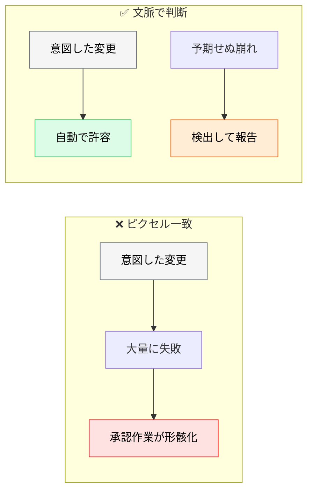
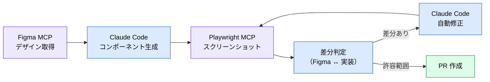
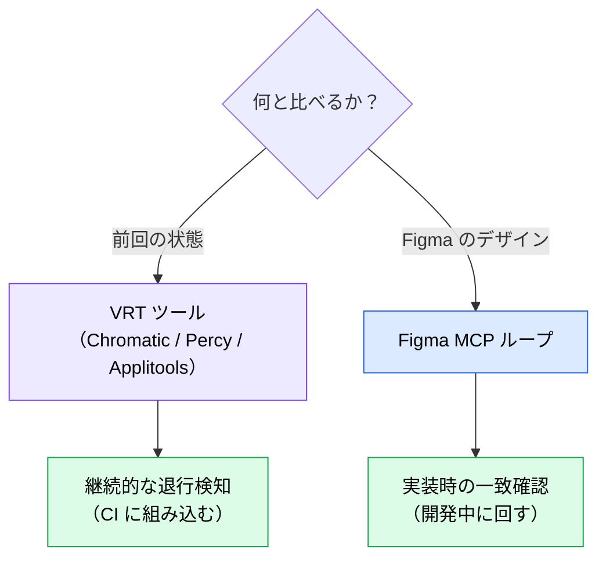

# ビジュアルリグレッションと視覚一致検証

> **この記事でわかること**：「意図したデザイン変更」と「予期せぬレイアウト崩れ」を切り分ける方法と、デザインとの差分を自動修正するループ。

## 結論

AI がコンポーネントを高速生成する環境では、**変更の意図を判別できることが VRT の価値**になる。

> **AI ベースの VRT ツールは、ピクセル完全一致ではなく文脈で判断する。**

さらに Figma MCP と組み合わせると、検出だけでなく**修正まで自動化**できる。

| 手段 | できること |
| --- | --- |
| **従来の VRT** | ピクセル差分を**検出**する |
| **Figma MCP × Playwright MCP** | 設計意図と照合して**修正まで**行う |

## 背景・課題

AI が UI を生成・修正するワークフローでは、差分が常時発生する。すべてを人間が目視確認するのは現実的でない。

一方でピクセル完全一致の VRT は、**意図した変更でも落ちる**。ボタンの色を変えたら、そのボタンを含む全画面が失敗する。



## 具体的な方法

### VRT ツール

| ツール | 特徴 |
| --- | --- |
| **Applitools Eyes** | AI が「意図した変更」と「バグ」を自動判別。クロスブラウザ対応 |
| **Chromatic** | Storybook 連携。コンポーネント単位のビジュアル変更検知 |
| **Percy（BrowserStack）** | Playwright / Cypress と統合。スナップショットベース |

> **Storybook を使っているなら Chromatic が最も導入が軽い。** 既存の story がそのまま検証対象になる。

**AI が UI を生成する時代だからこそ、AI が UI の品質を検証するプロセスが必要になる。** Playwright E2E + VRT の組み合わせが基本形である。

### Figma MCP × Playwright MCP の検証ループ

生成コードとデザインの視覚的ズレを、AI エージェントだけで検出・修正する。



**従来の VRT との違いは「何を正とするか」である。**

| | 比較対象 | 正 |
| --- | --- | --- |
| 従来の VRT | 前回のスクリーンショット | **前回の状態** |
| Figma 照合ループ | Figma のデザイン | **設計意図** |

前者は「変わったか」を見る。後者は「**あるべき姿と合っているか**」を見る。

### 典型プロンプト

```text
Figma MCP から nodeId=xxx のデザインを取得し、
Playwright MCP で @src/components/Card.tsx を localhost:3000 でレンダリングした
スクリーンショットを撮影してください。

両者の差分（余白・色・タイポグラフィ）を列挙し、
デザイン側を正として実装を修正してください。
差分がしきい値以下になるまでループしてください。
```

> **ループには上限を切る。** 「しきい値以下になるまで」だけだと収束しない場合に止まらない。「最大5回」を添える。

### 使い分け



**両者は排他ではない。** 実装時に Figma ループで合わせ、以降は VRT で退行を検知する。

### Figma 側の前提

このループは **Figma ファイルが整っていること**が前提である。レイヤー名が `Rectangle 47` のままでは、AI は何と比較すべきか判断できない（→ [`../02_mcp/30_figma.md`](../02_mcp/30_figma.md)）。

### 環境の注意

> **WSL2 や CI コンテナ環境では、Chromium の起動が不安定になりスクリーンショットが欠損することがある。** Playwright MCP 起動前に `npx playwright install --with-deps` でブラウザ依存を確実にインストールし、失敗時はリトライ回数を上限付きで設定する。

## 実際のプロンプト例

```text
# 視覚一致の検証（上限付き）
Figma MCP で [FigmaフレームURL] のデザインを取得して、
Playwright MCP で @src/components/ProductCard.tsx を
localhost:3000 でレンダリングしたスクリーンショットと比較して。

差分を「余白 / 色 / タイポグラフィ / サイズ」に分類して列挙し、
デザイン側を正として実装を修正して。

制約：
- 修正 → 再撮影 → 比較のループは最大5回まで
- 5回で収束しなければ、残差分の一覧と原因の推測を報告して
- デザイン側が誤っていると判断した場合は、修正せずに報告して
```

```text
# 意図した変更かの判別
この PR のビジュアル差分を確認して、それぞれ
「意図した変更」「予期せぬ崩れ」のどちらかを判定して。

判定根拠として、PR の説明文・変更されたコードとの対応を示して。
判断がつかないものは「要確認」として人間に回して。
```

```text
# VRT の導入判断
このリポジトリの構成（Storybook の有無、コンポーネント数、CI 環境）を確認して、
VRT ツールを導入する場合の推奨と、その理由を示して。

導入コスト（ライセンス費用・CI 実行時間の増加）にも触れて。
```

## 注意点

> **ループには必ず上限を切る。** 「しきい値以下になるまで」は収束しない場合に止まらない。

> **デザイン側が誤っている可能性を残す。** 「デザインを正とする」と指示すると、デザイン側のミスまで実装に反映される。「誤りと判断したら報告」を添える。

> **Figma ファイルが整っていないと機能しない。** 変数・Auto Layout・意味のあるレイヤー名が前提である。

> **VRT の承認作業が形骸化しやすい。** 差分が多すぎると「全部承認」で流れる。ピクセル一致ではなく文脈判断のツールを選ぶ理由がここにある。

> **CI 環境ではブラウザ依存の事前インストールが要る。** スクリーンショットが欠損すると、差分ゼロと誤判定されうる。

## 参考リンク

- 関連：[`../02_mcp/30_figma.md`](../02_mcp/30_figma.md) — Figma ファイルの準備
- 関連：[`../02_mcp/20_playwright.md`](../02_mcp/20_playwright.md) — Playwright MCP
- 関連：[`../12_ui-ux/04_design-tokens.md`](../12_ui-ux/04_design-tokens.md) — デザイントークン
