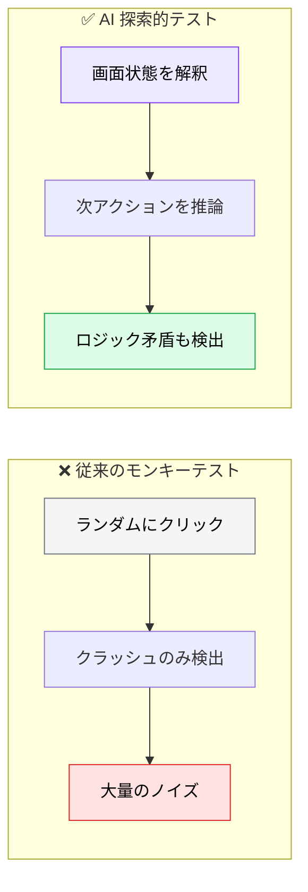
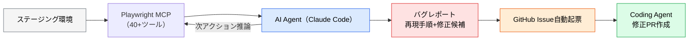
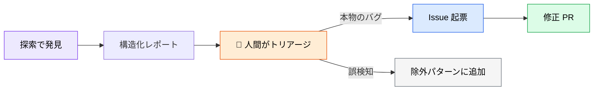

# AI 探索的テスト

> **この記事でわかること**：ランダム入力のモンキーテストとの違いと、常時稼働させるための設計（停止条件・出力形式）。

## 結論

従来のモンキーテスト（ランダム入力）は**ノイズが多くシグナルが低い**。

2026年時点のベストプラクティスは、**AI エージェントが前ステージの観察結果をもとに次のアクションを決定する「好奇心駆動型」の探索**である。

そして実用化の鍵は2つある。

> **停止条件と出力形式を必ず指定する。** これがないと、無限に探索して構造化されていない報告が返る。

## 背景・課題

ランダム入力では、クラッシュ系のバグしか見つからない。「ボタンは押せるが何も起きない」「エラー後にリトライ手段がない」といった**ロジックの問題**は、画面を理解していないと発見できない。



## 具体的な方法

### 従来との比較

| 項目 | 従来のモンキーテスト | AI 探索的テスト |
| --- | --- | --- |
| 入力生成 | ランダム | **画面状態を解釈して次アクションを推論** |
| 発見できるバグ | クラッシュ・例外系のみ | **ロジック矛盾・ワークフロー切断・アクセシビリティ違反**も検出 |
| コンテキスト | なし | ユーザーストーリー・仕様書を踏まえた探索 |
| レポート | スタックトレースのみ | **再現手順・影響範囲・修正候補**まで提示 |

### 実装パターン

Playwright MCP はブラウザ操作・DOM 取得・スナップショットなどのツール群を LLM に提供する。要点はツール数ではなく、AI が**アクセシビリティツリーを構造化データとして解釈**することにある。



> **Vision モデルが不要**な点が実用上大きい。アクセシビリティツリーで要素を認識できるため、**画像処理の追加コストなしで**動かせる。
>
> ただし**トークンは消費する**。アクセシビリティのスナップショットは1回で数千トークン規模になり、1時間の自律探索は相応の金額になりうる。「常時稼働」ではなく**夜間バッチ／リリース前に時間を区切って**回すのが現実的である。導入前に短時間で実測する。

### 他ツールとの比較

Playwright MCP 以外にも選択肢がある。

| ツール | 特徴 |
| --- | --- |
| **Playwright MCP + Claude Code**（推奨） | OSS、既存 Playwright 資産を活用、コスト極小 |
| **testRigor** | 平易な英語でテストを記述、自律的に UI クロールで自然言語テストケース生成 |
| **Mabl** | 統合ダッシュボードで機能／視覚／パフォーマンスを一括管理 |
| **Reflect** | ノーコード、UI 変更に自動追従するインテリジェントセレクタ |
| **Gremlin**（Chaos Engineering） | ML でインシデント履歴から障害仮説を自動生成、「Reliability Score」でシステム健全性を数値化 |

**既に Playwright 資産があるなら Playwright MCP が最も安い。** ノーコードで非エンジニアも触る前提なら Reflect や Mabl を検討する。

> **UI 側の探索と同時に、コード側でもアンチパターン検出を回す**構成が有効である。コード側のツールは [`../22_security/03_security-scan.md`](../22_security/03_security-scan.md) を参照する。

### 探索の指示

**目標・アンチパターン・出力形式・停止条件**の4点を必ず指定する。

```text
Playwright MCP を使い、以下の目標で staging.example.com を1時間探索してください。

【目標】
新規登録 → 商品購入 → キャンセルフローを、
20種類の異なるペルソナ視点で動線を辿り、
以下のアンチパターンを発見してください：

1. 5秒以上応答がない画面（体感パフォーマンス問題）
2. ボタンが押せてしまうが機能しない（デッド状態）
3. エラー時にリトライ手段が示されない
4. 戻るボタンで状態が壊れる
5. モバイル幅（375px）でレイアウト崩れ

【出力】
発見した問題ごとに JSON で以下を出力：
{ severity, reproduce_steps, screenshot_path, suggested_fix, related_spec_section }

【停止条件】
- 60分経過、または30個の Issue 候補が集まったら停止
```

### 4点の役割

| 要素 | ないとどうなるか |
| --- | --- |
| **目標** | どこを重点的に見るか決まらず、浅く広く回るだけになる |
| **アンチパターン** | 「何が問題か」の基準がなく、正常動作を報告してくる |
| **出力形式** | 散文で返り、Issue に変換できない |
| **停止条件** | **止まらない。** コストが際限なく積み上がる |

**停止条件が最も重要である。** 時間と件数の両方で切る。

### 実行環境

| 項目 | 推奨 |
| --- | --- |
| 対象環境 | **ステージング**（本番では実行しない） |
| データ | テストデータのみ。実顧客データを操作させない |
| 頻度 | 夜間バッチ、またはリリース前 |
| 権限 | 決済・メール送信など**外部影響のある操作は無効化**する |

> **本番環境で実行しない。** 探索的テストは「何が起きるか分からない操作」を意図的に行う。実データへの副作用が読めない。

### 発見からの流れ



**Issue の自動起票を最初から有効にしない。** 誤検知が混ざると、Issue が溢れて誰も見なくなる。まず人間がトリアージし、精度が安定してから自動化する。

## 実際のプロンプト例

```text
# 小さく始める（30分・5件）
Playwright MCP で staging.example.com のログイン〜商品検索までを30分探索して。

観点：
1. エラー時にリトライ手段が示されない
2. ボタンが押せるが何も起きない
3. モバイル幅（375px）でのレイアウト崩れ

出力：問題ごとに { 重大度, 再現手順, 該当URL, 修正案 } の表で。
停止条件：30分経過、または5件見つかったら停止。

決済・メール送信に至る操作は行わないで。
```

```text
# 誤検知の削減
前回の探索で報告された問題を確認したところ、
以下は仕様どおりの動作だった。[誤検知の一覧]

これらを除外パターンとしてまとめて、
次回の探索プロンプトに含める形にして。
```

```text
# 探索結果を Issue に変換
探索レポートの JSON を読んで、重大度 High 以上のものだけを
gh で Issue として起票する下書きを作って。

まだ起票はしないで。内容を確認させて。
```

## 注意点

> **停止条件を必ず指定する。** 時間と件数の両方で切らないと、コストが際限なく積み上がる。

> **本番環境で実行しない。** 意図的に異常な操作を試すため、実データへの副作用が読めない。

> **外部影響のある操作を無効化する。** 決済・メール送信・外部 API 呼び出しは、テスト環境でも実際に発火しうる。

> **Issue の自動起票を最初から有効にしない。** 誤検知が混ざると Issue が溢れる。人間のトリアージを挟み、精度が安定してから自動化する。

> **AI 探索テストの真価は「バグ発見」ではない。** 「**バグの初動 → Issue 起票 → 修正 PR ドラフト → 人間レビュー**」までを一気通貫で回すことにある。夜間バッチで走らせ、朝に修正 PR のレビューだけ行う運用が目指す形である。

> **「問題なし」も報告させる。** 探索して何も見つからなかったのか、探索自体が失敗したのかを区別する必要がある。

## 参考リンク

- 関連：[`01_e2e-automation.md`](01_e2e-automation.md) — 定型テストとの使い分け
- 関連：[`../02_mcp/20_playwright.md`](../02_mcp/20_playwright.md) — Playwright MCP
- 関連：[`../12_ui-ux/02_ux-auto-test.md`](../12_ui-ux/02_ux-auto-test.md) — ペルソナ評価
