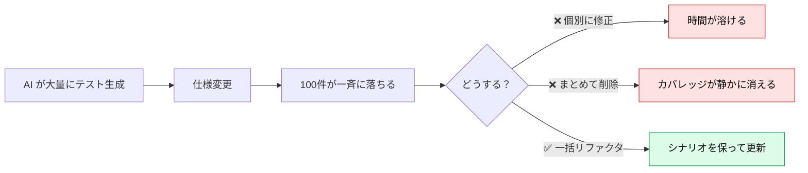
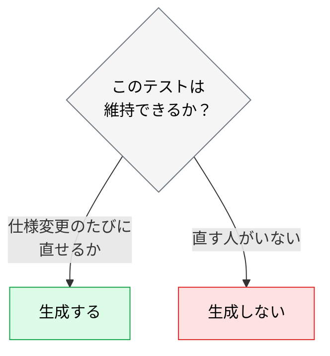

# AI テスト負債の管理

> **この記事でわかること**：仕様変更で大量のテストが落ちたときの対処と、AI に「勝手にテストを消させない」指示の書き方。

## 結論

仕様変更で大量のテストが落ちたとき、**個別に修正しない**。

> **AI に仕様変更を伝えて、テストスイート全体をリファクタリングさせる。**

ただし必ず添える制約がある。

> **「シナリオは維持、実装詳細のみ修正」。** これを言わないと、AI は重要なエッジケースのテストを勝手に削除する（**サイレントなカバレッジ低下**）。

## 背景・課題

AI は大量のテストを高速に生成できる。その結果、仕様変更のたびに「大量のテストが落ちて保守が追いつかない」という問題が起きる。これを **AI テスト負債**と呼ぶ。



**最も危険なのは2番目である。** 「不要になったテストを削除して」と指示すると、AI は落ちているテストを片っ端から消す。カバレッジが下がったことに誰も気づかない。

## 具体的な方法

### 一括リファクタリングのプロンプト

```text
仕様が変更されました。@SPEC.md の変更内容を確認し、
@tests/ 配下のテストスイート全体を新仕様に合わせてリファクタリングしてください。

重要な制約：
- 既存のテストシナリオ（Given/When/Thenの条件）は絶対に維持すること
- 実装の詳細（セレクタやMockの書き方など）のみを新仕様に合わせて修正
- テストを削除する場合は、削除理由をコメントで明記すること
- 新要件のテストは追加してください
- 全テストがパスすることを確認してください
```

**4つの制約すべてが必要である。**

| 制約 | 防ぐもの |
| --- | --- |
| シナリオは絶対に維持 | エッジケースの消失 |
| 実装詳細のみ修正 | 検証内容のすり替え |
| **削除するなら理由をコメント** | **サイレントな削除** |
| 新要件のテストは追加 | 変更部分の検証漏れ |

### 削除の追跡

3つ目の制約が効くのは、**削除が diff に残る**ためである。

```diff
- test("金額が0のとき例外を投げる", () => { ... })
+ // 削除理由：仕様変更により金額0が正常系になったため（SPEC.md §3.2）
```

理由がコメントで残れば、レビューで妥当性を判断できる。**理由なき削除を許さない**ことが、カバレッジ低下を防ぐ唯一の手段である。

### 予防策：テスト設計の原則

そもそも壊れにくいテストを書けば、負債は溜まらない。

| 原則 | 理由 |
| --- | --- |
| **テストは「動作」を検証し、「実装」を検証しない** | 実装詳細に依存するテストはリファクタのたびに壊れる |
| **Mock は最小限に押さえる** | 過度な Mock はテストを脆弱にし、保守コストを上げる |
| **AI 生成テストもレビューする** | 不要なテストや重複テストを剥ぎ落とす |
| **カバレッジより意味のあるテストを優先** | 100% カバレッジより、重要なビジネスロジックの検証を重視 |

**1つ目が最も効く。** 「`calculateTotal` が `formatPrice` を呼ぶこと」を検証するテストは、リファクタで必ず壊れる。「合計金額が正しいこと」を検証すればよい。

### 生成量を制御する

「AI が書けるから」で大量生成すると、維持できない量になる。



**生成量は「実際に維持できる量」に抑える。** 特に E2E は壊れやすいため、重要な業務フローに絞る（→ [`00_test-strategy.md`](00_test-strategy.md)）。

### 定期的な棚卸し

負債は放置すると増える。四半期ごとに見直す。

| 見るもの | 判断 |
| --- | --- |
| 長期間 skip されているテスト | 直すか消すかを決める（放置しない） |
| 実行時間の長いテスト | 層を下げられないか検討する |
| 一度も落ちたことがないテスト | 本当に何かを検証しているか確認する |
| 頻繁に落ちるテスト | 実装依存になっていないか確認する |

## 実際のプロンプト例

```text
# 一括リファクタ（削除を追跡可能にする）
@docs/spec/SPEC.md の変更を踏まえて、@tests/ 配下を新仕様に合わせて更新して。

制約：
- 既存のテストシナリオ（Given/When/Then）は絶対に維持する
- 修正するのは実装の詳細（セレクタ・Mock の書き方）のみ
- 削除するテストがあれば、コメントで削除理由と根拠（SPEC のどの節か）を明記する
- 新要件に対するテストは追加する
- 全テストがパスすることを確認する

削除したテストの一覧を、最後にまとめて報告して。
```

```text
# 壊れやすいテストの特定
@tests/ 配下を読んで、実装の詳細に依存しているテストを特定して。

判定基準：
- 内部関数の呼び出し回数を検証している
- Mock の呼び出し引数を細かく検証している
- 特定の実装構造（クラス名・プライベートメソッド）に依存している

それぞれ「動作を検証する形」への書き換え案を示して。
```

```text
# 棚卸し
skip / todo になっているテストを全て列挙して、
最終更新日と、なぜ skip されたかを推測して。

「直す」「消す」「そのまま」の3分類で提案して。
消す提案には、失われるカバレッジを明記して。
```

## 注意点

> **「不要なテストを削除して」とだけ指示しない。** 落ちているテストが片っ端から消される。**「シナリオは維持、実装詳細のみ修正」**を必ず添える。

> **削除には必ず理由を書かせる。** diff に理由が残れば、レビューで妥当性を判断できる。理由なき削除がサイレントなカバレッジ低下を生む。

> **テストを緩めて通させない。** AI は失敗したテストを通すために、アサーションを弱める・待機時間を伸ばす近道を取る。「テストが正しくアプリが間違っている可能性」を検討させる。

> **生成量を「維持できる量」に抑える。** 書けることと維持できることは違う。

> **skip の放置が最も静かな負債である。** 落ちないので気づかない。四半期ごとに棚卸しする。

## 参考リンク

- 関連：[`00_test-strategy.md`](00_test-strategy.md) — 層ごとの生成比率
- 関連：[`01_e2e-automation.md`](01_e2e-automation.md) — 最も壊れやすい層
- 関連：[`../14_code-review/00_ai-human-split.md`](../14_code-review/00_ai-human-split.md) — レビューの分担設計
