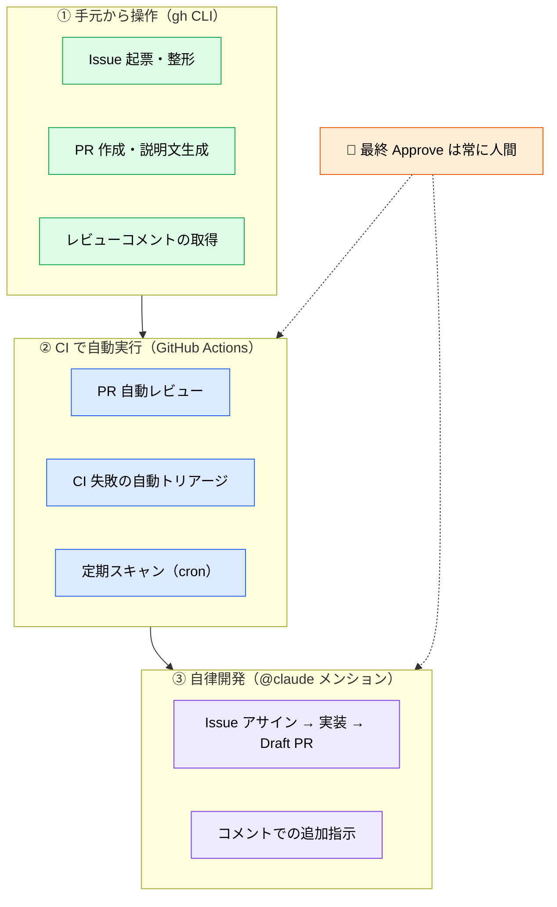
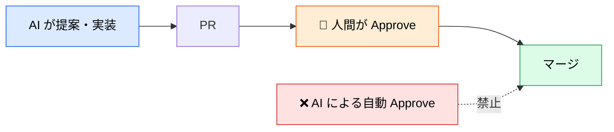

# GitHub × Claude でできることの地図

> **この記事でわかること**：GitHub 連携には「手元から操作する」「CI で自動実行する」の2系統があり、どちらから始めるべきか。

## 結論

GitHub × Claude には**3つのレイヤー**がある。**下から順に導入する。**

| レイヤー | 手段 | 導入コスト | 始めどき |
| --- | --- | --- | --- |
| **① 手元から操作** | `gh` CLI（Bash 経由） | ほぼゼロ | **まずここから** |
| **② CI で自動実行** | GitHub Actions + `claude-code-action` | 中（App 設定・Secrets・権限設計） | ①が定着してから |
| **③ 自律開発** | `@claude` メンション駆動 | 高（権限・ガバナンス設計が必須） | ②が安定してから |

いきなり ③ から始めると、権限設計とコスト管理が追いつかず事故る。

## 背景・課題

「GitHub と AI を連携させたい」という要望は漠然としている。実際にやりたいことは次のどれかに分かれる。

- PR の説明文を書くのが面倒 → ①で足りる
- レビューの一次チェックを自動化したい → ②
- Issue を投げたら実装まで進んでほしい → ③

**必要なレイヤーを見極めれば、無駄な設定をしなくて済む。**

## 具体的な方法

### 全体像



### レイヤー①：手元から操作する

**`gh auth login` を済ませるだけで始まる。** Claude Code は `gh` の存在を認識し、Issue 取得・PR 作成・コメント読み取りに自動で利用する。

MCP は不要である。`gh` は都度 Bash で実行されるため、**コンテキストを常時消費しない**（→ [`../02_mcp/10_github.md`](../02_mcp/10_github.md)）。

| やること | 記事 |
| --- | --- |
| Issue の起票・整形・分解 | [`01_issue.md`](01_issue.md) |
| PR 作成・説明文生成 | [`02_pull-request.md`](02_pull-request.md) |

### レイヤー②：CI で自動実行する

`anthropics/claude-code-action` を使い、GitHub イベントに反応させる。

| 導入ステップ | 操作 |
| --- | --- |
| 1 | Claude Code CLI 上で `/install-github-app` を実行 |
| 2 | 表示される URL から GitHub App をリポジトリへインストール |
| 3 | `.github/workflows/` にワークフロー YAML を追加 |
| 4 | GitHub Secrets に `ANTHROPIC_API_KEY` を登録 |

| やること | 記事 |
| --- | --- |
| PR 自動レビュー | [`03_auto-review.md`](03_auto-review.md) |
| ワークフローの設定全般 | [`04_github-actions.md`](04_github-actions.md) |

### レイヤー③：自律開発

Issue や PR コメントに `@claude` とメンションすると、ブランチ作成・実装・Draft PR 起票まで自律的に実行する。

**ここから先は権限設計が必須になる。** コードの変更権限（`contents: write`）を与えるため、次を先に決める。

- Claude が変更してよい範囲（ディレクトリ・ファイル種別）
- 誰のコメントで起動してよいか（外部コントリビューターを弾く）
- 1タスクあたりのターン数上限（コスト制御）

詳細は [`04_github-actions.md`](04_github-actions.md)、導入前の確認は [`05_checklist.md`](05_checklist.md) を参照する。

### 全レイヤーに共通する原則



> **AI レビューは補助であり、最終 Approve は人間が行う。** これを `CLAUDE.md` に明記し、Branch Protection Rule で技術的にも担保する。

## 実際のプロンプト例

```text
# レイヤー①（今すぐ試せる）
現在のブランチの変更内容から PR を作成して。
タイトルは変更の要点、本文には「変更点」「テスト方法」「関連 Issue」を含めて。
まだ push はしないで、作成する内容だけ見せて。
```

```text
# 導入計画を立てさせる
このリポジトリの構成・チーム規模・ブランチ運用を踏まえて、
GitHub × Claude の導入計画を3段階で提案して。

各段階について「必要な設定」「想定コスト」「事故りうるポイント」を挙げて。
いきなり全部やらない前提で、最初の1歩だけ具体化して。
```

## 注意点

> **レイヤーを飛ばさない。** ③から始めると、権限設計・コスト管理・レビュー体制が未整備のまま自律実行が走る。①で「AI に何を任せると良いか」の感覚を掴んでから進む。

> **`ANTHROPIC_API_KEY` は Secrets に置く。** ワークフロー YAML に直書きしない。ログに出力されないことも確認する。

> **fork からの PR に注意する。** 外部コントリビューターのコメントで無制限に起動されないよう制限をかける（→ [`05_checklist.md`](05_checklist.md)）。

> **コスト上限を必ず設定する。** `--max-turns` を指定しないと、複雑なタスクで想定外のトークンを消費しうる。

## 参考リンク

- [anthropics/claude-code-action（GitHub）](https://github.com/anthropics/claude-code-action)
- 関連：[`../02_mcp/10_github.md`](../02_mcp/10_github.md) — MCP と gh CLI の使い分け
- 関連：[`../14_code-review/`](../14_code-review/) — レビュー観点の設計
