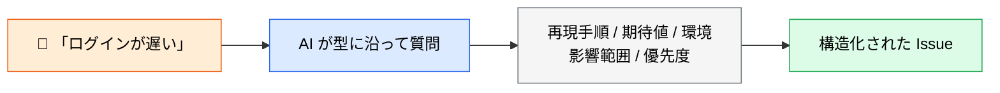
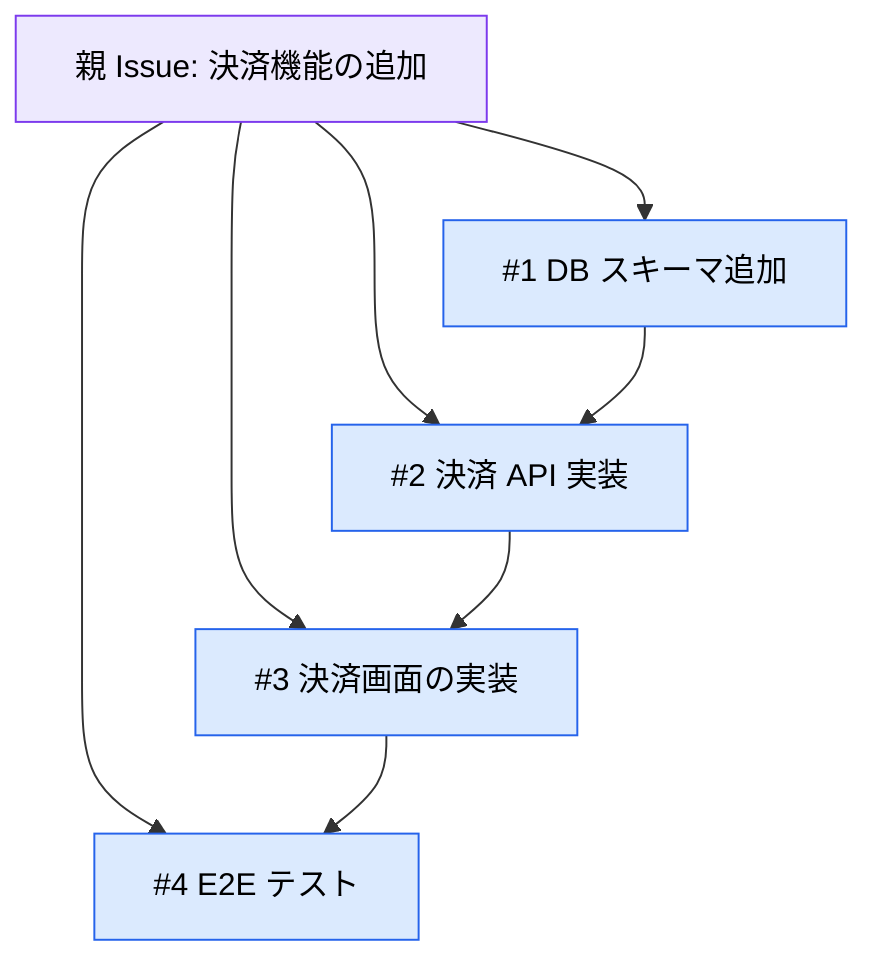

# Issue の起票・整形・分解を AI に任せる

> **この記事でわかること**：曖昧な Issue を「実装可能な粒度」に整える方法と、Issue の記述を鵜呑みにさせない指示の書き方。

## 結論

Issue まわりで AI が最も効くのは**起票そのものではなく、整形と分解**である。

| 作業 | AI の適性 | 理由 |
| --- | --- | --- |
| 起票（新規作成） | ○ | 型に沿った文章生成は得意 |
| **整形**（曖昧な記述を構造化） | ◎ | **抜けている項目を機械的に指摘できる** |
| **分解**（大きな Issue を分割） | ◎ | **依存関係を整理させると質が上がる** |
| 原因の推定 | △ | Issue に書かれた「原因」は間違っていることが多い |

## 背景・課題

実装が止まる Issue には共通点がある。

- 再現手順がない
- 期待する挙動が書かれていない
- 「〇〇機能を作る」だけで粒度が大きすぎる
- 報告者の推測した原因が、事実として書かれている

**これらは書き手の怠慢ではなく、書くべき項目を覚えていないだけ**であることが多い。AI に型を持たせれば機械的に埋められる。

## 具体的な方法

### 起票：型を渡す



**足りない情報を AI に質問させる**のが要点である。勝手に埋めさせると、推測が事実として記録される。

### 整形：既存 Issue の品質を上げる

「着手可能か」を判定させ、足りないものを列挙させる。

| 判定 | 基準 |
| --- | --- |
| ✅ 着手可能 | 再現手順・期待値・完了条件が揃っている |
| ⚠️ 要確認 | 一部が欠けている。報告者への質問が必要 |
| ❌ 着手不可 | 何をすべきか判断できない |

### 分解：粒度を揃える

大きな Issue を分割するとき、**依存関係を明示させる**と実装順序が決まる。



**分解の目安は「1 Issue = 1 PR で閉じられること」**である。複数 PR にまたがるなら、まだ大きい。

### Issue テンプレートを整備する

繰り返し使うなら、リポジトリ側にテンプレートを置く。AI にも人間にも同じ型が効く。

```text
.github/ISSUE_TEMPLATE/
├── bug_report.md
└── feature_request.md
```

テンプレート自体も AI に作らせられる。過去の Issue を分析させて、実際に必要だった項目を洗い出すのが効率的である。

## 実際のプロンプト例

```text
# 起票（勝手に埋めさせない）
「決済画面でエラーが出る」という報告から Issue を作成したい。
Issue に必要な項目のうち、私がまだ伝えていない情報を質問して。
推測で埋めないで。全部揃ったら Issue の本文を作成して。
```

```text
# 整形（既存 Issue の棚卸し）
gh コマンドでこのリポジトリの open な Issue を全て取得して、
それぞれ「着手可能 / 要確認 / 着手不可」に分類して。

要確認・着手不可のものは、何の情報が足りないかを具体的に列挙して。
報告者に投げる質問文の案も添えて。
```

```text
# 分解
Issue #42「決済機能の追加」を実装可能な粒度に分解して。

条件:
- 1つの子 Issue = 1つの PR で閉じられる粒度にする
- 依存関係を明示する（どれを先にやるべきか）
- 各子 Issue に完了条件を書く

まず分解案だけ提示して。承認したら gh で実際に作成して。
```

```text
# 原因の検証（鵜呑みにさせない）
Issue #57 を読んで、報告されている原因が正しいか
実際のコードを確認して検証して。

報告者の推測が誤っている可能性も考慮して、
「報告内容」「コードから読み取れる事実」「一致するか」の3点で報告して。
```

## 注意点

> **Issue に書かれた「原因」を前提にさせない。** 報告者の推測が誤っていることは珍しくない。「原因は〇〇」と書かれていても、コードで検証させる指示を添える。

> **一括作成の前に案を見せさせる。** 分解した子 Issue をいきなり10件作られると、後始末が面倒である。「まず案だけ」を習慣にする。

> **ラベル・アサインの自動付与は慎重に。** 誤ったアサインは通知を飛ばし、相手の作業を止める。

> **既存 Issue の大量整形は通知に注意する。** 過去 Issue を一括編集すると、ウォッチしている全員に通知が飛ぶ。件数が多い場合は事前にチームへ周知する。

## 参考リンク

- [GitHub CLI 公式](https://cli.github.com/)
- 関連：[`02_pull-request.md`](02_pull-request.md) — Issue から PR へ
- 関連：[`../10_requirements/`](../10_requirements/) — 要件定義との接続
