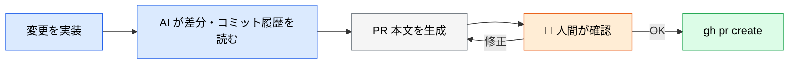
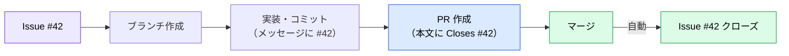

# PR 作成と説明文の自動生成

> **この記事でわかること**：`gh` CLI だけで完結する PR 運用と、レビュアーが読みたくなる説明文を書かせる指示。

## 結論

**PR 作成に MCP は要らない。`gh auth login` だけで始まる。**

そして AI に PR を書かせる価値は、作成の手間を省くことより **「何を変えたか」ではなく「なぜ変えたか」を書かせる**ことにある。差分は GitHub が表示する。人間が読みたいのは意図である。

## 背景・課題

PR の説明文が「〇〇を修正」の一行で終わるのは、書くのが面倒だからである。しかし説明が薄い PR はレビューが遅れる。

| レビュアーが最初に知りたいこと | 差分から分かるか |
| --- | --- |
| 何を変えたか | ✅ 分かる |
| **なぜ変えたか** | ❌ 分からない |
| **どこを重点的に見てほしいか** | ❌ 分からない |
| **どう検証したか** | ❌ 分からない |

**AI は差分とコミット履歴を読める。** 意図と検証方法を人間が一言添えれば、残りは埋められる。

## 具体的な方法

### 基本の流れ



**「作成前に内容を見せる」工程を挟む。** PR を作れば関係者に通知が飛ぶ。取り消しはできても、通知は取り消せない。

### PR 本文に含める項目

| 項目 | 内容 | AI に任せられるか |
| --- | --- | --- |
| **変更点** | 何を変えたか | ✅ 差分から生成できる |
| **背景・目的** | なぜ変えたか | ⚠️ Issue から取得、無ければ人間が伝える |
| **レビュー観点** | どこを重点的に見てほしいか | ✅ 変更の性質から推測できる |
| **テスト方法** | どう検証したか | ⚠️ 実行結果を渡せば書ける |
| **影響範囲** | 何が壊れうるか | ✅ 参照箇所を調べさせる |

### テンプレートを置く

リポジトリに置けば、AI にも人間にも同じ型が効く。

```text
.github/pull_request_template.md
```

テンプレートがあれば、「テンプレートに沿って埋めて」と指示するだけで済む。

### コミットメッセージも同時に整える

PR の質はコミットの質に依存する。**コミットが「wip」「fix」ばかりだと、AI も意図を読み取れない。**

```text
# コミット時
これまでの変更をコミットして。
メッセージは Conventional Commits 形式で、
「何を」ではなく「なぜ」が分かる本文を添えて。
```

### Issue との紐付け

Issue 番号を含めると、GitHub が自動でリンクする。`Closes #42` と書けばマージ時に Issue が閉じる。



## 実際のプロンプト例

```text
# 基本形（作成前に確認を挟む）
このブランチの変更内容から PR を作成して。

本文には次を含めて:
- 変更点（箇条書き）
- 背景・目的（関連 Issue があれば参照）
- レビュー観点（どこを重点的に見てほしいか）
- テスト方法（実行したコマンドと結果）

まだ作成はしないで、内容だけ見せて。
```

```text
# レビュー観点を具体的にさせる
PR の説明文に「レビュー観点」を追加して。
「全体を確認してください」のような曖昧な書き方はしないで、
差分の中で特に判断が分かれそうな箇所を3点まで挙げて、
それぞれ何を判断してほしいのかを書いて。
```

```text
# 影響範囲を調べさせる
この PR で変更した関数を参照している箇所を全て洗い出して、
影響が及ぶ範囲を PR 本文の「影響範囲」セクションに追記して。
テストでカバーされていない参照箇所があれば明示して。
```

```text
# 大きな PR の分割提案
現在の差分が大きすぎる気がする。
レビュー可能な単位に分割できるか検討して。
分割案（どのファイルをどの PR にまとめるか、順序と依存関係）を提示して。
```

## 注意点

> **PR は外向きの成果物である。** 作成すればレビュアーに通知が飛ぶ。「まず内容を見せて」を習慣にする。

> **差分の要約だけの説明文には価値がない。** GitHub が差分を表示する以上、変更点の羅列は情報を増やさない。**意図・観点・検証**を書かせる。

> **AI に「なぜ」を捏造させない。** 背景を伝えていなければ、AI はもっともらしい理由を作る。Issue が無い場合は人間が一言渡す。

> **`Closes #42` の副作用に注意する。** マージ時に Issue が自動でクローズされる。まだ残タスクがある場合は `Refs #42` を使う。

> **push と PR 作成を分ける。** 「PR を作って」と頼むと push まで実行されることがある。意図しないブランチへの push を避けたい場合は、指示で明示的に分離する。

## 参考リンク

- [GitHub CLI 公式](https://cli.github.com/)
- 関連：[`01_issue.md`](01_issue.md) — Issue からの流れ
- 関連：[`03_auto-review.md`](03_auto-review.md) — 作成後の自動レビュー
