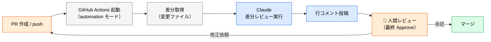

# PR 自動レビューの設定

> **この記事でわかること**：Claude と Copilot による PR 自動レビューの設定方法と、AI レビューを「補助」に留めるためのガードレール。

## 結論

AI 自動レビューを入れるときの鉄則は1つ。

> **最終 Approve は必ず人間が行う。** Branch Protection Rule で技術的に担保する。

そのうえで、**指摘に重要度をつけさせる**と実用性が跳ね上がる。重要度がないレビューは、量が多いほど読まれなくなる。

| 分類 | 意味 |
| --- | --- |
| `[Blocker]` | マージ前に必ず修正が必要 |
| `[Suggestion]` | 改善推奨だが必須ではない |
| `[Nit]` | 軽微なスタイル・命名の提案 |

## 背景・課題

AI レビューを導入して失敗するパターンは決まっている。

- 指摘が多すぎて誰も読まなくなる
- 重要度がなく、些細な指摘と重大な指摘が並ぶ
- AI が Approve できてしまい、人間のレビューが形骸化する

**「指摘の量」ではなく「読まれる量」を設計する。**

## 具体的な方法

### 処理フロー



### Claude によるレビュー（ワークフロー）

```yaml
# .github/workflows/claude-pr-review.yml
name: Claude PR Review

on:
  pull_request:
    types: [opened, synchronize]

permissions:
  contents: read
  pull-requests: write

jobs:
  review:
    runs-on: ubuntu-latest
    # fork PR はシークレットにアクセスできないため自リポジトリのブランチのみ実行
    if: github.event.pull_request.head.repo.full_name == github.repository
    steps:
      - name: Run Claude PR Review
        uses: anthropics/claude-code-action@v1
        with:
          prompt: |
            このPRの差分をレビューしてください。
            プロジェクト規約は CLAUDE.md、セキュリティ基準は SECURITY.md を参照してください。
            指摘は以下の重要度で分類し、行コメントとして投稿してください：
            - [Blocker] マージ前に必ず修正が必要な問題
            - [Suggestion] 改善推奨だが必須ではない提案
            - [Nit] 軽微なスタイル・命名の修正提案
            最後に全体サマリーをPRにコメントしてください。
            人間レビュアーが最終 Approve を判断するための補助情報として提供します。
          claude_args: --model claude-sonnet-5 --max-turns 5 --allowedTools "Read,Grep,Glob"
        env:
          ANTHROPIC_API_KEY: ${{ secrets.ANTHROPIC_API_KEY }}
          GITHUB_TOKEN: ${{ secrets.GITHUB_TOKEN }}
```

**3つのガードレールが入っている。**

| 設定 | 目的 |
| --- | --- |
| `permissions: contents: read` | コードを書き換えられない（レビュー専用） |
| `--allowedTools "Read,Grep,Glob"` | 読み取り専用ツールのみ。**構造的に変更不可** |
| `--max-turns 5` | ループ上限。意図しないコスト増大を防ぐ |

### レビュー観点を明示する

観点を書かないと、指摘が表面的なスタイル修正に偏る。

```text
このPRの差分をレビューしてください。
プロジェクト規約は CLAUDE.md、セキュリティ基準は SECURITY.md を参照してください。

以下の観点でチェックし、指摘事項を重要度で分類して行コメントとして投稿してください：

【チェック観点】
1. セキュリティ：インジェクション・シークレット露出・認証漏れ
2. 仕様との整合性：CLAUDE.md / SPEC.md との乖離
3. テストカバレッジ：正常系・異常系・エッジケースの網羅性
4. パフォーマンス：N+1クエリ・不要な同期処理
5. 保守性：命名・責務分割・コメントの適切さ

【重要度分類】
- [Blocker] マージ前に必ず修正が必要
- [Suggestion] 改善推奨（任意）
- [Nit] 軽微なスタイル指摘

最後に全体サマリー（承認可否と主要な指摘一覧）をPRにコメントしてください。
AIレビューは補助情報であり、最終 Approve は人間レビュアーが判断します。
```

### Copilot Code Review との併用

GitHub 側の機能も併用できる。設定は2ステップである。

1. リポジトリの Settings → Copilot → Code Review で「Copilot code review」を有効化
2. PR の Reviewers に `copilot` を追加（手動、または下記の Actions で自動化）

```yaml
# .github/workflows/copilot-review.yml
name: Auto-assign Copilot Review
on:
  pull_request:
    types: [opened, ready_for_review]
jobs:
  assign-reviewer:
    runs-on: ubuntu-latest
    steps:
      - uses: actions/github-script@v7
        with:
          script: |
            await github.rest.pulls.requestReviewers({
              owner: context.repo.owner,
              repo: context.repo.repo,
              pull_number: context.issue.number,
              reviewers: ['copilot']  // Copilotを自動アサイン
            });
```

カスタムインストラクション（`.github/copilot-review-instructions.md`）で重点チェック項目を指定できる。CodeQL と組み合わせればセキュリティ脆弱性（SQL injection、XSS 等）も自動検出できる。

### 役割分担

| レビュアー | 担当 |
| --- | --- |
| **Copilot / CodeQL** | 既知パターンの検出（脆弱性・アンチパターン） |
| **Claude** | 仕様との整合性、設計判断、文脈を要する指摘 |
| **人間** | **最終 Approve**、トレードオフの判断、優先度の決定 |

**両方入れると指摘が重複する。** どちらか一方から始め、不足を感じたら足す。

## 実際のプロンプト例

```text
# 導入前の設計
このリポジトリの過去50件の PR レビューコメントを gh で取得して分析して。

「人間が実際に指摘していた内容」を分類し、
そのうち AI に任せられるもの / 人間が判断すべきものに分けて。
AI レビューのプロンプトに含めるべき観点を提案して。
```

```text
# ローカルでの試行（CI に入れる前）
現在のブランチの差分を、以下の観点でレビューして。
[Blocker] / [Suggestion] / [Nit] で分類して。

これを CI に組み込む前提なので、
指摘が多すぎないか、重要度の付け方が妥当かも自己評価して。
```

## 注意点

> **AI に Approve 権限を与えない。** Branch Protection Rule で「人間1名以上の Approve」を必須にする。`CLAUDE.md` にも「AI レビューは補助・最終 Approve は人間」と明記する。

> **`--allowedTools` を読み取り専用に絞る。** レビュー用途で `Edit` や `Write` を渡す理由はない。渡さなければ、どう振る舞っても変更は起きない。

> **fork PR からの発火を制限する。** `if: github.event.pull_request.head.repo.full_name == github.repository` で自リポジトリのブランチに限定する。

> **`--max-turns` を必ず指定する。** 指定しないと、複雑な差分で想定外のターン数を消費しうる。レビュー系は 5〜10 が目安。

> **指摘が多すぎたら観点を減らす。** 「全部見て」は結果的に何も読まれない。まず1〜2観点（セキュリティと仕様整合性）から始める。

> **`[Blocker]` の扱いを決めておく。** 自動マージのブロッカーにするかは Branch Protection Rule で別途制御する。AI の判定をそのままゲートにすると、誤検知で開発が止まる。

## 参考リンク

- [anthropics/claude-code-action（GitHub）](https://github.com/anthropics/claude-code-action)
- 関連：[`04_github-actions.md`](04_github-actions.md) — ワークフロー全般
- 関連：[`05_checklist.md`](05_checklist.md) — 導入前の確認
- 関連：[`../14_code-review/00_ai-human-split.md`](../14_code-review/00_ai-human-split.md)
