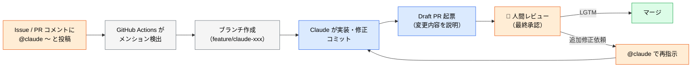

# Claude Code Action の設定

> **この記事でわかること**：2つの動作モードの使い分け、v1.0 のパラメータ、そして `@claude` メンション駆動を安全に有効化する方法。

## 結論

`anthropics/claude-code-action` は **`prompt` 入力の有無でモードが自動判別される**。

| モード | 条件 | 挙動 |
| --- | --- | --- |
| **automation** | `prompt` **あり** | ワークフロー起動時に即時実行。自動レビュー・バッチ処理向け |
| **interactive** | `prompt` **なし** | コメント内の `@claude` を待って起動。対話的な開発支援向け |

そして**必ず完全版を使う**。

| アクション | 用途 |
| --- | --- |
| `anthropics/claude-code-action@v1` | **本番ワークフロー（推奨）**。untrusted input 対策・プロンプトインジェクション防護を内蔵 |
| `anthropics/claude-code-base-action@v1` | 低レベルラッパー。**セキュリティ保護は呼び出し元の責任** |

## 背景・課題

CI から `claude -p` を直接呼ぶ方法（シェルスクリプトの延長）でも自動化はできる。しかし次の問題が残る。

- イベントごとに起動条件を書き分けるのが煩雑
- PR へのコメント投稿を自前で実装する必要がある
- プロンプトインジェクション対策を自分で書く必要がある

`claude-code-action` は、これらを**宣言的・イベント駆動の上位レイヤー**として引き受ける。大規模チームへの展開が容易になる。

## 具体的な方法

### 導入 4ステップ

| ステップ | 操作 |
| --- | --- |
| 1 | Claude Code CLI 上で `/install-github-app` を実行 |
| 2 | 表示される URL から GitHub App をリポジトリへインストール |
| 3 | `.github/workflows/` にワークフロー YAML を追加 |
| 4 | GitHub Secrets に `ANTHROPIC_API_KEY` を登録 |

### 主要トリガー

| トリガー | イベント | 典型ユースケース |
| --- | --- | --- |
| `issue_comment` / `pull_request_review_comment` | コメント内 `@claude` | メンション駆動のコード修正・質問応答 |
| `pull_request: [opened, synchronize]` | PR 作成 / push | 自動差分レビュー（automation モード） |
| `issues: [assigned]` | Issue アサイン | 実装タスクへの自律着手 |
| `schedule`（cron） | 定期実行 | 夜間コード品質スキャン・依存関係更新確認 |
| `workflow_dispatch` | 手動起動 | オンデマンドのトリアージ・分析 |

### v0.x → v1.0 のパラメータ移行

v1.0 では `model` / `allowed_tools` / `max_turns` / `custom_instructions` / `direct_prompt` などの個別入力が **`claude_args` に統合**された。

```yaml
# v0.x（旧）
with:
  model: claude-sonnet-5
  max_turns: "5"
  direct_prompt: "レビューしてください"

# v1.0（新）
with:
  prompt: "レビューしてください"
  claude_args: --model claude-sonnet-5 --max-turns 5
```

> モデル指定は `claude_args: --model claude-sonnet-5` の形式で渡すのが推奨。`anthropic_model` 入力も存在するが、`claude_args` 方式を主として使う。

### interactive モード（`@claude` メンション駆動）

Issue や PR コメントに `@claude` とメンションすると、ブランチ作成・実装・Draft PR 起票まで自律実行する。



```yaml
# .github/workflows/claude-interactive.yml
name: Claude Interactive Mode

on:
  issue_comment:
    types: [created]
  pull_request_review_comment:
    types: [created]
  issues:
    types: [assigned]

permissions:
  contents: write
  pull-requests: write
  issues: write

jobs:
  claude:
    runs-on: ubuntu-latest
    # @claude を含むコメント、または自リポジトリへのアサインのみ実行。
    # issue_comment は fork PR のコメントでもシークレットありで発火するため、
    # author_association で書き込み権限を持つメンバーのコメントに限定する。
    if: |
      (github.event_name == 'issue_comment' && contains(github.event.comment.body, '@claude') && contains(fromJson('["OWNER","MEMBER","COLLABORATOR"]'), github.event.comment.author_association)) ||
      (github.event_name == 'pull_request_review_comment' && contains(github.event.comment.body, '@claude') && contains(fromJson('["OWNER","MEMBER","COLLABORATOR"]'), github.event.comment.author_association)) ||
      (github.event_name == 'issues' && github.event.action == 'assigned')
    steps:
      - name: Run Claude (interactive)
        uses: anthropics/claude-code-action@v1
        with:
          # prompt を書かない = interactive モード（メンション待ち）
          claude_args: >-
            --model claude-sonnet-5
            --max-turns 20
            --allowedTools "Read,Edit,Write,Bash,Glob,Grep"
        env:
          ANTHROPIC_API_KEY: ${{ secrets.ANTHROPIC_API_KEY }}
          GITHUB_TOKEN: ${{ secrets.GITHUB_TOKEN }}
```

**`author_association` チェックが最重要である。** `issue_comment` は fork PR のコメントでもシークレットありで発火する。この条件がないと、外部の誰でも Claude を無制限に起動できてしまう。

### CI 失敗の自動トリアージ

テスト / ビルド失敗時に失敗ログを解析させ、根本原因と修正案を提示させる。**適用は人間の承認後に限る。**

```mermaid
flowchart LR
    Fail["テスト / ビルド失敗"] --> Log["失敗ログ収集<br/>（Actions artifact）"]
    Log --> Trigger["@claude help triage failing CI<br/>コメント、または<br/>workflow_run トリガー"]
    Trigger --> Analyze["Claude<br/>ログ解析・根本原因特定"]
    Analyze --> Cause["根本原因レポート<br/>（PR コメント）"]
    Cause --> Patch["修正パッチ案<br/>（ドラフト PR または提案コメント）"]
    Patch --> Human["👤 人間が承認・適用"]
    Human -->|"適用後"| Rerun["CI 再実行"]

    style Fail fill:#fee2e2,stroke:#dc2626,color:#000
    style Log fill:#f5f5f5,stroke:#6c757d,color:#000
    style Trigger fill:#ffedd5,stroke:#ea580c,color:#000
    style Analyze fill:#dbeafe,stroke:#2563eb,color:#000
    style Cause fill:#dbeafe,stroke:#2563eb,color:#000
    style Patch fill:#dbeafe,stroke:#2563eb,color:#000
    style Human fill:#ffedd5,stroke:#ea580c,color:#000
    style Rerun fill:#dcfce7,stroke:#16a34a,color:#000
```



### ターン数の目安

| 用途 | `--max-turns` |
| --- | --- |
| レビュー系 | 5〜10 |
| 実装系 | 20 前後 |

タスクの複雑さに応じて調整する。**指定しないという選択肢はない。**

## 実際のプロンプト例

```text
# ワークフローを作らせる
このリポジトリ向けに、PR の自動レビューを行う GitHub Actions ワークフローを作成して。

要件:
- automation モード（prompt あり）
- fork PR からは発火しない
- permissions は最小権限（contents: read）
- allowedTools は読み取り専用に限定
- max-turns を明示

作成後、なぜその権限設定にしたのかを説明して。
```

```text
# 既存ワークフローの監査
.github/workflows/ 配下の Claude 関連ワークフローを読んで、
次の観点で監査して。

1. fork PR からの発火が制限されているか
2. author_association のチェックがあるか
3. permissions が最小権限か
4. --max-turns が指定されているか
5. allowedTools が用途に対して過剰でないか

問題があれば修正案を diff で示して。
```

## 注意点

> **`claude-code-base-action` を安易に使わない。** untrusted input への保護が実装者任せである。プロンプトインジェクション対策を自前で実装しない限り使用しない。

> **`pull_request_target` トリガーを使わない（公式非推奨）。** fork の PR に対してシークレット付きで実行されるため、危険性が高い。

> **`contents: write` を渡す前に範囲を決める。** interactive モードはコードを変更できる。Claude が変更してよい範囲をプロンプトまたは `CLAUDE.md` に明示的に書く。

> **アクションのバージョンをピン留めする。** Dependabot / Renovate による自動更新を設定し、脆弱性情報が出たら追随できるようにする。

> **実装後の PR Approve は必ず人間が行う。** interactive モードで Draft PR まで自動化しても、マージの判断は人間の責務である。

> **`schedule` トリガーはコストが積み上がる。** 夜間スキャンを毎日回すと、気づかないうちに月次コストが膨らむ。実行頻度と `--max-turns` を保守的に設定する。

## 参考リンク

- [anthropics/claude-code-action（GitHub）](https://github.com/anthropics/claude-code-action)
- 関連：[`03_auto-review.md`](03_auto-review.md) — automation モードの実例
- 関連：[`05_checklist.md`](05_checklist.md) — 導入前チェックリスト
