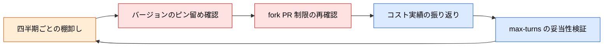

# 導入チェックリスト

> **この記事でわかること**：GitHub × Claude を本番リポジトリに入れる前に確認すべき項目。四半期ごとに見直す前提のリスト。

## 結論

**「一度設定したら終わり」ではない。** 特に次の2項目は、脆弱性情報が公開されるたびに確認が必要である。

- アクションのバージョンのピン留め
- fork PR からの発火制限

チェックリスト全体は**四半期ごとに見直す**。

## 背景・課題

GitHub Actions に AI を組み込むと、次の3つのリスクが同時に発生する。

| リスク | 具体例 |
| --- | --- |
| **セキュリティ** | 外部コントリビューターによる無制限起動、シークレット漏洩 |
| **コスト** | ターン数上限なしによる想定外の消費 |
| **ガバナンス** | AI レビューのみでマージされ、人間の確認が形骸化 |

導入時に一括で潰しておかないと、後から気づくのは事故が起きたときになる。

## 具体的な方法

### セットアップ

- [ ] Claude Code CLI で `/install-github-app` を実行し、GitHub App をインストール済み
- [ ] `ANTHROPIC_API_KEY` を GitHub Secrets に登録済み
- [ ] ワークフロー YAML に `permissions:` を明示し、最小権限で設定済み

### セキュリティ

- [ ] `anthropics/claude-code-action` のバージョンを最新にピン留め済み
      （Dependabot / Renovate による自動更新を設定することを推奨）
- [ ] fork PR からの発火を `if: github.event.pull_request.head.repo.full_name == github.repository` で制限済み
- [ ] `issue_comment` トリガーに `author_association` チェックを入れ、外部コントリビューターによる起動を防止済み
- [ ] `pull_request_target` トリガーを使用していない（公式非推奨）
- [ ] プロンプトインジェクション対策として外部入力（コメント本文等）をそのままプロンプトに渡していない
- [ ] `claude-code-base-action` ではなく `claude-code-action`（完全版）を使用している

### コスト管理

- [ ] `--max-turns` で上限を明示設定済み（レビュー系: 5〜10 / 実装系: 20 前後）
- [ ] 変更ファイルのみをコンテキストに渡す設計にしている
- [ ] 月次コスト・トークン消費量をモニタリングする仕組みを用意済み
- [ ] `schedule` トリガーの実行頻度が妥当か確認済み

### ガバナンス

- [ ] `CLAUDE.md` に「AI レビューは補助・最終 Approve は人間」を明記済み
- [ ] `CLAUDE.md` に Claude が変更してよい範囲（ディレクトリ・ファイル種別）を明記済み
- [ ] PR の最終 Approve を人間 1 名以上が行う Branch Protection Rule を設定済み
- [ ] AI が自動コミット・push できる場合の承認フローを文書化済み

### 権限設計の早見表

用途に対して過剰な権限を渡していないか確認する。

| 用途 | `permissions` | `--allowedTools` |
| --- | --- | --- |
| **レビューのみ** | `contents: read` / `pull-requests: write` | `Read,Grep,Glob` |
| **CI トリアージ** | `contents: read` / `pull-requests: write` | `Read,Grep,Glob,Bash` |
| **実装（interactive）** | `contents: write` / `pull-requests: write` / `issues: write` | `Read,Edit,Write,Bash,Glob,Grep` |

> **レビュー用途に `Edit` / `Write` を渡さない。** 渡さなければ、AI がどう振る舞ってもコードは変わらない。**これが最も確実なガードレールである。**

### 見直しのサイクル



## 実際のプロンプト例

```text
# 監査を実行させる
.github/workflows/ 配下の全ワークフローを読んで、
@contents/20_github-claude/05_checklist.md のチェックリストに対して
現状を「済 / 未 / 該当なし」で判定して。

未対応の項目は、修正案を diff 形式で示して。
危険度の高い順に並べて。
```

```text
# コスト実績の振り返り
過去3ヶ月の Claude 関連ワークフローの実行回数を gh で取得して、
トリガー別（pull_request / issue_comment / schedule）に集計して。

実行回数の多い順に、--max-turns の設定値が妥当かを評価して。
削減できそうなものがあれば提案して。
```

## 注意点

> **チェックリストは「導入時の一回限り」ではない。** 四半期ごとに見直す。特にバージョンのピン留めと fork PR 制限は、脆弱性情報が公開されるたびに確認が必要な項目である。

> **`permissions` を書かないのが最も危険である。** 明示しないとデフォルトの権限が適用される。用途に関わらず必ず書く。

> **チェックリストを埋めることが目的化しない。** 各項目には理由がある。「なぜこの制限が必要か」を理解せずに設定すると、後で誰かが「不便だから」と外してしまう。

> **導入判断は段階的に。** 全項目を満たせないなら、レビューのみ（`contents: read`）から始める。実装権限は後から足せる。

## 参考リンク

- [anthropics/claude-code-action（GitHub）](https://github.com/anthropics/claude-code-action)
- 関連：[`04_github-actions.md`](04_github-actions.md) — 各設定の詳細
- 関連：[`../22_security/`](../22_security/) — セキュリティ全般
