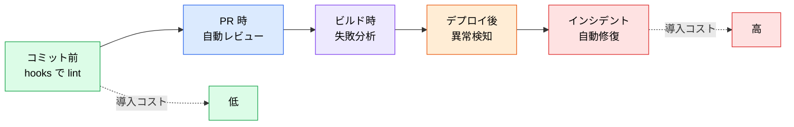

# AI 駆動の CI/CD パイプライン

> **この記事でわかること**：パイプラインのどのフェーズに AI を挿すか、そして挿す順序。

## 結論

AI は**パイプライン全体を置き換えるものではない**。既存のフェーズごとに1つずつ足していく。

| フェーズ | AI 活用 | ツール例 |
| --- | --- | --- |
| **コミット前** | Secret scan, lint, type check | GitHub Secret Scanning, Claude Code hooks |
| **PR 作成時** | 自動コードレビュー、テスト生成 | GitHub Copilot, CodeQL |
| **ビルド時** | テスト自動生成・**失敗ログの自動分析**（修復は行わない） | Claude（`claude -p`） |
| **デプロイ後** | 異常検知・予測的モニタリング | AIOps, Datadog AI |
| **インシデント** | 自動根本原因分析・修正提案 | AWS DevOps Agent |

そして導入順序が重要である。

> **左から順に入れる。** コミット前が最も安く、インシデント対応が最も難しい。

## 背景・課題

「CI/CD に AI を入れる」と言ったとき、多くの人はデプロイ後の自動修復を想像する。しかしそこは最も難易度が高い。



**左端は今日始められる。** hooks で lint を自動実行するだけで、指示忘れによる品質のばらつきが消える。

## 具体的な方法

### フェーズ別の入れ方

#### ① コミット前：hooks

最も安く、最も確実である。**モデルの判断を通らない**ため、指示忘れがない。

| 処理 | 置き場所 |
| --- | --- |
| 編集ファイルの lint / format | PostToolUse |
| シークレット混入のブロック | PreToolUse（`exit 2`） |
| 型チェック・テスト | **Stop hook**（応答完了時に1回） |

> PostToolUse に重い処理を置かない。編集のたびに走るため、多ファイル編集で破綻する（→ [`../01_claude-code/06_hooks.md`](../01_claude-code/06_hooks.md)）。

#### ② PR 作成時：自動レビュー

`anthropics/claude-code-action` で PR の差分をレビューさせる。**権限は読み取り専用に絞る**（→ [`../20_github-claude/03_auto-review.md`](../20_github-claude/03_auto-review.md)）。

> **CI で自動修復を走らせない。** テストの自動修復（Healer）は、本来検知すべき退行まで「修正」してしまう（→ [`../15_test/01_e2e-automation.md`](../15_test/01_e2e-automation.md)）。CI で行うのは**分析まで**である。

#### ③ ビルド時：`claude -p`

非対話モードで CLI から直接呼ぶ。ワークフローに組み込みやすい。

```bash
# PRごとにAIレビューを自動実行
claude -p "Review changes in this PR for security vulnerabilities and spec compliance.
          Reference @SPEC.md and @SECURITY.md" \
  --output-format json \
  --allowedTools "Read,Grep,Glob"

# ビルド失敗時の自動分析（stream-json は --verbose が必須）
claude -p "Build failed with: $(cat build-error.log). Analyze and suggest fix." \
  --output-format stream-json --verbose
```

> **CI では3点で詰まりやすい。**
>
> - `--output-format stream-json` は **`--verbose` の併用が必須**
> - `ANTHROPIC_API_KEY`（または Bedrock / Vertex の設定）を環境変数で渡す必要がある
> - プロンプト内の `@SPEC.md` は**作業ディレクトリ基準で解決される**

> **ビルドログや PR 本文は外部から書き込める入力である。** `$(cat build-error.log)` の中身に指示めいた文字列が含まれると、モデルに作用しうる（プロンプトインジェクション）。**外部由来の内容は「データとして扱え」と明示する**（→ [`../22_security/00_ai-code-risks.md`](../22_security/00_ai-code-risks.md)）。

**`--output-format json` で構造化出力**にすると、後続のスクリプトで扱える。`--allowedTools` を読み取り専用に絞ることも忘れない。

#### ④ デプロイ後：AIOps

異常検知と根本原因分析（→ [`02_aiops-monitoring.md`](02_aiops-monitoring.md)）。

#### ⑤ インシデント：自動修復

最も難しい。**自動適用の前に、まず提案までで止める**（→ [`01_self-healing.md`](01_self-healing.md)）。

### `claude -p` と GitHub Actions の使い分け

| | `claude -p`（CLI） | `claude-code-action` |
| --- | --- | --- |
| 性質 | シェルスクリプトの延長。**命令的** | イベント駆動。**宣言的** |
| 向いているもの | 既存スクリプトへの組み込み、単発処理 | PR / Issue と連動する自動化 |
| 展開のしやすさ | 個別 | チーム・複数リポジトリへ展開しやすい |

**小さく試すなら `claude -p`、定着させるなら Action** である。

### 権限とコストの原則

パイプラインに AI を入れる際、**すべてのフェーズで共通する**ルールがある。

| 原則 | 具体策 |
| --- | --- |
| **最小権限** | `--allowedTools` を用途に絞る。レビューなら読み取り専用 |
| **ターン上限** | `--max-turns` を必ず指定（レビュー系 5〜10 / 実装系 20 前後） |
| **人間の承認** | 本番への変更は Branch Protection と承認フローを通す |
| **コスト監視** | 実行回数とトークン消費を計測する（→ [`06_finops.md`](06_finops.md)） |

> **`schedule` トリガーはコストが積み上がる。** 夜間スキャンを毎日回すと、気づかないうちに月次コストが膨らむ。

## 実際のプロンプト例

```text
# 導入計画を立てさせる
このリポジトリの CI/CD 構成（.github/workflows/）を読んで、
AI を組み込む余地を5フェーズ（コミット前 / PR時 / ビルド時 / デプロイ後 / インシデント）で診断して。

各フェーズについて「現状」「導入コスト」「期待効果」を表にして。
最も費用対効果が高い1つだけを、具体的な実装案とともに提案して。
```

```text
# ビルド失敗の自動分析を組み込む
ビルド失敗時に Claude が失敗ログを解析するステップを
既存のワークフローに追加して。

条件：
- 失敗時のみ実行（成功時は走らせない）
- --allowedTools は読み取り専用
- --max-turns を明示
- 結果は PR コメントとして投稿。修正の自動適用はしない
```

```text
# 権限の監査
.github/workflows/ 配下で AI を呼んでいるステップを全て洗い出して、
それぞれの permissions と --allowedTools が用途に対して過剰でないか確認して。

過剰なものは、必要最小限に絞った差分を示して。
```

## 注意点

> **左から順に入れる。** インシデント自動修復から始めない。コミット前の hooks が最も安く、効果を体感しやすい。

> **`--max-turns` を必ず指定する。** 指定しないと、複雑な入力で想定外のターン数を消費しうる。

> **`--allowedTools` を絞る。** レビュー用途に `Edit` / `Write` を渡す理由はない。渡さなければ構造的に変更が起きない。

> **本番への自動適用をしない。** 提案・PR 作成までを AI、適用は人間の判断とする。

> **一度に全フェーズを変えない。** 効果が測れなくなり、問題が起きたときの切り分けもできない。

## 参考リンク

- 次に読む：[`01_self-healing.md`](01_self-healing.md) — 自己修復パターン
- 関連：[`../20_github-claude/04_github-actions.md`](../20_github-claude/04_github-actions.md) — Action での実装
- 関連：[`../15_test/02_ci-integration.md`](../15_test/02_ci-integration.md) — テストの組み込み
