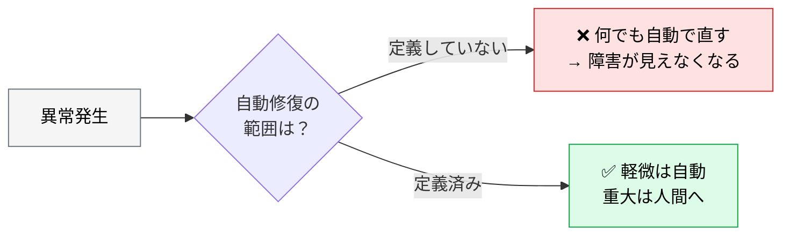
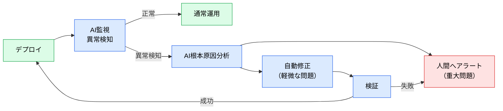
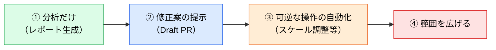

# Self-Healing Pipeline パターン

> **この記事でわかること**：異常検知から自動修復までのループと、「どこまで自動化してよいか」の線引き。

## 結論

自己修復パイプラインの設計で最も重要なのは、**修復の自動化範囲**である。

> **軽微な問題は自動修正、重大な問題は人間へアラート。この分岐を最初に定義する。**

分岐を定義しないまま自動修復を有効にすると、**AI が障害を「見えなくする」方向の対処**をしうる。

## 背景・課題

デプロイ後の異常を人間が検知して対応するまでには時間がかかる。特に深夜・休日は顕著である。

一方で「全部自動で直す」は危険である。何が起きたかの記録が残らず、根本原因も分からないまま似た問題が再発する。



## 具体的な方法

### 基本のループ



**`Verify` から `Alert` への経路が重要である。** 自動修正が失敗したら、必ず人間に上げる。無限にリトライさせない。

### 自動化してよい範囲

| 分類 | 例 | 自動化 |
| --- | --- | --- |
| **可逆で影響が限定的** | 一時的なスケール調整、キャッシュのクリア、リトライ | ✅ 自動 |
| **可逆だが影響が広い** | 設定値の変更、ロールバック | ⚠️ 提案 → 人間承認 |
| **不可逆** | データ変更、リソース削除 | ❌ 人間のみ |
| **原因不明** | 分析で根本原因が特定できない | ❌ **必ず人間へ** |

**4行目が最も重要である。** 原因が分からないまま「とりあえず再起動」を自動化すると、根本原因が永遠に分からない。

### 禁止する対処

AI に自動修復を任せると、次の近道を取ることがある。

| 近道 | なぜ危険か |
| --- | --- |
| アラートの閾値を緩める | 障害が「見えなくなる」だけで解決していない |
| モニターを無効化する | 同上。しかも次回は検知すらできない |
| リトライ回数を無制限にする | 失敗が隠れる |
| エラーを握りつぶす | 症状が消えるだけで原因は残る |

```text
自動修復のポリシーには以下を明記する：

- アラートの閾値変更・モニターの無効化は禁止
- リトライは上限付き
- エラーハンドリングの追加で症状を隠すことは禁止
- 根本原因が特定できない場合は、修復せず人間にエスカレーションする
```

### CI 失敗の自動トリアージ

デプロイ後だけでなく、**CI 失敗にも同じパターンが適用できる**。こちらのほうが安全に始められる（本番に影響しない）。

```mermaid
flowchart LR
    Fail["テスト / ビルド失敗"] --> Log["失敗ログ収集"]
    Log --> Analyze["Claude<br/>ログ解析・根本原因特定"]
    Analyze --> Cause["根本原因レポート<br/>（PR コメント）"]
    Cause --> Patch["修正パッチ案<br/>（Draft PR）"]
    Patch --> Human["👤 人間が承認・適用"]
    Human --> Rerun["CI 再実行"]

    style Fail fill:#fee2e2,stroke:#dc2626,color:#000
    style Analyze fill:#dbeafe,stroke:#2563eb,color:#000
    style Cause fill:#dbeafe,stroke:#2563eb,color:#000
    style Patch fill:#ffedd5,stroke:#ea580c,color:#000
    style Human fill:#ffedd5,stroke:#ea580c,color:#000
    style Rerun fill:#dcfce7,stroke:#16a34a,color:#000
```



**Draft PR で止める。** 修正の実際の適用は人間の承認後に限る。

### 段階的な導入



**①で1〜2ヶ月運用し、分析の精度を確認してから②に進む。** 分析が的外れな段階で修正を任せてはいけない。

## 実際のプロンプト例

```text
# CI 失敗の分析（適用はしない）
以下の CI 失敗ログを解析して。

[失敗ログ]

出力：
1. 根本原因の仮説（複数あれば可能性の高い順）
2. その根拠（ログのどの部分か）
3. 修正案

「原因の仮説」と「事実」を分けて書いて。
根拠が薄い場合は「特定できない」と正直に報告して。
修正の適用はしないで。
```

```text
# 自動修復ポリシーの設計
このシステムの構成を踏まえて、自動修復してよい操作の一覧を作って。

分類：
- 可逆で影響が限定的（自動化可）
- 可逆だが影響が広い（提案のみ）
- 不可逆（人間のみ）

あわせて「禁止する対処」（閾値の緩和、モニター無効化など）も明記して。
```

```text
# 自動修復の妥当性チェック
先ほど AI が提案した修正が、症状を隠す対処になっていないか確認して。

チェック観点：
- エラーを握りつぶしていないか
- 閾値やタイムアウトを緩めていないか
- リトライで隠していないか

該当する場合は、根本原因に対処する代替案を示して。
```

## 注意点

> **自動修復の範囲を先に定義する。** 定義しないまま有効化すると、AI が障害を「見えなくする」方向の対処を選びうる。

> **原因不明なら修復させない。** 「とりあえず再起動」を自動化すると、根本原因が永遠に分からなくなる。

> **アラートを緩める提案に注意する。** 「このモニターの閾値を緩めれば解決」は、多くの場合解決ではない。

> **CI 失敗のトリアージから始める。** 本番に影響しないため、分析精度を安全に検証できる。

> **`Verify` の失敗を必ず人間に上げる。** 自動修正が失敗したまま無限リトライさせない。

## 参考リンク

- 関連：[`00_cicd-pipeline.md`](00_cicd-pipeline.md) — パイプライン全体
- 関連：[`02_aiops-monitoring.md`](02_aiops-monitoring.md) — 異常検知
- 関連：[`03_incident-response.md`](03_incident-response.md) — 人間参加型の対応
