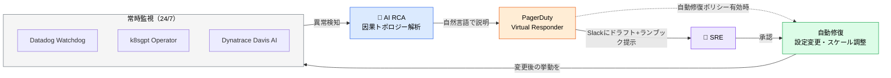

# AIOps ― 常時監視と根本原因分析

> **この記事でわかること**：異常検知 → RCA → 修復提案のループと、2026年の焦点が「事後対応」から「予兆検知」に移っていること。

## 結論

AIOps の価値は2段階ある。

| 段階 | 内容 |
| --- | --- |
| **第1段階** | 異常検知 → 根本原因分析（RCA）→ 修復提案 |
| **第2段階** | **予兆検知 → 予防的操作（Preventive Operations）** |

> **AI 監視の真価は「予兆検知 → 予防的操作」に移りつつある。** 障害が起きてから対応するのではなく、**インシデント発生前に潜在問題を潰すループ**をどれだけ回せるかが差別化ポイントになる。

そして開発者にとっての即効性は別のところにある。

> **ダッシュボードとエディタを行き来する「コンテキストスイッチ」がなくなる。**

## 背景・課題

障害対応の初動は手順が決まっている。アラートを見て、ログを探して、コードを開いて、メトリクスを確認する。**決まっているのに毎回人間がやっている**。しかも深夜・休日に発生する。

さらに深刻なのがアラート疲れである。ノイズが多いと、本物のアラートが埋もれる。

## 具体的な方法

### 主要ツール

| ツール | 特徴 |
| --- | --- |
| **Datadog Watchdog** | 非教師あり ML で AWS / K8s の異常をリアルタイム検出。カスタム異常・外れ値・予測アラートに対応 |
| **Dynatrace Davis AI** | **もっとも成熟した RCA 実装**。因果トポロジーで根本原因エンティティをハイライト。自然言語での問題サマリー＋修復ステップ提示 |
| **New Relic** | フルスタック（インフラ・APM・LLM ワークロード）に ML 適用 |
| **PagerDuty AIOps「Virtual Responder」** | **アラートノイズ削減 91%**、Sev-2 MTTR 20〜40% 削減（ベンダー公表値）。異常検知→診断→通知→関係者タグ付けまで自動 |
| **Grafana AI Observability** | OpenTelemetry ベースで LLM エージェントの会話追跡・コスト・品質を一元管理 |
| **k8sgpt Auto-remediation** | Kubernetes 問題の一般的なパターンを自動修復。**センシティブデータの LLM 送信前自動匿名化** |

> **数値はベンダー公表値である。** 自環境で同じ結果が出るとは限らない。導入時は小規模に試して効果を測る。

**アラートノイズの削減が最も体感しやすい効果**である。検知精度を上げるより、まずノイズを減らすほうが運用は楽になる。

### エンドツーエンドの仕組み



### Claude Code から使う

開発者にとって即効性があるのは、**エラーログとコードを同時に見られる**ことである。ダッシュボードとエディタを行き来する必要がなくなる。

> **Datadog MCP の接続手順・障害調査のシーケンス・スコープ付き Application Key の設計は [`../02_mcp/50_datadog.md`](../02_mcp/50_datadog.md) に集約している。**
>
> **k8sgpt のインストールと診断コマンドは [`04_container-k8s.md`](04_container-k8s.md) に集約している。**

本記事では、それらを**どう運用ループに組み込むか**に絞る。

### 予防的操作へ

第2段階は「起きる前に潰す」である。

| 事後対応 | 予防的操作 |
| --- | --- |
| OOMKilled が起きてから対処 | **実使用量ベースでリソース制限を自動調整** |
| ディスク枯渇のアラート後に拡張 | 増加傾向から枯渇時期を予測して事前に対処 |
| レイテンシ悪化を検知して調査 | デプロイ前後の傾向から劣化を予測 |

**予測アラートを使う前に、事後対応の精度を確認する。** 予測が外れると、起きてもいない問題への対処でリソースを消費する。

### 権限の設計

| 操作 | 推奨 |
| --- | --- |
| メトリクス・ログの参照 | ✅ 許可する |
| モニターの作成・変更 | ⚠️ 都度確認 |
| **アラートの無効化** | ❌ **AI にやらせない** |

**Datadog に「読み取り専用 API キー」という区分は存在しない。** スコープ付き Application Key を新規発行し、`metrics_read` / `logs_read_data` / `monitors_read` などの read 系スコープのみを付ける（→ [`../02_mcp/50_datadog.md`](../02_mcp/50_datadog.md)）。

## 実際のプロンプト例

```text
# 初動調査（仮説と事実を分けさせる）
Datadog MCP で直近1時間の Critical エラーを取得して、
最も件数の多いエラーについて次を調べて。

1. スタックトレースから該当ファイル:行を特定し、コードを読む
2. 同時刻の関連サービスのメトリクス（レイテンシ・エラー率）を取得
3. 直近のデプロイ履歴と時刻を照合

「原因の仮説」と「その根拠」を分けて報告して。
根拠が薄い場合は「特定できない」と正直に書いて。修正はまだしないで。
```

```text
# k8s の常時監視ループを設計させる
k8sgpt と Claude Code で以下の運用ループを設計して。

【監視対象】namespace: production の Deployment / Pod / Service / Ingress
【トリガー】Pod が CrashLoopBackOff / OOMKilled / ImagePullBackOff に5分以上留まった場合
【アクション】
1. k8sgpt analyze で根本原因を取得
2. 該当 manifests/ と過去24時間の変更履歴を確認
3. 修正案を Draft PR として起票
4. インシデント用チャンネルに要約を投稿

【安全装置】本番リソースへの直接適用は禁止。必ず PR 経由・人間承認後に適用。
```

```text
# アラートノイズの棚卸し
過去1ヶ月のアラート履歴を取得して、次で分類して。

A: 実際にインシデントに繋がった
B: 自然に解消した（一過性）
C: 誤検知

B と C が多いモニターを特定して、閾値や条件の見直し案を出して。
ただし「無効化する」という提案はしないで。
```

## 注意点

> **本番のログには個人情報が含まれうる。** 取得したログはコンテキストに載る。マスキングされているか事前に確認し、取得範囲を絞る。

> **「原因の仮説」と「事実」を分けさせる。** AI は断定的に原因を述べがちである。根拠のない断定を鵜呑みにしない。

> **アラートを止める方向の提案に注意する。** 「このモニターの閾値を緩めれば解決」は多くの場合解決ではない。

> **本番への変更を AI に自動適用させない。** 障害時は判断が急かされるが、パッチの提案までに留める。

> **ログ取得はコンテキストを大量に消費する。** 期間とフィルタを必ず指定する。

> **予測アラートは事後対応が安定してから。** 予測が外れると、起きてもいない問題への対処でリソースを消費する。

## 参考リンク

- 関連：[`../02_mcp/50_datadog.md`](../02_mcp/50_datadog.md) — Datadog MCP の設定
- 関連：[`01_self-healing.md`](01_self-healing.md) — 自動修復の範囲
- 関連：[`03_incident-response.md`](03_incident-response.md) — 人間参加型の対応
- 関連：[`04_container-k8s.md`](04_container-k8s.md) — k8sgpt の詳細
