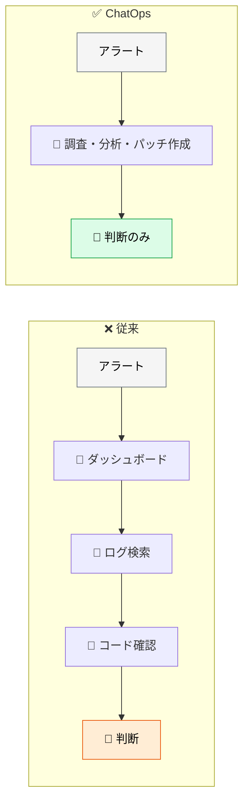
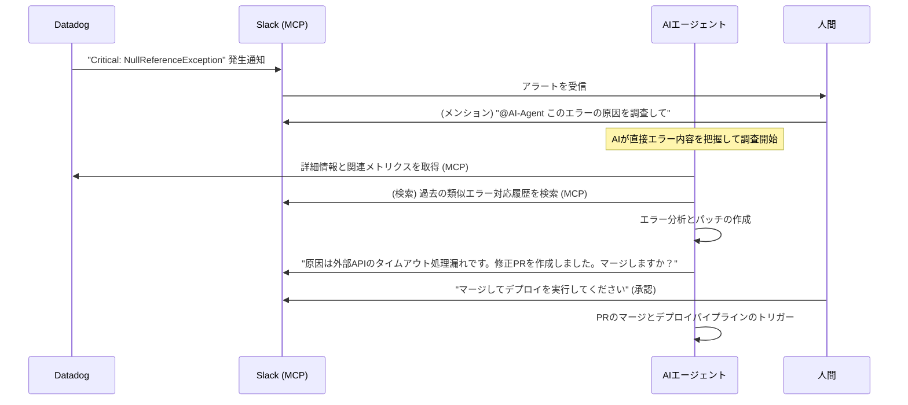
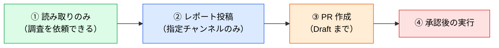

# ChatOps と Human-in-the-Loop インシデント対応

> **この記事でわかること**：Slack を「AI への依頼窓口」と「過去議論のデータベース」の両方として使う構成。

## 結論

ChatOps の設計思想は明確である。

> **AI が自律的に裏で調査からパッチ作成までを行い、最終的な意思決定（デプロイ承認など）は人間が Slack 上の見慣れた UI で行う。**

これが理想的な Human-in-the-Loop である。人間は**新しいツールを覚えずに**判断だけを行う。

## 背景・課題

インシデント対応で人間が消耗するのは、判断そのものではなく**その前段の作業**である。

- ダッシュボードを開く
- ログを探す
- コードを確認する
- 過去に似た事例がなかったか思い出す

**判断に必要な材料を集める工程が長い。** ここを AI に任せ、人間は判断だけに集中する。



## 具体的な方法

### 専用エージェントという選択肢

ChatOps を自前で組む以外に、**インシデント対応に特化したエージェント**を使う手もある。

| ツール | できること |
| --- | --- |
| **AWS DevOps Agent** | モニタリング・アラート・デプロイツールと統合。インシデント発生時に**タイムライン・根本原因・推奨修正を自動生成**し、オンコール対応の時間を削減 |

**「タイムラインの自動生成」が地味に効く。** 事後のポストモーテム作成が大幅に楽になる。

ただし特定クラウドに閉じるため、マルチクラウド環境や独自ツール構成では自前の ChatOps のほうが柔軟である。

### 連携フロー



**Slack が2つの役割を担っている**のが要点である。

| 役割 | 内容 |
| --- | --- |
| **依頼窓口** | メンションで AI に調査を依頼する |
| **ナレッジベース** | 過去の類似インシデントの議論を検索する |

### 過去事例の活用

2番目の役割が特に価値を生む。**同じ調査を二度やらない。**

「3年前に似た障害があったはずだが、どのスレッドか分からない」——これを AI が探す。現在の障害の事実（Datadog）と過去の対応（Slack）を突き合わせることで、初動の質が上がる。

> 具体的な検索プロンプトと MCP の設定は [`../02_mcp/42_slack.md`](../02_mcp/42_slack.md) / [`../02_mcp/50_datadog.md`](../02_mcp/50_datadog.md) を参照する。

### 承認の設計

**どこで人間が入るか**を明確に定義する。

| 段階 | 担当 |
| --- | --- |
| 調査・分析 | 🤖 AI |
| 根本原因の仮説提示 | 🤖 AI |
| **仮説の妥当性判断** | **👤 人間** |
| パッチ作成 | 🤖 AI |
| **マージ・デプロイ承認** | **👤 人間** |
| 実行 | 🤖 AI |

**判断は2箇所**である。仮説が妥当か、そして適用してよいか。

### 投稿権限の設計

**調査だけのつもりが投稿まで実行される**事故を防ぐ。

```json
{
  "permissions": {
    "deny": ["mcp__slack__post_message", "mcp__slack__add_reaction"]
  }
}
```

> **プロンプトで「投稿しないで」と書くのは安全装置ではない。** 実際の担保は `permissions.deny` かトークンのスコープで行う。

投稿を許可する運用にする場合も、**インシデントチャンネル以外への投稿を禁止**するなど範囲を絞る。

### 導入の順序



**①だけでも効果が出る。** 「調査して」と投げるだけで、材料が揃った状態で判断できる。

### ポストモーテムへの接続

対応が終わったら、**その記録自体を次の資産にする**。

```text
このインシデントのスレッド全体を読んで、ポストモーテムの下書きを作って。

項目：
- 事象（いつ・何が・どれくらいの影響）
- タイムライン
- 根本原因
- 暫定対応と恒久対応
- 再発防止策
- 検知が遅れた要因（あれば）

推測で埋めないで。スレッドに記録がない項目は「未記載」として残して。
```

**「推測で埋めない」を明示する。** ポストモーテムに誤った事実が入ると、次回の対応を誤らせる。

## 実際のプロンプト例

```text
# 過去事例を踏まえた対応案（投稿しない）
Slack MCP を使い、以下の手順で「決済APIタイムアウト」の対応案を作成して。

1. #incident-* チャンネル群を対象に "決済 タイムアウト" で過去1年を検索
2. ヒットしたスレッド上位5件の全履歴を取得
3. 各インシデントの「症状／原因／恒久対応」を整理
4. 現在の障害（Datadog MCP でログを取得）と比較し、
   最も類似度の高い過去事例に基づいて対応手順ドラフトを提示

5. 投稿系ツールは一切使わないこと。レポート出力のみ行うこと
```

```text
# 判断材料を揃えさせる
このアラートについて、判断に必要な材料を集めて。

- 何が起きているか（事実）
- いつから起きているか
- 影響範囲（どのユーザー・どの機能）
- 直近の変更（デプロイ・設定変更）との時間的な相関
- 過去の類似事例

「原因の断定」はしないで。判断は私がする。
```

```text
# 承認フローの設計
このチームのインシデント対応で、AI に任せる範囲と
人間が判断する箇所を定義して。

現状のツール構成（Datadog / Slack / GitHub）を踏まえて、
各段階の担当と、必要な権限設定（permissions.deny を含む）を表にして。
```

## 注意点

> **投稿権限は `permissions.deny` で絞る。** プロンプトの「投稿しないで」は安全装置ではない。誤投稿は取り消せない。

> **「原因の断定」をさせない。** 障害時は結論を急ぎたくなるが、AI の断定を鵜呑みにすると誤った方向に対応が進む。

> **Slack の過去議論は古くなる。** 2年前の対応手順が今も有効とは限らない。「いつの議論か」を必ず併記させる。

> **読み取りのみから始める。** ①の段階でも十分な効果が出る。投稿・実行の権限は段階的に広げる。

> **本番への適用は人間の承認後に限る。** 深夜対応でも例外を作らない。

## 参考リンク

- 関連：[`../02_mcp/42_slack.md`](../02_mcp/42_slack.md) — Slack MCP の設定
- 関連：[`02_aiops-monitoring.md`](02_aiops-monitoring.md) — 検知と分析
- 関連：[`01_self-healing.md`](01_self-healing.md) — 自動修復の範囲
