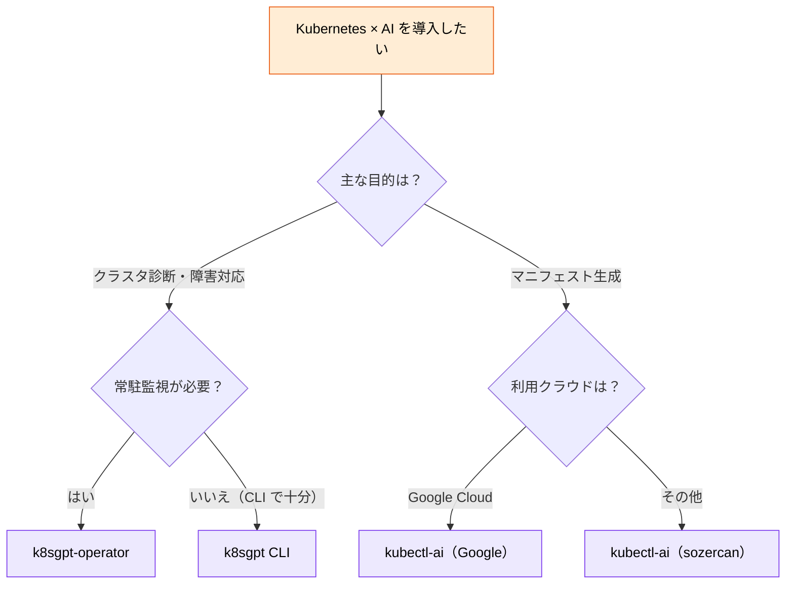

# コンテナ・Kubernetes × AI

> **この記事でわかること**：Kubernetes の診断・マニフェスト生成ツールの選び方と、コンテナで MCP を隔離する構成。

## 結論

Kubernetes × AI は**目的で選ぶツールが分かれる**。

| 目的 | ツール |
| --- | --- |
| **クラスタ診断・障害対応** | **k8sgpt**（常駐監視なら k8sgpt-operator） |
| マニフェスト生成 | kubectl-ai |
| インシデント調査 | HolmesGPT |

そして Docker 側の本命は Docker 操作ではない。

> **Docker MCP Toolkit の最大の価値は、他の MCP サーバーをコンテナに隔離すること**である。

## 背景・課題

Kubernetes の運用は複雑さが増す一方である。`CrashLoopBackOff` の原因を突き止めるには、Pod・Deployment・Service・Ingress・ConfigMap を横断して見る必要がある。

**この横断調査は手順が決まっている。** だから AI に任せられる。

一方 MCP サーバーは `npx` で起動すると**ホスト環境で直接実行される**。数が増えるほど、素性の分からないコードがホストで動くことになる。

## 具体的な方法

### Kubernetes ツールの比較

| ツール | 提供元 | 主な機能 | 特徴 |
| --- | --- | --- | --- |
| **k8sgpt** | CNCF Sandbox | クラスタ診断・根本原因分析・修復提案 | Trivy・Kyverno・Prometheus と統合。Operator で常駐監視も可能 |
| **kubectl-ai**（Google Cloud 版） | Google Cloud | 自然言語から kubectl コマンド・マニフェスト生成 | Google Cloud 環境との親和性が高い |
| **kubectl-ai**（OSS / sozercan 版） | コミュニティ | 自然言語からマニフェスト生成 | cert-manager / ArgoCD 等のカスタムリソースも生成可能 |
| **HolmesGPT** | Robusta | インシデント調査・根本原因分析 | Robusta のアラートエンジンと統合 |

### 選定ガイド



**まず `k8sgpt` CLI から始める。** 常駐が必要かは、しばらく使ってから判断すればよい。

### k8sgpt の使い方

```bash
# インストール（専用 tap が必要）
brew tap k8sgpt-ai/k8sgpt
brew install k8sgpt

# バックエンドの登録（API キーを渡す）
k8sgpt auth add --backend anthropic

# クラスタ全体の診断
k8sgpt analyze

# AIによる根本原因分析と修復提案
k8sgpt analyze --explain --backend anthropic

# 特定のリソースタイプに絞って診断
k8sgpt analyze --explain --filter=Pod,Service,Ingress

# Trivy 連携（インテグレーションを有効化してからフィルタを追加）
k8sgpt integration activate trivy
k8sgpt filters add VulnerabilityReport
k8sgpt analyze --explain --filter=VulnerabilityReport
```

> **`k8sgpt auth add` で API キーを登録する時点で、クラスタの情報が外部 LLM に送られる構成になる。** 規制業種では、何が送信されるかを事前に確認する。

> **`--filter` で絞る。** クラスタ全体を診断すると出力が膨大になり、重要な指摘が埋もれる。

**k8sgpt は LLM 送信前にセンシティブデータを自動匿名化する**（Auto-remediation 機能を含むバージョン）。クラスタの情報を外部に送る以上、この挙動を確認してから使う。

### Docker MCP Toolkit（概要）

Docker 側の主役は Docker 操作ではなく、**他の MCP サーバーをコンテナに隔離すること**である。`npx` 起動はホスト環境で第三者コードを直接実行するが、Toolkit 経由なら Gateway とコンテナ境界の内側に収まる。

エンタープライズでは管理者がチームの利用可能サーバーを一元制御できる（RAM / IAM）。

> **アーキテクチャ図・機能一覧・Gordon のプロンプト例は [`../02_mcp/52_docker.md`](../02_mcp/52_docker.md) に集約している。** 本記事では扱わない。

### 権限の設計

```json
{
  "permissions": {
    "deny": [
      "Bash(kubectl delete:*)",
      "Bash(kubectl apply:*)",
      "Bash(helm uninstall:*)"
    ]
  }
}
```

**診断は許可し、変更は禁止する。** `kubectl apply` を AI に実行させず、マニフェストの生成と PR 作成までに留める。

> `deny` には抜け道がある。ラッパースクリプト（Makefile、独自の `k` コマンド）経由だとマッチしない。ラッパーがあるならその名前も `deny` に加える。

## 実際のプロンプト例

```text
# 診断（変更はしない）
k8sgpt で production namespace を診断して、
検出された問題を重大度順に整理して。

各問題について：
- 影響しているリソース
- 根本原因の仮説とその根拠
- 修正案（マニフェストの差分）

kubectl apply は絶対に実行しないで。差分の提示までに留めて。
```

```text
# 常時監視ループの設計
k8sgpt と Claude Code で以下の運用ループを設計して。

【トリガー】Pod が CrashLoopBackOff / OOMKilled / ImagePullBackOff に5分以上留まった場合
【アクション】
1. k8sgpt analyze で根本原因を取得
2. 該当 manifests/ と過去24時間の変更履歴を確認
3. 修正案を Draft PR として起票
4. インシデント用チャンネルに要約を投稿

【安全装置】本番リソースへの直接適用は禁止。必ず PR 経由・人間承認後に適用。
```

```text
# Dockerfile の生成と検証
このリポジトリの構成を読んで、本番用のマルチステージ Dockerfile を作成して。

要件:
- ビルドステージで npm ci、実行ステージは distroless
- 非 root ユーザーで実行
- ヘルスチェック付き
- イメージサイズを最小化

作成後、docker build が通ることを確認して。
ベースイメージの選定理由も説明して。
```

## 注意点

> **`kubectl apply` / `delete` を AI に実行させない。** `permissions.deny` で禁止し、マニフェスト生成と PR 作成までに留める。

> **クラスタ情報を外部 LLM に送ることを認識する。** k8sgpt は匿名化機能を持つが、何が送られるかは事前に確認する。規制業種では特に。

> **`--filter` で診断範囲を絞る。** クラスタ全体の診断は出力が膨大になり、重要な指摘が埋もれる。

> **Docker Desktop のライセンス条件を確認する。** 一定規模以上の組織では有償になる。

> **コンテナ分離は万能ではない。** マウントしたボリューム経由でホストのファイルにはアクセスできる。**何をマウントするかが実質的な権限設計**になる。

> **生成された Dockerfile をそのまま本番に使わない。** 脆弱性スキャンとレビューを通す。

## 参考リンク

- [k8sgpt 公式](https://k8sgpt.ai/)
- 関連：[`../02_mcp/52_docker.md`](../02_mcp/52_docker.md) — Docker MCP Toolkit
- 関連：[`02_aiops-monitoring.md`](02_aiops-monitoring.md) — 常時監視
- 関連：[`05_iac.md`](05_iac.md) — IaC との組み合わせ
