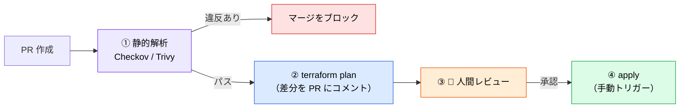

# IaC × AI ― Terraform MCP と静的解析

> **この記事でわかること**：「生成 → 即 apply」が危険な理由と、`plan` すら安全ではないという事実。

## 結論

IaC の AI 生成には、アプリコードにはない性質がある。

> **インフラの設定ミスは、気づいたときには公開されている。**

したがってフローは固定される。

> **AI 生成 → 静的解析 → plan → 人間レビュー → apply。この順序を必ず守る。**

そして見落とされがちな点がもう1つある。

> **`plan` は安全な読み取り操作ではない。**

## 背景・課題

AI が IaC を書くと、次の誤りが起きやすい。

| 誤り | 検出手段 |
| --- | --- |
| 古いプロバイダのリソース定義を使う | **Terraform MCP**（最新 Registry を参照） |
| セキュリティグループを広く開ける（`0.0.0.0/0`） | **静的解析**（Checkov / Trivy） |
| 暗号化・ログ設定をデフォルトのまま省略 | **静的解析** |

**1つ目は MCP で潰せるが、2つ目・3つ目は潰せない。** だから静的解析が必須になる。

## 具体的な方法

### ツールの位置づけ

| ツール | 提供元 | 役割 |
| --- | --- | --- |
| **Terraform MCP Server** | HashiCorp（公式） | Registry の最新ドキュメント・モジュール情報を AI に提供 |
| **Pulumi Neo** | Pulumi | 自然言語から IaC を生成し PR 作成まで実行 |
| **Checkov** | Prisma Cloud（Palo Alto Networks 傘下） | Terraform / OpenTofu のセキュリティ静的解析。網羅的なポリシーセットを持つ |
| **Trivy** | Aqua Security | IaC・コンテナ・依存関係を横断スキャン。**旧 tfsec は Trivy に統合済み**（新規に tfsec を選ばない） |
| **Firefly MCP** | Firefly | 自然言語でリソースをコード化・ドリフト修正 |

**Terraform MCP と Checkov はセットで導入する。** 前者は「正しい書き方」を、後者は「安全な設定か」を担保する。役割が違う。

### 導入手順は MCP カタログに集約

Terraform MCP の接続方法、`permissions.deny` の具体的な JSON、静的解析を含む安全なワークフロー図は
**[`../02_mcp/51_terraform.md`](../02_mcp/51_terraform.md) に集約している**。本記事では扱わない。

本記事では、それを**CI/CD パイプラインのどこに置くか**に絞る。

### パイプライン内での位置づけ



**①を必須ステップにする**のが要点である。オプショナルにすると、急いでいるときに飛ばされる。

| ステージ | 設定 |
| --- | --- |
| ① 静的解析 | **必須ステップ**。失敗したらマージ不可 |
| ② `plan` | 差分を PR にコメント。**自動 apply しない** |
| ③ レビュー | Branch Protection で人間の Approve を必須化 |
| ④ `apply` | **手動トリガー**（`workflow_dispatch`）に限定 |

### `plan` も安全ではない

「`plan` までを AI、`apply` は人間」という線引きは妥当だが、**`plan` を無害な読み取り操作と考えてはいけない**。

| リスク | 内容 |
| --- | --- |
| **副作用がある** | `external` / `http` データソースや一部プロバイダは plan 時に実行される |
| **認証情報が要る** | plan には実際のクラウド認証情報が必要 |
| **シークレットが露出しうる** | 人間向け CLI 出力では `(sensitive value)` に伏せられるが、**`terraform show -json`・保存したプランファイル・state 参照経由では平文になる** |

**plan 用の認証情報も最小権限（ReadOnly 相当）にする。**

> **AI に渡すのはまさに機械可読な形式である。** CLI 出力で伏せられていても安心できない。`-json` 出力をそのまま貼らせない。

### `tfstate` を読ませない

**ステートファイルにはシークレットが平文で格納される。** AI に `terraform.tfstate` を読ませると、認証情報がまるごとコンテキストに入る。

`Read(**/*.tfstate)` を `deny` に入れる。バックアップファイル（`.tfstate.backup`）も忘れない。

> **⚠️ `Read` の deny だけでは塞げない。** この指定は Read ツールしか止めない。**`cat terraform.tfstate`・`terraform show`・`terraform state pull` はすべて素通りする。** Bash 側も deny に加える。
>
> ```json
> "Bash(terraform show:*)",
> "Bash(terraform state pull:*)"
> ```
>
> **根本対策はリモートバックエンドである。** S3 + DynamoDB ロック等を使い、**そもそもローカルに state を置かない**。

### リスクと対策

| リスク | 対策 |
| --- | --- |
| AI が古いリソース定義を生成する | Terraform MCP で最新の Registry 情報を参照させる |
| セキュリティ設定ミス | Checkov / Trivy を CI の**必須ステップ**として組み込む |
| `apply` の意図しない破壊的変更 | 必ず `plan` の差分を人間がレビュー。**自動 apply は禁止** |
| ステートファイルの競合 | リモートバックエンド（S3 + DynamoDB ロック等）を必須とする |
| 生成コードの保守性低下 | モジュール化を徹底し、AI 生成コードもコードレビューを通す |

> **AI 生成の比率が上がるほど、静的解析の有無が結果を分ける。** 生産性の向上と品質の低下は同時に起こりうる。静的解析を必須ステップにしていないチームでは、設定ミスが増える方向に働く。

## 実際のプロンプト例

```text
# Terraform MCP を使った構築（まず捨てられる環境で）
Terraform MCP Server を参照して、以下の AWS インフラを構築する .tf ファイルを作成してください：

1. VPC（10.0.0.0/16）+ パブリック/プライベートサブネット
2. ALB + ターゲットグループ
3. ECS Fargate サービス（2タスク）
4. RDS PostgreSQL（単一AZ・開発用）

要件：
- 最新のプロバイダーバージョンを使用
- セキュリティグループは最小権限の原則に従う
- タグ付けは company=example, env=dev で統一
- Checkov のスキャンに通るセキュリティ設定にすること

制約：
- 既存の workspace には一切触れないこと
- -target オプションは使わないこと
- terraform apply は実行しないこと
```

```text
# 生成後の自己検証（黙らせない）
作成した .tf に対して checkov を実行して、
違反があれば修正して。修正のたびに再スキャンして、パスするまで繰り返して。

ただし「違反を除外設定で黙らせる」対処はしないで。
# checkov:skip を追加する対処は禁止。
どうしても除外が必要なら、理由を添えて報告して。
```

```text
# 既存構成のレビュー
@infra/ 配下の .tf を読んで、Terraform MCP で最新のプロバイダー仕様と照合して。

- deprecated な書き方
- 非推奨になった属性
- セキュリティ上の懸念（過度に開いた設定）

を一覧にして。tfstate は読まないで。
```

## 注意点

> **`terraform apply` を AI に実行させない。** `permissions.deny` で禁止する。`plan` までを AI、`apply` は人間の作業と明確に分ける。

> **`plan` は安全な読み取り操作ではない。** 副作用があり、認証情報を要し、シークレットが出力に載りうる。plan 用の認証も最小権限にする。

> **`tfstate` を AI に読ませない。** シークレットが平文で格納されている。`Read` の deny だけでは足りず、`Bash(terraform show:*)` などの経路も塞ぐ。

> **静的解析を「通す」ことと「安全である」ことは別。** Checkov がパスしても、業務要件上あってはならない設定はある。人間のレビューを省略する理由にはならない。

> **除外設定で黙らせる対処を禁止する。** AI は静的解析を通すために `# checkov:skip` を追加する近道を取ることがある。

> **本番相当の構成をいきなり生成させない。** サンドボックス環境で挙動を確認してから本番向けに書き換える。

> **生成量が増えると保守が破綻する。** 「動くから良い」で量産すると、半年後に誰も理解していないインフラが残る。

## 参考リンク

- [Terraform MCP Server（HashiCorp）](https://developer.hashicorp.com/terraform)
- [Checkov 公式](https://www.checkov.io/)
- 関連：[`../02_mcp/51_terraform.md`](../02_mcp/51_terraform.md) — MCP としての設定
- 関連：[`04_container-k8s.md`](04_container-k8s.md) — コンテナ・K8s
