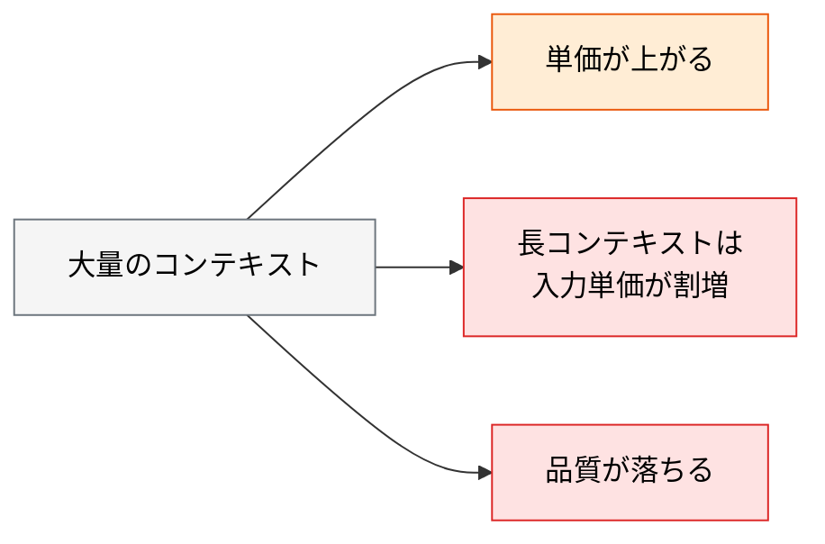
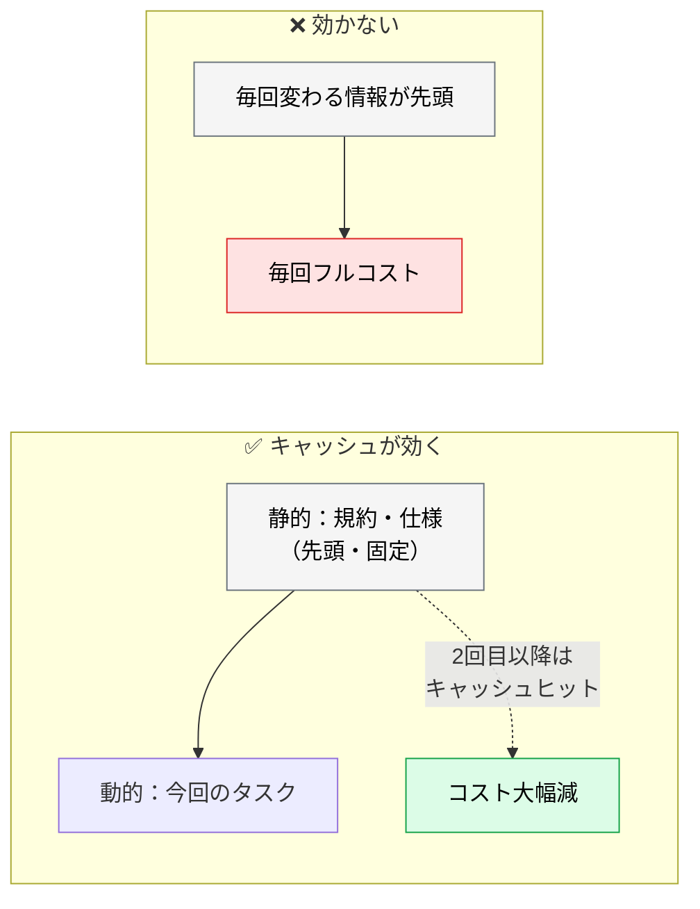

# LLM FinOps とコスト最適化

> **この記事でわかること**：プロンプトキャッシュを効かせるファイル配置と、コストを押し上げる主因。

## 結論

コスト最適化の最大の鍵は1つである。

> **プロンプトキャッシュを意識した配置。** 頻繁に変更されない静的コンテキストを固定化することで、**2回目以降の読み込みコストを最大90%削減**できる。

そのための設計指針も1行で書ける。

> **「毎回変わる動的な情報」と「共通の静的な情報」をディレクトリレベルで分割する。**

## 背景・課題

長大な `CLAUDE.md` や巨大なシステム仕様書を毎セッション読み込ませると、トークン消費が爆発する。

しかも問題は単価だけではない。



**コスト施策と品質施策は同じ方向を向く。** コンテキストを絞ることは、両方に効く。

## 具体的な方法

### プロンプトキャッシュを効かせる

キャッシュは**プロンプトの先頭からの一致**で効く。したがって配置が重要になる。

| 配置 | 内容 | 変更頻度 |
| --- | --- | --- |
| **先頭（キャッシュ対象）** | システム全体仕様、ルールファイル | ほぼ変わらない |
| 後方 | その時のタスク、対話履歴 | 毎回変わる |

**頻繁に変更されない「システム全体仕様」や「ルールファイル」は先頭に配置**し、再利用する。これで2回目以降の読み込みコストが大幅に下がる。



### キャッシュが効く条件

**順序だけ整えても効かない。** 実務で外す主因は次の3点である。

| 条件 | 内容 |
| --- | --- |
| **TTL が短い** | 既定は数分程度。ヒットで延長されるが、**間隔が空くと失効する** |
| **書き込みコストがある** | キャッシュ書き込みは通常の入力より割高。ミスし続けると**割増だけ払う** |
| **最小トークン長がある** | 短いプレフィックスはキャッシュ対象にならない |

> **⚠️ 用途で効き方が正反対になる。**
>
> | 用途 | キャッシュ |
> | --- | --- |
> | **対話セッション**（連続して使う） | ✅ よく効く |
> | **CI・夜間バッチ**（実行間隔が空く） | ❌ ほぼ常にミスし、**書き込み割増だけを払う** |
>
> 「最大90%削減」を CI に期待すると外す。**CI のコスト削減はキャッシュではなく、渡すコンテキスト量とターン数で行う。**

### ファイルの分割

「毎回の対話で更新・送信する動的な情報」と「システム共通の静的な情報」を、**あらかじめディレクトリレベルで分割する**（SHOULD）。

| 種別 | 置き場所 | 例 |
| --- | --- | --- |
| **静的** | `CLAUDE.md`、`.claude/skills/` | コーディング規約、アーキテクチャ制約 |
| **動的** | その場のプロンプト、`@` 参照 | 今回変更するファイル、エラーログ |

**静的なものを動的な場所に混ぜない。** 「今週のスプリント目標」を `CLAUDE.md` に書くと、毎回キャッシュが無効化される。

### コストを押し上げる主因

| 要因 | 対策 |
| --- | --- |
| **`CLAUDE.md` の肥大化** | 200行程度を目安に保つ。詳細は skills へ |
| **MCP のツール定義** | 接続数に比例して常時消費。棚卸しする |
| **長いセッション** | `/clear` でリセット。200K 超は入力単価が割増 |
| **並列 sub-agent** | 体数以上に増える。`opus` は1体まで |
| **`schedule` トリガー** | 夜間バッチの頻度を見直す |

**2番目が最も見落とされる。** MCP は一度も呼び出さなくてもツール定義が毎ターン送信される（→ [`../02_mcp/02_tool-reduction.md`](../02_mcp/02_tool-reduction.md)）。

### 測り方

汎用の金額目安より、**自環境の数字を出す手順**のほうが長持ちする。

```text
1. /context を実行し、表示された内訳を確認する
   → CLAUDE.md / MCP tools / 履歴 それぞれの占有量が分かる

2. .mcp.json から MCP を1つ外して Claude Code を再起動し、
   もう一度 /context を実行する
   → 差分がそのサーバーの固定コストになる

3. 典型的なタスク1回のトークン消費を記録する
   → 月間の実行回数を掛ければ概算が出る
```

> **⚠️ `/context` の出力はクライアント側の表示であり、モデルのコンテキストには入らない。** AI に分析させたいなら、**出力を自分でコピーして貼る**必要がある。
>
> **MCP の増減はセッション再起動まで反映されない。** 「外してもう一度打つ」だけでは差分が出ない。

**3ステップで自分の環境の数字が出る。** これを持って初めて「どれを削るか」の判断ができる。

### モデルの使い分け

**ルーティングが最も費用対効果が高い。**

| タスク | モデル |
| --- | --- |
| 書式チェック・分類・要約 | `haiku` |
| 日常のコーディング | `sonnet`（デフォルト） |
| 深い判断が要るもの | `opus`（1体まで） |

sub-agent ごとにモデルを割り当てるだけで、コストが大きく変わる（→ [`../01_claude-code/01_models.md`](../01_claude-code/01_models.md)）。

### 組織で測る

`/context` は「1人・1セッション」の話である。テックリードが知りたいのは「**チーム全体で今月いくら使ったか**」である。

| 手段 | 分かること |
| --- | --- |
| **テレメトリのエクスポート**（OpenTelemetry） | トークン数・コストをメトリクスとして収集し、既存の監視基盤で可視化 |
| **ワークスペース単位の支出上限** | 使いすぎを構造的に止める |
| **AI ゲートウェイ** | チーム別・プロジェクト別の上限とダッシュボード |

**「個人で測る」と「組織で測る」を分ける。** 前者は改善のため、後者は統制のためである。

### AI ゲートウェイでの一元管理

組織規模では、ゲートウェイでチーム別・プロジェクト別のトークン上限を設定する。

| 機能 | 効果 |
| --- | --- |
| トークン上限 | 超過時に自動スロットリング |
| セマンティックキャッシュ | 類似プロンプトの結果を再利用 |
| 利用状況ダッシュボード | チーム別・モデル別の可視化 |

> **セキュリティ目的で導入したゲートウェイが、実は FinOps で最も価値を出した**という例は多い（→ [`../22_security/04_ai-gateway.md`](../22_security/04_ai-gateway.md)）。

### レート上限への備え

金額試算より重要なことがある。

> **シート契約には利用上限がある。上限に当たるとチーム開発が止まる。**

当たったときの運用（`haiku` へ落とす、時間帯を分散する、API キーに切り替える）を**事前に決めておく**。繁忙期に全員の手が止まってから考えるのでは遅い。

## 実際のプロンプト例

```text
# 自環境のコスト構造を可視化する（/context の出力を貼ってから実行）
以下は /context の出力です。内訳を分析して。

[/context の出力をここに貼る]


- CLAUDE.md が占める割合
- MCP のツール定義が占める割合
- 会話履歴が占める割合

削減余地が大きい順に、具体的な削減案を提案して。
```

```text
# CLAUDE.md の棚卸し
@CLAUDE.md を読んで、各ルールを次で分類して。

A: 削除するとあなたが間違いを起こす（残す）
B: あなたが既に知っている一般知識（削除）
C: 特定作業でしか使わない（skills へ切り出し）
D: 頻繁に変わる情報（キャッシュを無効化する。外部参照に）

分類結果と、削減後の推定行数を示して。
```

```text
# サブエージェントのモデル割り当てを見直す
.claude/agents/ 配下を読んで、各エージェントの model 指定が
役割に対して過剰でないか診断して。

haiku で十分なのに sonnet / opus を使っているものを特定して、
変更案とその根拠を示して。
```

## 注意点

> **キャッシュは先頭からの一致で効く。** 静的な情報を先頭に固め、動的な情報を後ろに置く。順序が崩れるとキャッシュが無効化される。

> **`CLAUDE.md` に頻繁に変わる情報を書かない。** キャッシュが毎回無効化されるうえ、古い記述が残って有害になる。

> **MCP は繋いだ瞬間からコストを払っている。** 一度も呼ばなくてもツール定義が送信される。

> **長コンテキスト枠を有効にしている場合、一定量を超えると入力単価が割増になる。** 通常の運用では超える前に圧縮が入るため、常に発生するわけではない。`/clear` の主な効能は**精度とトークン総量**であり、単価はその次である。

> **金額の目安を鵜呑みにしない。** モデル・プラン・使い方で大きく変わる。**測り方を持つ**ほうが長く役に立つ。

> **レート上限に当たったときの運用を事前に決める。** 金額試算より、止まったときの計画のほうが実務では重要である。

## 参考リンク

- 関連：[`../01_claude-code/10_context-management.md`](../01_claude-code/10_context-management.md) — コンテキスト管理
- 関連：[`../02_mcp/02_tool-reduction.md`](../02_mcp/02_tool-reduction.md) — MCP の棚卸し
- 関連：[`../22_security/04_ai-gateway.md`](../22_security/04_ai-gateway.md) — 一元管理
- 関連：[`../01_claude-code/01_models.md`](../01_claude-code/01_models.md) — モデル選択
