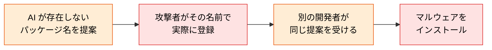
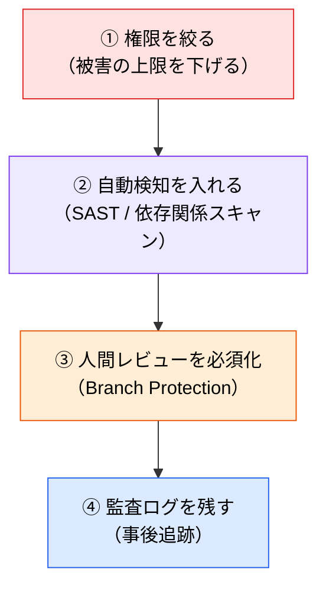

# AI 生成コードの既知リスク

> **この記事でわかること**：AI 生成コードに実際どれだけ脆弱性が含まれるかという調査結果と、OWASP が定義した LLM 固有のリスク分類。

## 結論

調査で繰り返し確認されている、最も注意すべき知見はこれである。

> **AI を使った開発者は、使わない開発者より脆弱なコードを書く傾向があり、かつ「自信を持って」提出していた。**

品質が下がるだけなら気づける。**自信が伴うことで検証が省略される**のが本当のリスクである。

## 背景・課題

「AI がセキュアなコードを書くか」は測定されている。2024〜2025年の調査で得られた主な知見は次のとおりである。

| 調査結果 | 数値 |
| --- | --- |
| GitHub Copilot 生成コードにセキュリティ上の弱点 | **29.5%（Python）/ 24.2%（JavaScript）** |
| Copilot アクティブなリポジトリでのシークレット漏洩 | **6.4%**（全リポジトリ平均 4.6% の 1.4倍） |

そして **Hallucination Squatting（ハルシネーション乗っ取り）** という新しい攻撃手法がある。



AI は同じ質問に対して同じ幻覚を繰り返す傾向があるため、**攻撃者はその名前を先回りして登録できる**。「AI が薦めたパッケージ」を無検証で入れてはいけない理由がここにある。

## 具体的な方法

### OWASP Top 10 for LLMs 2025

LLM を組み込んだシステム固有のリスク分類である。**アプリ開発者と、AI ツールの利用者の双方に関係する。**

| # | リスク | 説明 | 主な対策 |
| --- | --- | --- | --- |
| LLM01 | **プロンプトインジェクション** | 入力を通じて LLM の指示を書き換える | 入力サニタイズ、サンドボックス化、多層バリデーション |
| LLM02 | **機密情報の漏洩** | 訓練データや設定情報の意図しない露出 | データ最小化、アクセス制御、出力監視 |
| LLM03 | **サプライチェーンリスク** | 悪意のある依存関係・モデルの汚染 | 依存関係の検証、出所確認、SBOM ワークフロー |
| LLM04 | **データ・モデルポイズニング** | 訓練・ファインチューニングデータへの改ざん | 出所確認、異常検知、継続的評価 |
| LLM05 | **不適切な出力処理** | LLM 出力を検証なしで下流システムに渡す | 出力バリデーション、実行サンドボックス |
| LLM06 | **過剰なエージェンシー** | LLM への過度な権限付与 | 最小権限の原則、使用量監視、ガードレール |
| LLM07 | **システムプロンプト漏洩** | 隠し指示・システムプロンプトの露出 | プロンプトのマスキング、出力監視 |
| LLM08 | **ベクター・埋め込みの脆弱性** | RAG システムへの悪意ある埋め込み注入 | 埋め込み検証、入力サニタイズ |
| LLM09 | **誤情報** | 虚偽・誤解を招くコンテンツの生成 | 人間レビュー、ファクトチェック |
| LLM10 | **無制限の消費** | リソース枯渇・コストの急増 | レートリミット、自動スケーリング保護、コスト監視 |

### 開発ツールとして使う場合に特に効くもの

10個すべてを同時に見るのは現実的でない。**Claude Code のようなエージェントを使う立場で、優先度が高いのは3つ**である。

| # | なぜ効くか | 対策の記事 |
| --- | --- | --- |
| **LLM01** プロンプトインジェクション | MCP・Web・Issue から外部コンテンツが入る | [`05_mcp-risks.md`](05_mcp-risks.md) |
| **LLM03** サプライチェーン | MCP サーバー・AI が薦めるパッケージ | [`05_mcp-risks.md`](05_mcp-risks.md) |
| **LLM06** 過剰なエージェンシー | AI に渡す権限の設計そのもの | [`07_claude-code-hardening.md`](07_claude-code-hardening.md) |

**LLM06（過剰なエージェンシー）が最も見落とされる。** 「便利だから」で `Edit` や `Bash` を渡し、書き込み権限のあるトークンを渡すことが、そのまま被害の上限を決めている。

### 対策の優先順位



**①が最も費用対効果が高い。** 検知は漏れるが、権限がなければそもそも実行できない。

## 実際のプロンプト例

```text
# AI が薦めたパッケージを検証する
先ほど提案された依存パッケージについて、追加する前に次を確認して。

1. npm / PyPI に実在するか
2. 週間ダウンロード数、最終公開日、メンテナ
3. GitHub リポジトリのスター数と最終コミット
4. 同名の別パッケージ（タイポスクワッティング）がないか

1つでも怪しい点があれば、追加せずに報告して。
```

```text
# 生成コードのセキュリティ観点レビュー
この差分を OWASP Top 10 for LLMs と一般的な Web 脆弱性の両面でレビューして。

特に次を重点的に:
- 外部入力を検証せずに使っている箇所
- LLM の出力をそのまま下流（DB / シェル / HTML）に渡している箇所
- ハードコードされた認証情報

指摘は [Blocker] / [Suggestion] / [Nit] で分類して。
```

## 注意点

> **数値は調査時点のものである。** モデルの世代が変われば比率は変わる。重要なのは「一定割合で脆弱性が混入する」という事実であって、具体的な%ではない。

> **「自信を持って提出していた」が本質である。** AI 生成コードは見た目が整っているため、レビューが甘くなりやすい。**整っていることと正しいことは別**である。

> **LLM05（不適切な出力処理）は自作アプリで特に危険。** LLM の出力を検証せずに SQL・シェル・HTML に流すと、そのままインジェクションになる。

> **OWASP のリストは網羅ではなく優先順位付けの道具である。** 全部やろうとせず、自分の使い方に効くものから着手する。

## 参考リンク

- [OWASP Top 10 for LLMs](https://genai.owasp.org/llm-top-10/)
- 次に読む：[`01_checklist.md`](01_checklist.md) — フェーズ別の具体的対策
- 関連：[`05_mcp-risks.md`](05_mcp-risks.md) / [`07_claude-code-hardening.md`](07_claude-code-hardening.md)
