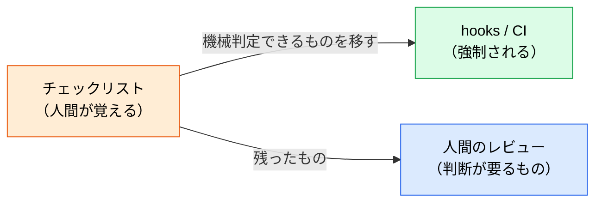
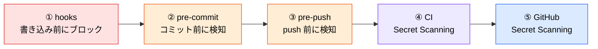

# フェーズ別セキュリティチェックリスト

> **この記事でわかること**：実装・レビュー・CI/CD の各フェーズでやることと、そのうち機械的に強制できるもの。

## 結論

チェックリストは**人間が覚えておくもの**ではない。

> **機械的に判定できる項目は hooks と CI に落とす。人間のチェックは「判断が要るもの」だけに絞る。**

覚えておく前提のチェックリストは、忙しいときに必ず飛ばされる。

## 背景・課題

セキュリティチェックリストは作られるが、運用されない。理由は明確である。

- 項目が多すぎて全部確認する時間がない
- 確認しなくてもマージできてしまう
- 「今回は急ぎだから」が常態化する

**強制力のある層に移す**ことでしか解決しない。



## 具体的な方法

### 実装フェーズ

```markdown
- [ ] AI生成コードを「信頼できないコード」として扱い、必ずレビューする
- [ ] シークレット・APIキーがコードに含まれていないか確認
- [ ] AIが提案したパッケージを npm audit / pip audit で検証
- [ ] AIが提案した依存関係のGitHubリポジトリを確認（スター数・更新日・オーナー）
- [ ] 新規 MCP サーバー追加時は出所・権限・メンテナを確認しレビューする
- [ ] MCP 設定ファイルの変更は PR で承認必須
- [ ] MCP に渡すシークレットは環境変数経由のみ（平文記載なし）
```

### レビューフェーズ

```markdown
- [ ] SAST（Static Application Security Testing）ツールを実行
- [ ] 依存関係スキャン（Snyk / Dependabot）
- [ ] シークレット検出（GitHub Secret Scanning）
- [ ] セキュリティ重点プロンプトでAIレビューを実施
```

### CI/CD フェーズ

```markdown
- [ ] Secret Scanning をGitHub Actions に組み込む
- [ ] CodeQL を PRに自動実行
- [ ] Copilot Autofix を有効化（自動脆弱性修正提案）
- [ ] SBOM（Software Bill of Materials）を自動生成
```

### 機械化できるものとできないもの

上のリストを、**誰が担保するか**で分け直す。

| 項目 | 担保する層 |
| --- | --- |
| シークレットの混入 | **hooks（PreToolUse）** — 書き込み前にブロック |
| 依存関係の脆弱性 | **CI** — Dependabot / Snyk |
| 既知の脆弱パターン | **CI** — CodeQL / SAST |
| MCP 設定の変更 | **CODEOWNERS + Branch Protection** — レビュー必須化 |
| パッケージの出所 | **人間** — スター数や更新日は判断が要る |
| 設計上の妥当性 | **人間** — 自動化できない |

### シークレット混入を hooks でブロックする

**書き込まれてから検知するのではなく、書き込む前に止める**のが最も確実である。

```json
{
  "hooks": {
    "PreToolUse": [
      {
        "matcher": "Edit|Write",
        "hooks": [{ "type": "command", "command": "$CLAUDE_PROJECT_DIR/.claude/hooks/guard-secret.sh" }]
      }
    ]
  }
}
```

```bash
#!/usr/bin/env bash
# .claude/hooks/guard-secret.sh
set -euo pipefail

INPUT=$(cat)
CONTENT=$(printf '%s' "$INPUT" | jq -r '.tool_input.content // .tool_input.new_string // ""')

if printf '%s' "$CONTENT" | grep -qE '(api[_-]?key|secret|password|token)[[:space:]]*[=:][[:space:]]*["'"'"'][^"'"'"']{8,}'; then
  echo "BLOCK: シークレットらしき記述を検出しました。環境変数経由に変更してください" >&2
  exit 2
fi
exit 0
```

> **`exit 2` でブロックし、理由は stderr に出す。** `exit 1` ではブロックされない（→ [`../01_claude-code/06_hooks.md`](../01_claude-code/06_hooks.md)）。

> **導入したら必ず「ブロックされること」を確認する。** hooks の失敗モードは「何も起きずに素通り」である。
> ```bash
> echo '{"tool_input":{"content":"api_key = \"abcdefghijkl\""}}' \
>   | .claude/hooks/guard-secret.sh; echo "exit=$?"   # → exit=2 なら正しい
> ```

### 多層で守る

1箇所に頼らない。



> **pre-commit だけでは足りない。** 2026年5月に報告された Claude Code GitHub Action のシークレット漏洩脆弱性の教訓として、**pre-push にもシークレットスキャンを設定する**ことが推奨されている。

### 見直しのサイクル

チェックリストは**四半期ごとに見直す**。特に次は脆弱性情報が出るたびに確認する。

- 使用中の MCP サーバー・アクションのバージョン
- AI エージェントに渡している権限の範囲

## 実際のプロンプト例

```text
# 現状の監査
このリポジトリを @contents/22_security/01_checklist.md のチェックリストで監査して。

各項目を「済 / 未 / 該当なし」で判定し、
「未」のものは何を設定すれば満たせるかを具体的に示して。
危険度の高い順に並べて。
```

```text
# 機械化できるものを洗い出す
チェックリストの項目を次に分類して。

A: hooks で強制できる（書き込み前に判定可能）
B: CI で検知できる（既存ツールで自動化可能）
C: 人間の判断が必要

A と B について、実装案（hooks スクリプト / ワークフロー YAML）を出して。
```

```text
# セキュアレビューの実行
この差分を次の観点でレビューして。

1. インジェクション脆弱性（SQL / XSS / コマンド）
2. 認証・認可の欠陥
3. シークレット・認証情報の露出
4. 外部入力の検証漏れ

該当行を指定し、修正案を添えて。
```

## 注意点

> **チェックリストを埋めることが目的化しない。** 各項目には理由がある。理由を理解せずに設定すると、「不便だから」と誰かが外してしまう。

> **項目を増やしすぎない。** フェーズごとに5〜7項目で足りる。多すぎると誰も見なくなる。

> **grep によるシークレット検知は完全ではない。** Base64 エンコードされた値や、変数経由で組み立てられる文字列は検出できない。**GitHub Secret Scanning など複数の層と併用する。**

> **「AI 生成コードを信頼できないコードとして扱う」が起点である。** これが崩れると、以降のチェックはすべて形式的なものになる。

## 参考リンク

- 関連：[`00_ai-code-risks.md`](00_ai-code-risks.md) — なぜ必要か
- 関連：[`03_security-scan.md`](03_security-scan.md) — 自動検知の具体
- 関連：[`../01_claude-code/06_hooks.md`](../01_claude-code/06_hooks.md) — hooks の書き方
