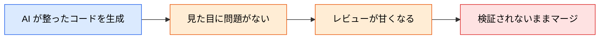
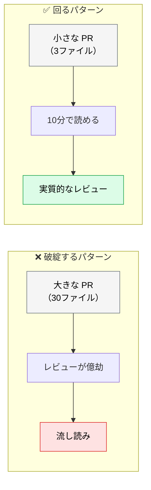

# Vibe Coding リスクの管理

> **この記事でわかること**：OWASP が「Inappropriate Trust in AI Generated Code」として問題視した行為と、組織として止める方法。

## 結論

Vibe Coding とは、**AI が生成したコードをレビューせずにそのまま Ship する行為**である。

対策は3点セットで、**どれか1つでは効かない**。

> **全ての AI 生成コードに PR 必須 + AI レビュー + 人間の最終確認。**

そして重要なのは、**ルールとして書くだけでなく Branch Protection で技術的に強制する**ことである。

## 背景・課題

Vibe Coding が起きるのは、開発者が怠けているからではない。**AI 生成コードが「見た目は正しい」から**である。



調査でも「AI を使った開発者は脆弱なコードを書く傾向があり、かつ**自信を持って提出していた**」ことが確認されている（→ [`00_ai-code-risks.md`](00_ai-code-risks.md)）。**自信が伴うぶん、検証が省略される。**

さらに AI を使うと1人あたりの生産量が増えるため、**レビューがボトルネックになる**。ここで「全部見るのは無理だから」と省略が始まる。

## 具体的な方法

### 3層の防御

| 層 | 内容 | 強制する手段 |
| --- | --- | --- |
| **① PR 必須** | 直接 push を禁止 | Branch Protection Rule |
| **② AI レビュー** | 一次チェックを自動化 | GitHub Actions |
| **③ 人間の最終確認** | Approve は人間 | Branch Protection Rule（Approve 1名以上） |

**①と③は設定で強制できる。** ②だけを入れて「AI が見たから大丈夫」とするのが最も危険なパターンである。

### 人間が見る観点を絞る

「全部見る」は実行されない。**AI に任せる部分と人間が見る部分を明示的に分ける**ことで、人間のレビューが機能する。

| 観点 | 担当 |
| --- | --- |
| 構文・スタイル・命名 | AI（+ linter） |
| 既知の脆弱パターン | AI（+ SAST） |
| 仕様との整合性 | AI が一次チェック → 人間が確認 |
| **設計判断・トレードオフ** | **人間** |
| **業務ルールの正しさ** | **人間** |
| **この変更を入れるべきか** | **人間** |

> 人間が見るべきなのは「**AI には判断できないこと**」である。ここに絞れば、レビュー時間は現実的な範囲に収まる。

### レビュー量が増えすぎたときの対処

AI で生産量が増えると、レビューが追いつかなくなる。**生成量を制限するのではなく、PR を小さくする。**



**1セッション1課題**を守れば、PR は自然に小さくなる（→ [`../01_claude-code/10_context-management.md`](../01_claude-code/10_context-management.md)）。

### CLAUDE.md への明記

技術的な強制と併せて、**なぜそうするのかを文書化する**。理由が書かれていないルールは、いずれ「不便だから」と外される。

```markdown
# レビュー方針

- AI レビューは補助情報である。**最終 Approve は人間が行う**
- AI 生成コードは「信頼できないコード」として扱う
- 1 PR は 1 課題に限定する（レビュー可能な粒度を保つため）
```

### 例外を作らない

「急ぎだから今回だけ」が常態化する。**例外が必要なら、その手続きも決めておく。**

| 状況 | 対応 |
| --- | --- |
| 緊急のホットフィックス | 事後レビューを必須とし、期限を決める |
| 生成コードが自明に軽微 | それでも PR は通す（設定で強制されている） |

## 実際のプロンプト例

```text
# レビュー体制の診断
このリポジトリの設定を確認して、AI 生成コードが
レビューなしでマージできる経路がないか調べて。

1. Branch Protection Rule の設定（Approve 必須か、誰が Approve できるか）
2. 直接 push が可能なブランチ
3. CI をスキップできる設定
4. 自動マージの設定

抜け道があれば、塞ぐ方法を具体的に示して。
```

```text
# PR の粒度を見直す
過去1ヶ月のマージ済み PR を gh で取得して、変更ファイル数と行数を集計して。

「レビュー可能な粒度」を超えていた PR を特定し、
どう分割できたかを1件だけ具体例として示して。
```

```text
# 人間が見るべき観点の抽出
この差分について、次を分けて報告して。

A: AI・linter・SAST で機械的に判定できる指摘
B: 人間の判断が必要な論点（設計・トレードオフ・業務ルール）

B だけを、判断に必要な材料とともに提示して。
A は件数のみでよい。
```

## 注意点

> **AI レビューを入れると人間のレビューが甘くなる。** 「AI が見たから大丈夫」という心理が働く。AI レビューの導入時こそ、人間が見る観点を明示的に定義する。

> **「レビューする」と決めるだけでは足りない。** Branch Protection Rule で技術的に強制する。設定していなければ、忙しい日に必ず飛ばされる。

> **生成量を減らすのは解決策ではない。** AI の利点を捨てることになる。**PR を小さくして、レビューを実行可能にする**のが正しい方向である。

> **AI に Approve 権限を渡さない。** 技術的に可能な構成でも、責任分界が崩れる。

## 参考リンク

- 関連：[`00_ai-code-risks.md`](00_ai-code-risks.md) — なぜ「自信を持って」提出されるのか
- 関連：[`../14_code-review/00_ai-human-split.md`](../14_code-review/00_ai-human-split.md) — 分担の設計
- 関連：[`../20_github-claude/03_auto-review.md`](../20_github-claude/03_auto-review.md) — 自動レビューの設定
