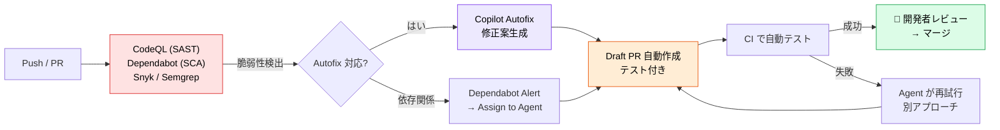
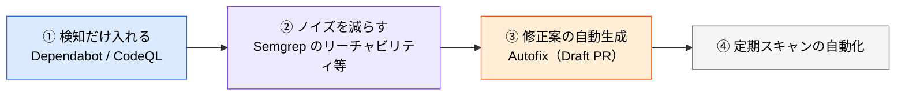

# AI による継続的な脆弱性検知と自動修復

> **この記事でわかること**：「週次スキャン → 手動対応」から「常時スキャン → AI が Draft PR → 人間はレビューだけ」への移行方法と、その安全装置。

## 結論

CVE や依存関係の脆弱性を **AI が24時間検知し、自動で修正 PR を作る仕組み**が実用段階にある。

ただし移行するのは**検知と修正案の作成まで**である。

> **AI 生成の修正パッチは未検証であり副作用の可能性がある。適用の判断は必ず人間が行う。**

Critical / High レベルはシニアエンジニアのレビューを必須とする。

## 背景・課題

従来の運用は「週次でスキャン → 結果を見る → 手で直す」だった。問題は2点ある。

- 検知から対応までのラグが大きい
- 依存関係の更新は退屈で後回しになる

**退屈で機械的な作業ほど AI に向く。** そして脆弱性対応の大半はこれにあたる。

## 具体的な方法

### 主要ツール比較

| ツール | エンジン | 特徴 |
| --- | --- | --- |
| **GitHub Copilot Autofix**（GitHub Advanced Security） | CodeQL + Coding Agent | 「Generate fix」で修正案生成 →「Create PR with fix」で自動 PR。**修正までの中央値28分・従来比3倍高速** |
| **Dependabot AI エージェント割り当て** | Copilot Coding Agent | アラートを「Assign to Agent」で委譲。メジャーバージョンアップ（30ファイル以上）も自動解析 → PR 作成 |
| **Snyk Code**（DeepCode AI） | 意味論的解析（データフロー・制御フロー横断） | Fix 提案 80% 正答率、**MTTR 84% 削減**。IDE 内リアルタイムスキャン |
| **Semgrep Assistant** | LLM + ルールベース | **ノイズ60%削減**、過去トリアージ学習、リーチャビリティ解析で**実際に呼ばれる脆弱関数のみ報告** |
| **Claude Code Security** | Anthropic | コードベース全体をスキャンし、脆弱性とパッチ案を提示 |
| **Trivy MCP** | OSS スキャナ | MCP 経由で Claude Code から呼び出し可能。コンテナ・IaC・依存関係を横断スキャン |

### コード品質・アンチパターン検出

脆弱性検出と並行して、**AI 生成コード特有のアンチパターン**を継続的に検出するツールもある。

| ツール | 特徴 |
| --- | --- |
| **SonarQube「AI Code Assurance」** | AI 生成コード専用の品質ゲートを提供 |
| **DeepSource** | 確定的解析（5,000+ ルール）+ AI レビューエージェント。Autofix 対応 |
| **CodeScene** | 静的解析ではなく「変更頻度」「担当者」の**行動データ**で、実際に問題を起こしている負債を特定 |
| **Semgrep Assistant「Memories」** | 過去のトリアージを学習し、ノイズを削減 |

**CodeScene のアプローチが特徴的である。** 「複雑なコード」ではなく「**頻繁に変更され、かつ複雑なコード**」を優先する。実際に痛みを生んでいる箇所に絞れる。

> **数値はいずれもベンダー公表値である。** 自環境で同じ結果が出るとは限らない。導入時は小規模に試して効果を測る。

**Semgrep のリーチャビリティ解析は特筆に値する。** 「脆弱な関数が依存関係に含まれる」ではなく「**実際に呼ばれている**」で絞るため、ノイズが大きく減る。アラート疲れの主因はここにある。

### エンドツーエンドのワークフロー



**Draft PR で止める**のが要点である。自動マージにしない。

### 構築を依頼するプロンプト

```text
以下の運用ループを .github/workflows/security-autopatch.yml として構築してください。

【トリガー】
- 毎日 02:00 UTC の定期スキャン
- Dependabot アラート発火時
- CodeQL アラート発火時

【フロー】
1. Trivy MCP でリポジトリを全スキャン（コンテナ・依存関係・IaC）
2. 検出された脆弱性を CVSS スコアと exploitability で優先順位付け
3. 修正可能な項目について Coding Agent に個別 PR 作成を委譲
4. すべての PR について以下を含めること：
   - 変更内容の要約（CVE ID / 影響範囲 / 修正内容）
   - 破壊的変更の有無
   - テスト結果
5. High/Critical は #security-alerts に通知（人間承認 MUST）

【安全装置】
- 本番環境への直接デプロイ禁止
- Critical レベルの脆弱性は必ず人間レビュアーを 2名以上アサイン
```

**「安全装置」を明示的に書く**ことで、生成されるワークフローに組み込まれる。

### 運用上の安全装置

| 項目 | ルール |
| --- | --- |
| **パッチの適用** | AI 生成の修正は未検証・副作用の可能性あり。**必ず人間がレビュー** |
| **Critical / High** | AI に任せきらず、**シニアエンジニアレビューを MUST** |
| **トークン権限** | `contents:write` + `pull-requests:write` に限定。**`admin` は絶対に付与しない** |
| **監査ログ** | Datadog / CloudTrail に長期保管し、後日の追跡性を確保 |

### CI/CD 権限に関する教訓

> **2026年5月、Claude Code の GitHub Action においてワークフローシークレットが漏洩しうる脆弱性が報告された**（該当バージョンで修正済み）。
>
> 教訓は3点である。
>
> - AI エージェントに CI/CD の権限を渡す際は**最小権限・独立ジョブ**で実行する
> - シークレットスキャン Hook を **pre-commit だけでなく pre-push にも**設定する
> - **アクションのバージョンをピン留めし、Dependabot / Renovate で追随する**

AI 関連の実行基盤そのものが攻撃対象になっている。「AI がセキュリティを見てくれる」ではなく、「AI 基盤もセキュリティ対象である」という前提で扱う。

### 導入の順序



**①の段階でアラートが処理しきれないなら、③に進んでも溢れるだけ**である。まずノイズを減らす。

## 実際のプロンプト例

```text
# 現状のアラート状況を把握する
gh でこのリポジトリの Dependabot アラートと CodeQL アラートを取得して、
次で分類して。

1. 重大度（Critical / High / Medium / Low）
2. 実際にそのコードパスが使われているか（リーチャビリティ）
3. 修正の破壊的変更の有無

「今すぐ対応すべきもの」だけを抽出して優先順位を付けて。
```

```text
# 修正 PR のレビュー
この Dependabot / Autofix の PR をレビューして、次を確認して。

1. 修正が脆弱性を実際に解消しているか
2. 破壊的変更が含まれていないか（API シグネチャ・挙動の変化）
3. テストがその変更をカバーしているか

「マージしてよい / 追加確認が必要」で判定し、根拠を示して。
```

## 注意点

> **自動マージにしない。** Draft PR までを自動化し、マージの判断は人間が行う。特に依存関係のメジャーバージョンアップは挙動が変わる。

> **アラートを減らす方向の「対処」に注意する。** 「この検出を除外設定で黙らせる」は解決ではない。AI にスキャンを通させると、この近道を取ることがある。**除外が必要なら理由を報告させる。**

> **`admin` 権限を渡さない。** 修正 PR の作成に必要なのは `contents:write` + `pull-requests:write` だけである。

> **ベンダー公表の数値をそのまま社内資料に転記しない。** 「中央値28分」「MTTR 84%削減」は条件付きの値である。自環境での効果は測って確かめる。

## 参考リンク

- 関連：[`01_checklist.md`](01_checklist.md) — CI/CD フェーズの項目
- 関連：[`05_mcp-risks.md`](05_mcp-risks.md) — サプライチェーンリスク
- 関連：[`../20_github-claude/04_github-actions.md`](../20_github-claude/04_github-actions.md) — 権限設計
