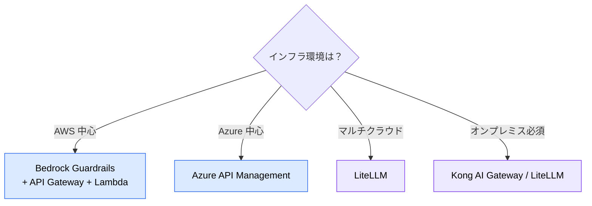

# AI ゲートウェイによる LLM API セキュリティ対策

> **この記事でわかること**：ゲートウェイが守れる範囲と守れない範囲、そして守れない領域をどう補うか。

## 結論

AI ゲートウェイは **「プロンプトが AI モデルに届く前の関所」** である。

ただし**適用範囲を誤解しやすい**。

> **ゲートウェイが保護できるのは「自社から LLM API を呼ぶ経路」のみ。外部 SaaS が内部で LLM を呼ぶフローには介入できない。**

Cursor や GitHub Copilot は SaaS 側がモデルを呼ぶため、ゲートウェイは効かない。**そこはエンタープライズ契約でカバーする**という二段構えになる。

## 背景・課題

アプリから直接 LLM プロバイダーを呼ぶと、次が制御できない。

- どんな機密情報がプロンプトに含まれているか
- 誰がいつ何を聞いたか
- どれだけコストがかかっているか

**部署ごとに勝手に LLM API を叩く「シャドー AI」**を防ぐには、経路を1本に絞る必要がある。

## 具体的な方法

### 適用範囲（最重要）

| フェーズ | ツール例 | ゲートウェイ適用 | 理由 |
| --- | --- | --- | --- |
| 仕様整理・設計 | Claude（API 経由） | **○ 適用可** | 自社から API を呼ぶ場合は経由できる |
| **実装** | **自社アプリの LLM 呼び出し** | **○ 適用可** | **最も重要な保護対象** |
| 実装 | Cursor / GitHub Copilot | **× 適用不可** | SaaS 側がモデルを呼ぶため介入不可 |
| 実装 | Claude Code（API 経由） | **○ 適用可** | プロキシ設定で経由にルーティング可能 |
| テスト | Playwright / AI テスト | **△ 部分的** | テスト内で LLM API を呼ぶ場合のみ |

> **主戦場は「実装フェーズ（自社アプリ → LLM）」である。** 外部 SaaS ツールにはそれぞれのサービス側のセキュリティ機能に依存する。

### 役割

```mermaid
flowchart LR
    App["アプリ / エージェント"] --> GW["AIゲートウェイ<br/>（ミドルウェア）"]

    subgraph gw_func["ゲートウェイが行うこと"]
        PII["① PIIマスキング"]
        Filter["② プロンプトフィルタ"]
        Log["③ 共通ログ & 監査"]
        Cost["④ コスト管理"]
        Route["⑤ ルーティング"]
        Cache["⑥ セマンティックキャッシュ"]
    end

    subgraph backends["バックエンドLLM"]
        B1["Anthropic"]
        B2["OpenAI"]
        B3["AWS Bedrock"]
    end

    GW --> gw_func
    gw_func --> backends

    style App fill:#ede9fe,stroke:#7c3aed,color:#000
    style GW fill:#dcfce7,stroke:#16a34a,color:#000
    style PII fill:#dcfce7,stroke:#16a34a,color:#000
    style Filter fill:#dcfce7,stroke:#16a34a,color:#000
    style Log fill:#dcfce7,stroke:#16a34a,color:#000
    style Cost fill:#dcfce7,stroke:#16a34a,color:#000
    style Route fill:#dcfce7,stroke:#16a34a,color:#000
    style Cache fill:#dcfce7,stroke:#16a34a,color:#000
    style B1 fill:#dbeafe,stroke:#2563eb,color:#000
    style B2 fill:#dbeafe,stroke:#2563eb,color:#000
    style B3 fill:#dbeafe,stroke:#2563eb,color:#000
```



### 主要機能

| 機能 | 説明 | なぜ必要か |
| --- | --- | --- |
| **PII マスキング** | プロンプト内の個人情報・機密データを送信前に自動検出・匿名化 | 情報漏洩防止、GDPR / 個人情報保護法対応 |
| **プロンプトフィルタ** | インジェクション防御、ポリシー違反や有害コンテンツをブロック | OWASP LLM01 対策 |
| **共通ログ & 監査** | 誰が・いつ・何を聞いたか追跡可能 | コンプライアンス、インシデント対応 |
| **コスト管理** | チーム別・プロジェクト別のトークン上限。超過時に自動スロットリング | コスト爆発防止、FinOps |
| **ルーティング** | 目的・コストに応じて最適なモデルへ自動振り分け | マルチプロバイダー戦略 |
| **セマンティックキャッシュ** | 過去の類似プロンプトの結果を再利用 | コスト削減、レイテンシ改善 |

### サービス比較と選定

| サービス | 種別 | 特徴 |
| --- | --- | --- |
| **AWS Bedrock Guardrails** | AWS ネイティブ | PII 検出・コンテンツフィルター内蔵 |
| **Azure API Management** | Azure ネイティブ | Azure AI Content Safety 連携。トークンレート制限が強力 |
| **Kong AI Gateway** | OSS / Enterprise | 既存 API ゲートウェイのプラグイン。オンプレミス対応 |
| **LiteLLM** | OSS | OpenAI 互換プロキシ。100+ モデル対応。セルフホスト可 |
| **Cloudflare AI Gateway** | SaaS | キャッシュ・レート制限・ログ。エッジで低レイテンシ |

**選定指針**



### 外部 SaaS はエンタープライズ契約で補う

ゲートウェイが効かない領域は、**SaaS 側の契約とポリシー制御でカバーする**。

| SaaS | エンタープライズ機能 | 確認ポイント |
| --- | --- | --- |
| GitHub Copilot Enterprise | Zero Data Retention（学習データのオプトアウト） | 契約で「コードが学習に使われない」ことを担保 |
| Cursor Business | プライバシーモード・SOC 2 認証 | コードがモデル学習に使用されない設定 |

> **「ハイブリッドセキュリティ」**：ゲートウェイで介入できない領域は契約でカバーする。どちらか一方では組織全体を守れない。

### 導入チェックリスト

```markdown
## プロンプトセキュリティ

- [ ] PIIマスキングを有効化（個人情報・APIキー・社内機密情報）
- [ ] プロンプトインジェクション防御フィルターを設定
- [ ] 不適切コンテンツの自動ブロックルールを定義

## コスト管理

- [ ] チーム別・プロジェクト別のトークン上限を設定
- [ ] 予算超過アラートを構成
- [ ] セマンティックキャッシュでAPIコール数を削減

## 監査・ログ

- [ ] 全LLMリクエスト/レスポンスのログ記録を有効化
- [ ] 利用状況ダッシュボードを構築（チーム別・モデル別）
- [ ] コスト分析レポートを自動生成

## 運用

- [ ] アプリからLLMへの直接アクセスを禁止（必ずゲートウェイ経由）
- [ ] フォールバック用のバックエンドLLMを構成
- [ ] ゲートウェイ自体の可用性監視を設定
```

**最後のブロックが要である。** 直接アクセスを組織として禁止しなければ、ゲートウェイは迂回される。

## 実際のプロンプト例

```text
# 適用範囲の棚卸し
このプロジェクトで LLM を呼んでいる箇所を全て洗い出して、
次で分類して。

A: 自社コードから API を呼んでいる（ゲートウェイ適用可）
B: SaaS ツール経由（ゲートウェイ適用不可）

B については、そのサービスのエンタープライズ機能で
何を担保する必要があるかを列挙して。
```

```text
# ゲートウェイ経由への移行
@src/ 配下で LLM API を直接呼んでいる箇所を全て見つけて、
ゲートウェイ経由に変更する差分を作って。

エンドポイントは環境変数で切り替えられる形にして、
既存のテストが通ることを確認して。
```

## 注意点

> **ゲートウェイは万能ではない。** 守れるのは自社から呼ぶ経路だけである。導入時に「これで全部守れる」と説明すると、後で認識のずれが生じる。

> **直接アクセスを禁止しないと機能しない。** 経路を1本にすることがゲートウェイの前提である。抜け道があれば必ず使われる。

> **PII マスキングは完全ではない。** パターンマッチで拾えない機密情報はある。マスキングを理由に「何でも送ってよい」としない。

> **ゲートウェイ自体が単一障害点になる。** 可用性監視とフォールバックの構成を最初から入れる。

> **コスト管理機能が実は最も使われる。** セキュリティ目的で導入して、FinOps の価値のほうが大きかったという例は多い（→ [`../21_cicd-ops/06_finops.md`](../21_cicd-ops/06_finops.md)）。

## 参考リンク

- 関連：[`06_local-llm.md`](06_local-llm.md) — 外部送信できない場合
- 関連：[`00_ai-code-risks.md`](00_ai-code-risks.md) — OWASP LLM01 / LLM02
