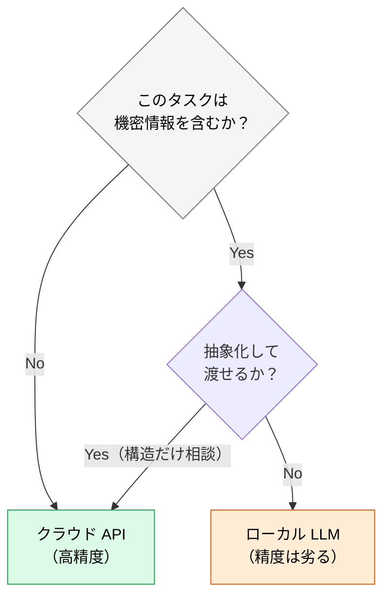

# ローカル LLM / SLM という選択肢

> **この記事でわかること**：外部 API にコードを送れない場合のフォールバックと、現実的な「ハイブリッド運用」の設計。

## 結論

ローカル LLM は**主役ではなくフォールバック**である。

> **機密情報を含まないタスクはクラウド API、機密タスクのみローカル LLM に回す「ハイブリッド運用」が現実的。**

ローカル LLM はクラウド API と比べて精度が劣る。**全面移行すると、AI 駆動開発の利点の大半を失う。**

## 背景・課題

機密性が極めて高いプロジェクトでは、外部 API にコードを送信できない場合がある。

- 顧客との契約で外部送信が禁止されている
- 規制業種で、データの所在に制約がある
- 未公開の重要な資産を含む

この制約下で「AI は一切使えない」と結論づける前に、**タスクを分けられないかを検討する**。



**実際には「抽象化して渡せる」ケースが多い。** 「この設計パターンの是非」を聞くのに、実データや顧客名は要らない。

## 具体的な方法

### ツールの選択肢

| ツール | 連携方法 | 特徴 |
| --- | --- | --- |
| **Ollama** + Continue | VS Code 拡張としてローカル LLM を利用 | 完全オフライン。データが外部に出ない |
| **Ollama** + Cursor | Cursor の OpenAI 互換エンドポイントで接続 | ローカルでも Cursor の UI/UX を活用 |
| **LM Studio** | OpenAI 互換 API をローカルで提供 | GUI でモデル管理。チーム内共有も可能 |

**OpenAI 互換 API を提供するもの**を選ぶと、既存ツールの接続先を差し替えるだけで済む。

### 推奨モデル

| 用途 | モデル |
| --- | --- |
| **コード生成** | DeepSeek Coder V3、Qwen 2.5 Coder 32B、CodeLlama 70B |
| **汎用** | Llama 3.3、Gemma 2、Phi-4 |

> モデルの世代交代は速い。**導入時点で最新のものを改めて調べる。**

### ハイブリッド運用の設計

タスクを機密度で分け、経路を変える。

| タスク | 経路 | 例 |
| --- | --- | --- |
| **一般的な技術相談** | クラウド API | 「この設計パターンの是非」 |
| **公開 OSS のコード** | クラウド API | ライブラリの使い方 |
| **社内コードの構造だけ** | クラウド API（抽象化して渡す） | 「認証フローの改善案」 |
| **機密データを含むコード** | **ローカル LLM** | 顧客固有のロジック |
| **未公開の重要資産** | **ローカル LLM** | コアアルゴリズム |

**「何を送るか」を判断する運用が要になる。** ツールの切り替えより、この判断基準をチームで共有することのほうが難しい。

### ローカル LLM を選ぶ前に検討すること

外部送信が禁止でも、**AI ゲートウェイで解決できる場合がある**。

| 手段 | できること |
| --- | --- |
| **AI ゲートウェイ** | 送信前に PII・機密情報を自動マスキングする（→ [`04_ai-gateway.md`](04_ai-gateway.md)） |
| **エンタープライズ契約** | Zero Data Retention（学習に使われない）を契約で担保する |
| **ローカル LLM** | そもそも外部に出さない |

**上から順に検討する。** ローカル LLM は精度と運用コストの代償が大きい。

### 運用コスト

見落とされやすいが、ローカル LLM には**インフラの負担**がある。

| 項目 | 内容 |
| --- | --- |
| ハードウェア | 32B クラスのモデルには相応の GPU メモリが要る |
| メンテナンス | モデルの更新、推論サーバーの運用 |
| 品質のばらつき | クラウド API と比べて出力が不安定 |

**個人の PC で動かすか、チーム共有のサーバーを立てるか**で運用の重さが変わる。

## 実際のプロンプト例

```text
# 送信可否の判断を支援させる（クラウド側で実行）
これから相談したい内容は、社内システムの認証フローの改善です。
実際のコードや顧客情報を送らずに相談するために、
どこまで抽象化すればよいか教えて。

抽象化した相談文の案も作って。
```

```text
# ハイブリッド運用の設計
このプロジェクトの制約（外部 API へのコード送信禁止）を踏まえて、
タスクを「クラウドで扱えるもの」「ローカルに回すもの」に分類する
判断基準を作って。

チームメンバーが迷わない粒度で、具体例を添えて。
```

## 注意点

> **ローカル LLM は「AI が使える」ことを意味しない。** 精度が劣るため、そのまま同じ使い方をすると品質が下がる。**期待値を調整したうえで導入する。**

> **フォールバックとして位置づける。** 全面移行ではなく、機密タスクのみに絞る。

> **判断基準の共有が最も難しい。** ツールを用意しても、「これは送っていいのか」が判断できなければ運用は回らない。具体例を含む基準をチームで作る。

> **モデルの世代交代が速い。** 推奨モデルは短期間で入れ替わる。半年ごとに見直す前提で運用する。

## 参考リンク

- 関連：[`04_ai-gateway.md`](04_ai-gateway.md) — マスキングによる代替手段
- 関連：[`../01_claude-code/01_models.md`](../01_claude-code/01_models.md) — モデル選択の考え方
