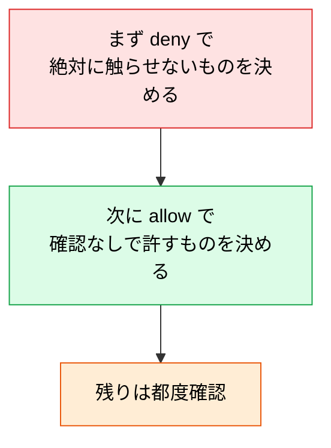
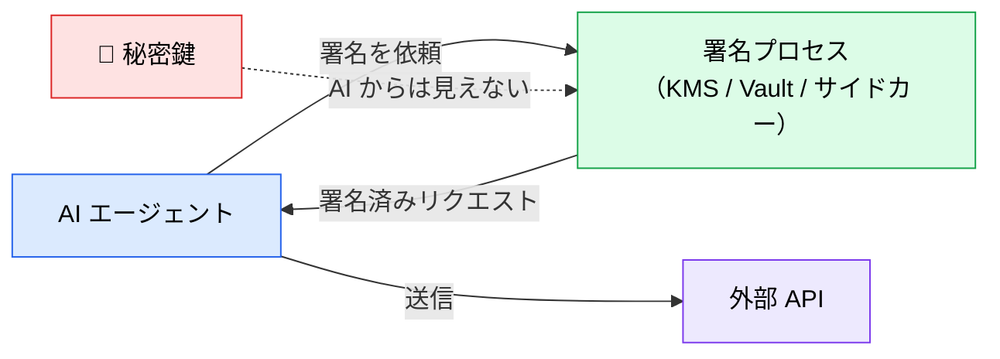

# Claude Code のセキュリティ初期設定

> **この記事でわかること**：デフォルト設定のどこを絞るべきか（7項目）と、プロンプトインジェクションで秘密鍵を守る認証方式。

## 結論

> **Claude Code のデフォルト設定は利便性優先で緩めに振られている。業務利用では明示的な絞り込みが必要である。**

これは「デフォルトが安全ではない」前提での最低ラインであり、個人検証用の設定をそのままチーム配布してはいけない。

そして最も効くのは1点。

> **`permissions.deny` で `.env` の読み書きを禁止する。**

## 背景・課題

Claude Code は開発体験を優先した既定値になっている。個人の実験には適切だが、業務では次が問題になる。

- `.env` を読める（環境変数ファイルの誤読み出し・誤コミット）
- 編集履歴・チェックポイントが長期に残る
- 実行できるコマンドが広い

**AI が「読める範囲」が、そのまま情報漏洩の範囲になる。**

## 具体的な方法

### 押さえるべき7項目

| # | 設定項目 | 目的 |
| --- | --- | --- |
| 1 | **`.env` を読み書き禁止に追加** | 環境変数ファイルの誤読み出し・誤コミット防止 |
| 2 | 編集履歴・チェックポイントの自動削除 | 機密データを含む履歴の長期残存を防ぐ |
| 3 | **dotenvx** で環境変数を暗号化 | 平文 `.env` を排除し、復号鍵は別管理 |
| 4 | コマンド実行のサンドボックス制限 | `permissions` で許可コマンドを許可リスト化 |
| 5 | `CLAUDE.md` にチームルールを明記 | 「触ってはいけないファイル」「禁止操作」を文書化 |
| 6 | 重要ロジックへのテストファースト推奨 | 品質インパクトが大きい箇所に絞って適用 ※ |
| 7 | 定期的な `/clear` でコンテキスト整理 | 機密情報を含む長大セッションの放置を防ぐ |

> **※6の補足**：全機能への厳密な TDD 強制は開発速度を著しく落とす場合がある。ビジネスロジック・API エンドポイント・セキュリティ関連など**品質インパクトが大きい箇所に絞って**テストファーストを適用し、UI の微調整や文言修正などは事後テストで十分。

### 設定例

```json
{
  "permissions": {
    "deny": [
      "Read(./.env)",
      "Edit(./.env)",
      "Read(./.env.*)",
      "Bash(rm -rf:*)"
    ],
    "allow": [
      "Bash(npm test:*)",
      "Bash(git diff:*)"
    ]
  }
}
```

> **編集履歴・チェックポイントの保持期間**は設定で制御できる場合があるが、キー名はバージョンで変わりうる。**公式ドキュメントで現行のキーを確認してから設定する。** 確認できない場合は、定期的に手動で削除する運用でも目的は達せられる。

**`deny` は `allow` より優先される。** 禁止したいものは `deny` に書けば、`allow` の記述に関わらず拒否される。

### 権限設計の考え方



**`allow` を広げる方向で考えない。** まず禁止事項を固め、そのうえで頻繁に使う安全な操作だけを許可する。

### AI エージェント認証：秘密鍵署名方式

「API キーを環境変数に置く」方式には次の問題がある。

- **プロンプトインジェクションで AI が環境変数を読み出し、外部送信する恐れ**
- ログ・コンテキスト履歴に秘密情報が混入しやすい
- 一度漏洩すると即座に全権限が奪われる

代替として、**リクエスト署名方式**（HMAC / 公開鍵暗号）がある。

| 要素 | 内容 |
| --- | --- |
| **タイムスタンプ** | リプレイ攻撃防止（数分以内のリクエストのみ受理） |
| **ボディハッシュ** | リクエストボディの改ざん検知 |
| **秘密鍵で署名** | 鍵そのものは **AI のコンテキスト外**（KMS or 署名専用プロセス）に保管 |
| **サーバー側で署名検証** | 秘密鍵を持たないと正しい署名を作れない |

```text
Authorization: Signature keyId="agent-01",
  ts="<unix-epoch-seconds>",
  bodyHash="sha256:...",
  signature="..."
```



> **本質は「秘密鍵を AI エージェントのコンテキストに乗せない」ことである。** 署名は KMS / 署名専用サイドカー / Vault Transit Engine などエージェントから隔離されたプロセスに任せ、AI 側は「署名済みリクエスト」だけを受け取る。**これにより、たとえプロンプトインジェクションが成功しても秘密鍵自体は漏れない。**

### `.claude/` 自体のリスク

設定を絞っても、**`.claude/settings.json` の hooks はチーム全員のマシンで任意のシェルコマンドとして実行される**。悪意ある PR を取り込むことは、実質的に任意コード実行の受け入れになる。

| 対策 | 内容 |
| --- | --- |
| CODEOWNERS | `.claude/` にレビュー必須を設定 |
| PR レビュー | hooks / settings.json / agents の差分は**コード変更以上の厳格さ**で見る |
| 起動前の確認 | hooks はセッション開始時にスナップショットされるため、起動前に差分を確認する意味がある |

## 実際のプロンプト例

```text
# 現状の権限設定を監査させる
.claude/settings.json と .claude/settings.local.json を読んで、
次の観点で監査して。

1. .env や認証情報ファイルが deny に入っているか
2. allow が広すぎないか（危険なコマンドが含まれていないか）
3. settings.local.json で一時的に緩めた設定が残っていないか

問題があれば修正案を diff で示して。
```

```text
# チーム配布用の設定を作る
このプロジェクト向けに、業務利用に耐える .claude/settings.json を作って。

要件:
- .env 系ファイルの読み書きを禁止
- 破壊的なシェルコマンドを禁止
- テスト実行と git diff は確認なしで許可
- 個人設定は settings.local.json に分離し、.gitignore に追加

なぜその設定にしたかの理由も添えて。
```

## 注意点

> **個人検証用の設定をそのままチーム配布しない。** 実験中に緩めた `settings.local.json` が残っていることが多い。配布前に必ず確認する。

> **`.env` の禁止だけでは足りない。** `.env.local` `.env.production` などのバリエーションも `deny` に含める。

> **`deny` は allow より優先される。** この優先順位を理解していないと、「許可したのに動かない」「禁止したのに実行された」の切り分けができない。

> **秘密鍵署名方式は実装コストが高い。** 全社的に必要とは限らない。**プロンプトインジェクションの影響が致命的になる領域**（決済・個人情報）から適用する。

> **さらに AI ゲートウェイ・MCP 監査と組み合わせる。** 本記事の7項目は最低ラインである（→ [`04_ai-gateway.md`](04_ai-gateway.md) / [`05_mcp-risks.md`](05_mcp-risks.md)）。

## 参考リンク

- [Claude Code 公式ドキュメント](https://docs.anthropic.com/ja/docs/claude-code/)
- 関連：[`../01_claude-code/06_hooks.md`](../01_claude-code/06_hooks.md) — hooks と permissions の使い分け
- 関連：[`../01_claude-code/09_directory-structure.md`](../01_claude-code/09_directory-structure.md) — 設定スコープ
